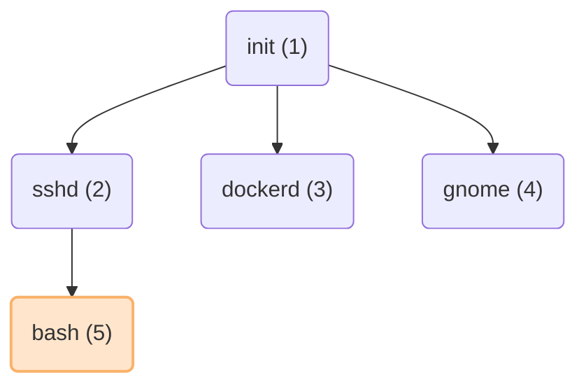

---
tags:
  - dumb-init
---
# 사용 이유
프로젝트에서 롯디 영상을 GIF로 추출하는 과정에서 브라우저를 띄워야 할 필요가 있었고, 이를 위해 `puppeteer` 라이브러리를 사용해 크롬 브라우저를 실행하여 작업을 진행했습니다.    
그런데 크롬이 정상적으로 종료된 후에도 메모리가 남아 있는 현상이 발생했고, 이를 해결하고자 별도의 child process에서 작업을 수행한 뒤 프로세스를 종료하는 방식으로 개선을 시도했습니다.   
하지만 이 과정을 Docker 환경에서 실행했을 때는 child process를 종료해도 메모리 누수가 계속 발생하는 문제가 있었고, 이에 대한 원인과 해결 방법을 찾아보게 되었습니다.
# PID 1의 역할
리눅스에서 PID 1은 부팅 시 커널에 의해 최초로 실행되는 init 프로세스입니다.   
init 프로세스는 시스템이 정상적으로 동작할 수 있도록 SSH, Docker, Nginx와 같은 다양한 데몬과 서비스를 시작하는 역할을 담당합니다.   
각 프로세스는 차례로 하위 프로세스를 생성할 수 있으며, 이로 인해 init 프로세스는 모든 프로세스의 최종 부모가 됩니다.   
아래의 다이어 그램은 프로세스의 한 예시입니다.

위 그림에서 만약 PID 5(bash)가 종료되면, 해당 프로세스는 좀비 프로세스가 됩니다.   
이는 유닉스 계열 시스템에서 부모 프로세스가 자식 프로세스의 종료 상태를 명시적으로 수집(waitpid 호출)해야만 자식 프로세스가 완전히 소멸하도록 설계되어 있기 때문입니다.   
좀비 프로세스는 부모가 waitpid()를 호출할 때까지 시스템에 남아 있게 되며, 이를 정리하는 과정을 reaping이라고 합니다.   
일반적으로 init 프로세스는 고아가 된 자식 프로세스의 종료 상태를 회수하는 역할도 수행합니다.   
하지만 컨테이너 환경에서는 PID 1의 역할이 일반적인 리눅스 시스템과 다르게 동작할 수 있기 때문에, 좀비 프로세스가 제대로 정리되지 않는 문제가 발생할 수 있습니다
# 컨테이너 태부에서 프로세스 동작
도커는 컨테이너를 실행할 때 ENTRYPOINT로 지정된 프로세스를 PID 1로 설정하고, 별도의 PID 네임스페이스에서 실행합니다.    
컨테이너 내부에서 PID 1을 가진 이 프로세스만이 도커나 쿠버네티스 등 외부에서 전달하는 종료 신호를 직접 받을 수 있습니다.   
예를 들면 아래와 같은 구조가 형성 될 수 있습니다.
```
 docker run (on the host machine)
  - /bin/sh (PID 1, inside container)
    - python my_server.py (PID 2, inside container)
```
이 경우 `/bin/sh`가 컨테이너 내에서 PID 1이 되며, 사용자가 만든 애플리케이션이 직접 PID 1이 되는 경우도 많습니다.   
문제는, 일반적인 애플리케이션이나 스크립트가 PID 1로 실행될 때 발생합니다.   
원래 PID 1은 init 시스템처럼 프로세스 관리를 담당해야 하지만, 일반 애플리케이션은 시그널 처리나 좀비 프로세스 정리에 대한 로직이 구현되어 있지 않은 경우가 많습니다
## 발생할 수 있는 문제
- 시그널 전파 문제
	- PID 1이 신호를 제대로 처리하지 않으면, 컨테이너 종료 시 하위 프로세스가 정상적으로 종료되지 않을 수 있습니다.
- 좀비 및 고아 프로세스 발생
	- PID 1이 자식 프로세스의 종료 상태를 수집(reaping)하지 않으면, 좀비 프로세스가 쌓여 시스템 자원을 점유하게 됩니다.
# dumb-init
dumb-init은 이러한 문제를 해결하고 컨테이너를 일반 프로세스와 같은 형태로 사용할 수 있도록 만들어졌다.
```
docker run (on the host machine)
  - dumb-init (PID 1, inside container)
    - python my_server.py (PID 2, inside container)
```
## Dockerfile의 예시
```dockerfile
FROM node:18
RUN apt-get update && apt-get install -y dumb-init
ENTRYPOINT ["dumb-init", "--"]
CMD ["node", "your-script.js"]
```
- `dumb-init` 도입: PID 1 프로세스 관리자로 좀비 프로세스 재활용 방지
- `--init` 플래그 사용: `docker run --init`으로 자체 init 시스템 활성화