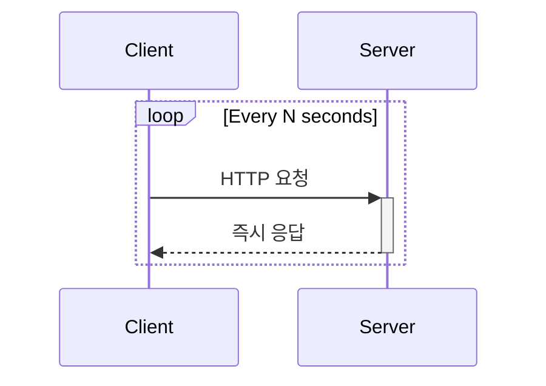

---
tags:
  - webSocket
  - polling
  - sse
---
# 기본 개념
서버에서 클라이언트에게 데이터를 전송 및 실시간으로 주고 받을 때 사용할 수 있는 통신 기술들이다.

| **실시간 통신 기술**            | **특징**            | **통신 방향**  | **기반 기술** |
| ------------------------ | ----------------- | ---------- | --------- |
| Regular Polling          | 주기적으로 서버에 요청      | 단방향        | HTTP 기반   |
| Long Polling             | 요청 대기 후 응답        | 단방향        | HTTP 기반   |
| Server-Sent Events (SSE) | 서버가 클라이언트로 데이터 푸시 | 서버 → 클라이언트 | HTTP 기반   |
| WebSocket                | 지속적인 연결 유지        | 양방향        | TCP 기반    |
# 폴링
### 동작 방식

