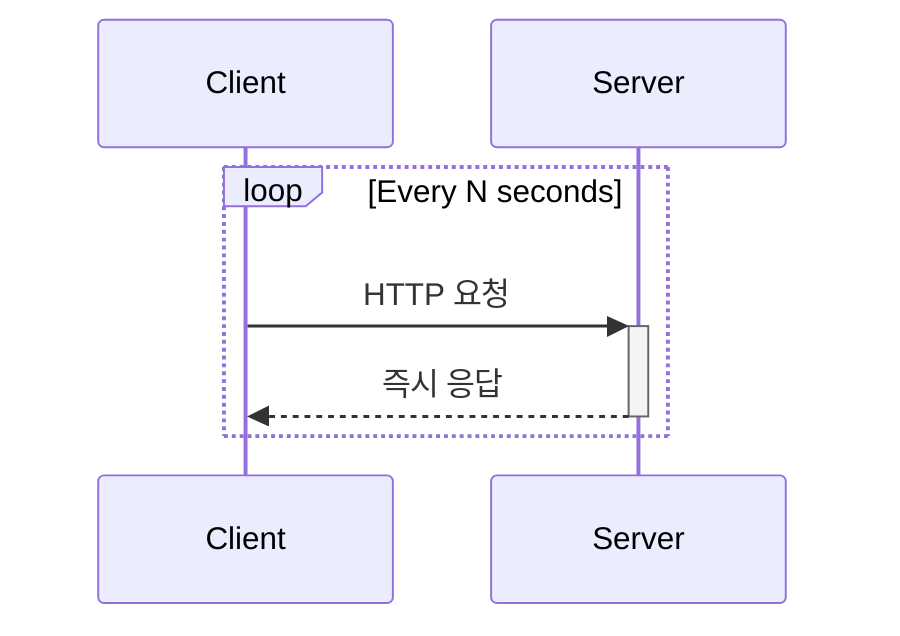
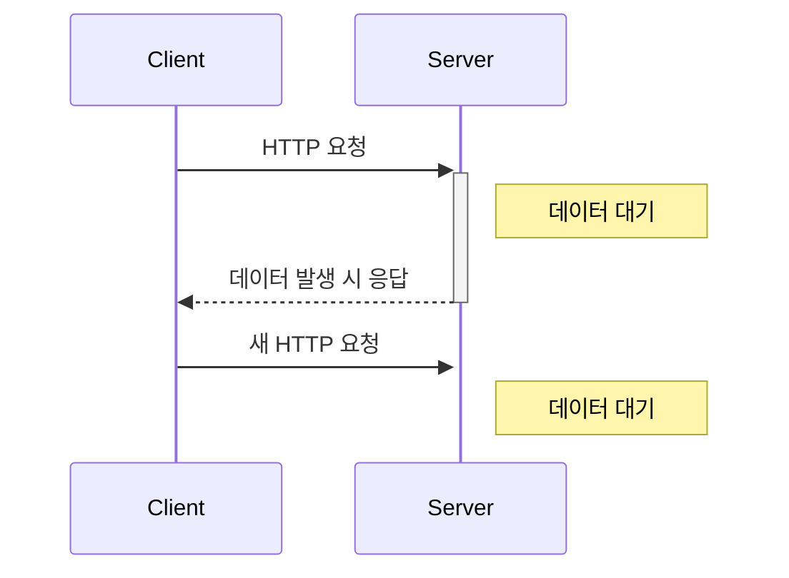
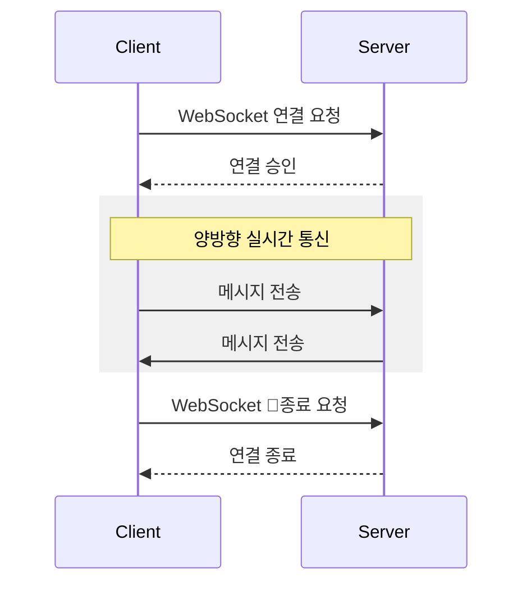
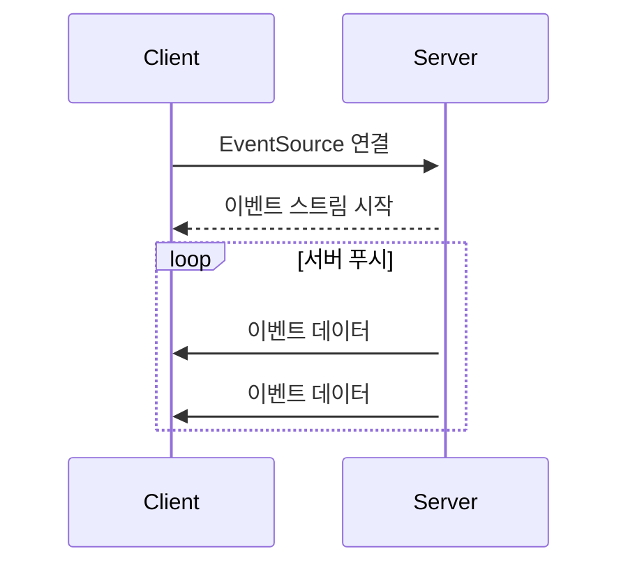

---
tags:
  - webSocket
  - polling
  - sse
---
# 기본 개념
서버에서 클라이언트에게 데이터를 전송 및 실시간으로 주고 받을 때 사용할 수 있는 통신 기술들이다.

| **실시간 통신 기술**            | **특징**            | **통신 방향**  | **기반 기술** |
| ------------------------ | ----------------- | ---------- | --------- |
| Regular Polling          | 주기적으로 서버에 요청      | 단방향        | HTTP 기반   |
| Long Polling             | 요청 대기 후 응답        | 단방향        | HTTP 기반   |
| Server-Sent Events (SSE) | 서버가 클라이언트로 데이터 푸시 | 서버 → 클라이언트 | HTTP 기반   |
| WebSocket                | 지속적인 연결 유지        | 양방향        | TCP 기반    |
# 폴링
## Regular Polling
### 동작 방식
클라이언트는 일정한 간격으로(예: 10초) 서버에 HTTP 요청을 보낸다.   
서버는 요청을 처리하고 응답을 반환한다. (만약 처리가 진행중이더라도 빈 응답을 반환한다)

### 특징
- 주기적인 요청 및 낮은 효율성
	- 클라이언트가 서버에 주기적으로 요청을 보내게 되므로 네트워크 리소스를 비효율 적으로 사용하게 된다.
- 쉬운 구현
	- 구현이 쉽고 HTTP 기반의 시스템에서는 언제든지 적용할 수 있다.
## Long Polling
### 동작 방식
클라이언트가 서버에 요청을 보내고 서버는 데이터가 준비될 때 까지 연결을 유지한다.   
새로운 데이터가 준비 되면 서버는 응답을 반환하고 클라이언트는 즉시 다음 요청을 보낸다.

### 특징
- 지속적인 연결 대기
	- 서버는 새 데이터가 준비될 때까지 응답을 지연시킵니다.
	- 연결 대기시간이 길어질 수록 클라이언트와 서버의 연결을 유지해야하므로 리소스 부담이 커질 수 있다. 
- 효율적인 데이터 전송
	- 새 데이터가 있을 때만 응답하므로 불필요한 요청이 줄어듭니다.
- 실시간성 강화
	- 새 데이터가 발생하면 즉시 전달됩니다.
# 소켓
### 동작 방식
클라이언트와 서버 간의 양방향 통신을 지원하며 지속적인 TCP 연결을 유지한다.   
WebSocket 연결 종료의 경우 명시적으로 요청해서 종료할 수 있다.

### 특징 및 장단점
[[웹 소켓이란]]
# Server-Side-Events(SSE)
클라이언트와 서버 간의 단방향 실시간 통신을 지원하는 기술이다.   
서버가 클라이언트에게 지속적으로 데이터를 푸시할 수 있습니다.    
SSE는 HTTP 기반으로 동작하며, 연결이 한 번 설정되면 클라이언트가 서버로부터 이벤트를 지속적으로 받을 수 있다.
### 동작 방식

### 특징
- 단방향 통신
	- 서버에서 클라이언트로만 데이터를 전달할 수 있다.
- HTTP 기반이다.
	- 기존 HTTP 프로토콜 위에서 동작한다.
- 자동 재연결
	- 네트워크 문제나 연결 끊김이 발생하면 클라이언트가 자동으로 재연결 한다.
### 서버 리소스를 사용하는 방식
- SSE는 HTTP 기반으로 동작하며, 클라이언트가 서버에 연결을 요청하면 서버는 `text/event-stream` 콘텐츠 타입으로 응답하고 연결을 유지한다.
- 이 연결은 HTTP 단일 요청으로 처리 되며 더 이상의 오버헤드는 필요하지 않다.
- 각 클라이언트 마다 하나씩 지속적인 연결이 필요하므로 많은 클라이언트가 접속되면 서버의 리소스가 점유된다.