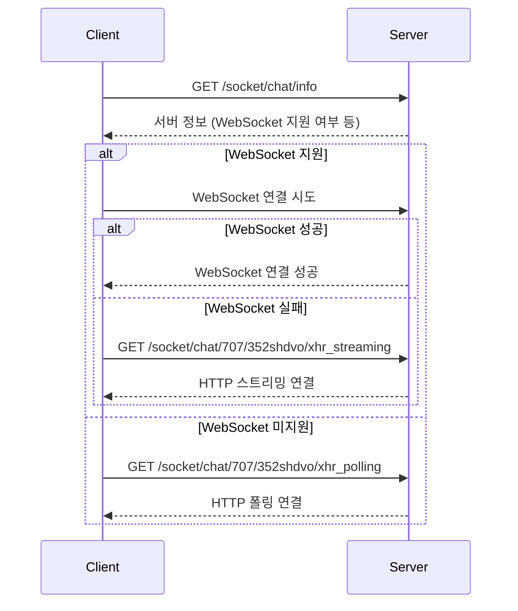

---
tags:
  - webSocket
  - sockjs
draft: "false"
---
# 개념
WebSocket 프로토콜은 RFC 6455는 단일 TCP 연결을 통해서 클라이언트와 서버 간에 이중성 양방향 통신 채널을 설정하는 표준화 된 방법을 제공한다. [spring webSocket 문서](https://docs.spring.io/spring-framework/reference/web/websocket.html)   
서버와 클라이언트 간에 지속적인 소켓 연결을 유지하여, 양방향 통신 및 실시간 데이터 전송이 가능한 기술이다.   
HTTP 기반의 전통적인 요청-응답 모델과 달리, 웹 소켓은 연결이 한번 성립되면 서버와 클라이언트가 언제든 데이터를 주고받을 수 있는 통신을 지원한다.
```yaml
GET /spring-websocket-portfolio/portfolio HTTP/1.1
Host: localhost:8080
Upgrade: websocket  => 1
Connection: Upgrade  => 2
Sec-WebSocket-Key: Uc9l9TMkWGbHFD2qnFHltg==
Sec-WebSocket-Protocol: v10.stomp, v11.stomp
Sec-WebSocket-Version: 13
Origin: http://localhost:8080
```
1. The Upgrade header (업그레이드 헤더)
2. Using the Upgrade connection(업그레이드 연결 사용)
## 주요 특징
- 지속적인 연결
	- 한 번 연결에 성공하면 클라이언트와 서버간에 지속적인 TCP 연결이 유지 되어 별도의 요청이 없이도 실시간 데이터 전송을 주고 받을 수 있다.
- 양방향 통신
	- 서버와 클라이언트가 동시에 데이터를 전송할 수 있어서, 실시간 알림 및 이벤트 기반의 프로그램에 적합하다.
- 낮은 지연 시간
	- HTTP의 경우 요청마다 새로 연결을 신청해야 하지만(3-Way handshake), 소켓은 연결을 유지하므로 오버헤드가 감소한다.
- 효율적인 데이터 전송
	- 초기 데이터 연결 이후에 필요한 데이터만 전송하므로, 대역폭 사용 측면에서도 효율적이다.
## 장점
- 양방향 데이터 통신
	- 채팅이나 게임과 같이 실시간으로 서버와 클라이언트의 상호작용을 할 수 있다.
- 효율성
	- 지속적인 연결로 인해서 네트워크 오버헤드가 적다.
- 다양한 데이터 형식 지원
	- 텍스트 뿐만 아니라 이진 데이터도 전송이 가능하다.
## 단점
- 서버 자원 부족
	- 웹 소켓은 클라이언트와의 지속적인 연결을 유지하므로 많은 사용자가 동시에 접속할 경우 서버의 메모리 및 CPU 사용량이 증가하여 관리가 어려워 질 수 있다.
- 스케일링 및 부하 분산의 어려움
	- 웹 소켓은 한 번 연결 되면 특정 서버 간에 지속적인 연결이 유지 되어야 한다.   
	  따라서 처음 연결된 서버와 지속적으로 통신을 하기 때문에 새로운 서버가 추가 되더라도 기존 연결을 다른 서버와 옮길 수 없다

# WebSocket vs SockJS 사용 이유

# SockJS란
## 개념
SockJS는 WebSocket과 유사한 객체를 제공하는 JavaScript 라이브러리로, WebSocket이 지원되지 않는 환경에서도 실시간 통신을 가능하게 해주는 폴백(fallback) 솔루션입니다.
## WebSocket 대신 SockJS를 사용하는 주요 이유
### 브라우저 호환성
- **WebSocket**
	- 구형 브라우저에서 지원되지 않을 수 있음
- **SockJS**
	- 다양한 전송 방식을 지원하여 호환성 보장
		- WebSocket (가장 우선)
		- HTTP streaming
		- HTTP long-polling
		- ....
### 네트워크 환경 대응
- **프록시 서버 문제**
	- 일부 기업 방화벽이나 프록시에서 WebSocket 연결을 차단
- **중간 인프라 호환성**
	- 로드 밸런서, CDN 등에서 WebSocket을 지원하지 않는 경우
- **자동 폴백**
	- 연결이 실패하면 자동으로 다른 전송 방식으로 전환

## Sock.js에서 연결 과정
1. /info 요청 → 서버 정보 수집
2. 전송 방식 결정 (WebSocket, XHR, etc.)
3. 세션 ID 생성
4. 실제 연결 시도
### `/info` 엔드포인트의 역할

#### 목적
- **서버 능력 확인**: 서버가 WebSocket을 지원하는지 확인
- **설정 정보 수집**: 쿠키 지원 여부, CORS 설정 등
- **전송 방식 결정**: 어떤 전송 방식을 사용할지 결정
#### `/info` 응답 예시
```json
{
  "websocket": true,
  "cookie_needed": false,
  "origins": ["*:*"],
  "entropy": 123456789
}
```
## 이후 발생한 추가 URL 패턴 분석
#### 실제로 발생한 추가 url의 예시
- `localhost:1900/socket/chat/707/352shdvo/xhr_streaming?t=1752910374452`
#### URL 구조 분해

```
/socket/chat/           ← 기본 SockJS 엔드포인트
707/                    ← 서버 ID (랜덤 숫자, 0-999)
352shdvo/              ← 세션 ID (랜덤 문자열)
xhr_streaming          ← 전송 방식
?t=1752910374452       ← 캐시 방지용 타임스탬프
```
### 연결 다이어 그램


## HTTP vs WebSocket 프로토콜 비교

### 순수 WebSocket (ws://, wss://)
```
장점:
- 낮은 오버헤드
- 실시간 양방향 통신
- 연결 유지로 인한 빠른 메시지 전송

단점:
- 호환성 문제
- 프록시/방화벽 이슈
- 연결 끊김 시 재연결 복잡성
```

### SockJS (http://, https://)
```
장점:
- 높은 호환성
- 자동 폴백 메커니즘
- Spring Boot 등 서버 프레임워크와 잘 통합
- 연결 안정성

단점:
- 약간의 오버헤드 (폴백 사용 시)
- 초기 연결 시 여러 전송 방식 시도로 인한 지연 가능성
```

## 참고 자료
- [SockJS 공식 문서](https://github.com/sockjs/sockjs-client)
- [Spring WebSocket 문서](https://docs.spring.io/spring-framework/docs/current/reference/html/web.html#websocket)
- [STOMP over WebSocket](https://stomp.github.io/)
- [SockJS Protocol Specification](https://sockjs.github.io/sockjs-protocol/sockjs-protocol-0.3.3.html)
- [Spring WebSocket Documentation](https://docs.spring.io/spring-framework/docs/current/reference/html/web.html#websocket-fallback)
