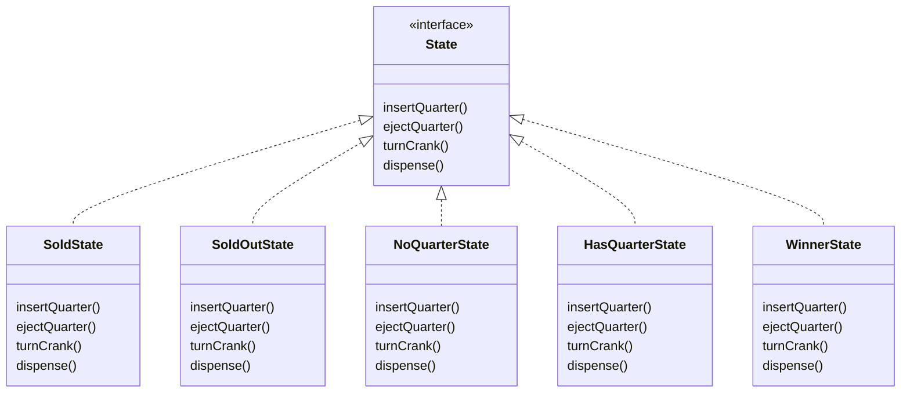
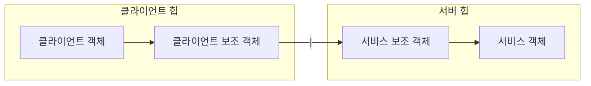

---
tags:
  - design-pattern
draft: "false"
---
# 챕터 1장
## 디자인 원칙
- 애플리케이션에서 달라지는 부분을 찾아내고 달라지지 않는 부분과 분리한다.(캡슐화)
- 구현 보다는 인터페이스에 맞춰서 프로그래밍한다.
- 상속 보다는 구성을 활용한다.
### 바뀌는 부분과 그렇지 않은 부분 분리하기
달라지는 부분을 찾아서 나머지 코드에 영향을 주지 않도록 **캡슐화** 한다.   
그러면 나중에 영향을 미치지 않은 부분은 따로 수정을 할 수가 있다.
### 캡슐화된 행동 살펴보기
클래스 다이어그램에 있는 각 화살표와 클래스들이 어떤 관계인지 자세히 살펴본다.   
(A는 B이다. / A에는 B가 있다. / A가 B를 구현한다.)
### 인터페이스에 맞춰서 프로그래밍하기
인터페이스에 맞춰서 프로그래밍한다는 것은 상위 형식에 맞춰서 프로그래밍한다는 의미이다.
```Java
// 구현에 맞춰서 코딩 => X
Dog d = new Dog();
d.bark();

// 인터페이스와 상위 형식에 맞춰서 프로그래밍한다.
Animal animal = new Dog();
animal.makeSound();

// 구현 된 객체를 실행시에 대입한다.
Animal a = getAnimal();
a.makeSound();
```
책에서는 오리가 하는 행동인 `Fly` 및 `Quack`에 대해서 따로 인터페이스를 만드는 것으로 보여준다.

#### 문제(50p)
1. 행동하는 인터페이스를 상속 받아서 로켓 추진력 클래스를 만든다
2. 오리 울음소리를 내는 부분에서 재사용이 가능해 보인다.
### 통합 과정 예제
Duck 클래스에 인터페이스 형식의 인스턴스 변수를 추가한다.   
각 오리들의 행동 및 울음소리 행동은 실행 시에 레퍼런스를 다형적으로 선언해 줄 수 있다.
```Java
public abstract class Duck {
	QuackBehavior quackBehavior;

	public void performQuack() {
		quackBehavior.quack();
	}
}


public class MallardDuck extends Duck {
	public MallardDuck() {
		quackBehavior = new Quack();
		flybehavoir = new FlyWithWings();
	}

	// method
}
```
## 결론
**전략 패턴**은 알고리즘군을 정의하고 캡슐화해서 각각의 알고리즘군을 수정해서 쓸 수 있게 해준다.   
전략 패턴을 사용하면 클라이언트로부터 알고리즘을 분리해서 독립적으로 변경할 수 있다.
# 챕터 2장(옵저버 패턴)
## 디자인 원칙
- 상호작용하는 객체 사이에는 가능하면 느슨한 결합을 사용해야 한다.
## 코드 살펴보기
- 구현을 바탕으로 코딩했으므로 프로그램을 고치기 전에 다른 디스플레이 항목을 추가/제거 불가능
- 바뀔 수 있는 부분은 캡슐화
## 개념
옵저버 패턴은 한 객체의 상태가 변경되면 그 객체에 의존하는 다른 객체에게 연락이 가고 자동으로 내용이 갱신되는 일대다 의존성을 정의한다.
## 패턴의 이해
주제(subject) / 옵저버(observer)
- 옵저버 객체들은 주제를 구독하고 있으며 주제 데이터가 변경되는 갱신 내용을 전달받는다.
- 주제에서 중요한 데이터는 주제 객체가 담당한다.
- 주제 데이터가 변경되면 옵저버 들에게 소식이 전달된다.
## 구조
```Java
interface Subject {
	registerObserver(); // 옵저버를 등록 및 삭제한다.
	removeObserver();
	notifyObservers(); // 모든 옵저버들에게 연락하는 알림 메소드
}

interface Observer {
	update(); // 옵저버 인터페이스만 구현하면 무엇이든 옵저버 클래스가 될 수 있다.
}
```

```Java
public interface Subject {
	public void registerObserver(Observer o);
	public void removeObserver(Observer o);
	public void notifyObservers();
}

public interface Observer {
	public void update(float temp, float humidity, float pressure);
}

public interface DisplayElement {
	public void display();
}

```

### 푸시 방식의 일방적인 구조
```Java
public class WeatherData implements Subject {

	private List<Observer> observers;
	private float temperature;
	private float humidity;
	private float pressure;
	
	public WeatherData() {
		observers = new ArrayList<Observer>();
	}
	
	public void registerObserver(Observer o) {
		observers.add(o);
	}
	
	public void removeObserver(Observer o) {
		observers.remove(o);
	}

	/*
		핵심 로직으로 구독하고 있는 옵저버들을 업데이트 시켜준다.
	*/
	public void notifyObservers() {
		for (Observer observer : observers) {
			observer.update(temperature, humidity, pressure);
		}
	}
	
	public void measurementsChanged() {
		notifyObservers();
	}
	
	public void setMeasurements(float temperature, float humidity, float pressure) {
		this.temperature = temperature;
		this.humidity = humidity;
		this.pressure = pressure;
		measurementsChanged();
	}

	... // 기타 메소드
}
```

```Java
public class CurrentConditionsDisplay implements Observer, DisplayElement {
    // 필드 선언
    private float temperature;
    private float humidity;
    private WeatherData weatherData;

    // 생성자에서 weatherData가 넘어가면서 디스플레이 옵저버로 등록한다.
    public CurrentConditionsDisplay(WeatherData weatherData) {
        this.weatherData = weatherData;
        weatherData.registerObserver(this);
    }

    // 옵저버 패턴 구현
    public void update(float temperature, float humidity, float pressure) {
        this.temperature = temperature;
        this.humidity = humidity;
        display();
    }

    // 출력 기능
    public void display() {
        System.out.println(
            "Current conditions: " + temperature + "F degrees and " 
            + humidity + "% humidity"
        );
    }
}
```
### 풀 방식으로도 접근이 가능하다.
```Java
public void notifyObservers() {
	for (Observer observer : observers) {
		observer.update(); // 여기서 어떤 객체도 넘겨 주지 않는다.
	}
}

// 이후 각 클래스에서 update를 구현할 때 마다 필요한 데이터를 갖고와서 업데이트 해준다.
public interface Observer {
	public void update();
}

public void update() {
	this.temperature = weatherData.getTemperature();
	this.humidty = weatherData.getHumidity();
	display();
}

```
# 3장 데코레이터 패턴
## 디자인 원칙
- 클래스는 확장에는 열려 있어야 하지만 변경에는 닫혀 있어야 한다.
## 진행 중 메모
- 행동을 상속으로 받으면 행동은 컴파일할 때 완전히 결정된다.
- 구성으로 객체의 행동을 확장하면 실행 중에 동적으로 행동을 설정할 수 있다.
- 데코레이터 패턴에서는 상속으로 사용해서 형식을 맞출뿐 행동을 물려받는 것은 아니다.
## 특정 음료를 장식하는 과정
1. DarkRoast 객체를 갖고 온다.
2. Mocha 객체로 장식한다.
3. Whip 객체로 장식한다.
4. cost() 메소드를 호출한다.
	1. 이때 첨가물의 가격을 계산하는 일은 해당 객체에 위임한다.
## 정리
- 데코레이터의 슈퍼 클래스는 자신이 장식하고 있는 객체의 슈퍼클래스와 같다.
- 한 객체를 여러 개의 데코레이터로 감쌀 수 있다.
- 데코레이터는 자신이 감싸고 있는 객체와  같은 슈퍼클래스를 갖고 있다. 
	- => 원래 객체가 들어갈 자리에 데코레이터 객체를 넣어도 된다.
- 데코레이터는 자신이 장식하고 있는 객체에게 어떤 행동을 위임하는 일 말고도 추가 작업을 수행할 수 있다.
- 객체는 언제든지 감쌀 수 있다. 
	- => 실행 중에 필요한 데코레이터를 마음대로 적용할 수 있다.
## 정의
- 데코레이터 패턴으로 객체에 추가 요소를 동적으로 더할 수 있다.
- 데코레이터를 사용하면 **서브 클래스를 만들 때 보다 훨신 유연하게 기능을 확장할 수 있다.**
## 구현
### 객체 코드들
```Java
public abstract class Beverage {  
  
    String description;  
  
    public String getDescription() {  
        return description;  
    }  
  
    public abstract double cost();  
}
```
첨가물을 나타내는 추상클래스를 구현
```Java
public abstract class CondimentDecorator extends Beverage {
	Beverage beverage; // 데코레이터가 감쌀 음료를 지정한다.
	public abstract String getDescription();
}
```
첨가물 코드 구현
```Java
public class Mocha extends CondimentDecorator {  
  
    public Mocha(Beverage beverage) {  
        this.beverage = beverage;  
    }  
  
    @Override  
    public String getDescription() {  
        return this.beverage.description + " : " + "모카";  
    }  
  
    public double cost() {  
        return beverage.cost() + .20; // 모카 가격  
    }  
}
```
음료 커피 구현
```Java
public class Espresso extends Beverage {  
  
    public Espresso() {  
        description = "에스프레소";  
    }  
      
    public double cost() {  
        return 1.99;  
    }  
}
```
### 사용하는 방법
아래와 같이 만들어진 에스프레소 객체에 첨가물이나 종류를 감싸주면 된다.
```Java
Beverage espresso = new Espresso();  
System.out.println(espresso.getDescription());  
  
Beverage espresso1 = new Espresso();  
espresso1 = new Mocha(espresso1);  
espresso1 = new Soy(espresso1);  
System.out.println(espresso1.getDescription());

// 아래와 같이 구현이 가능해진다.
=> Beverage espresso1 = new Soy(new Soy(new Mocha(new Espresso())));
```
## 문제 및 주의
- 데코레이터 패턴을 사용해서 디자인을 하다 보면 잡다한 클래스가 너무 많아진다.
- 특정 형식에 의존하는 코드를 만들면 안된다.
	- 클라이언트는 데코레이터를 사용하는 지 몰라야 한다.
## Fluent interface
// 

# 4장 팩토리 패턴
객체 생성을 처리하는 클래스를 **팩토리**라고 부른다.
## 디자인 원칙
- 추상화된 것에 의존하게 만들고 구상 클래스에 의존하지 않게 만든다.
## 간단한 팩토리
디자인 패턴이라기 보다는 프로그래밍에서 자주 쓰이는 관용구에 가깝다.
### 피자 가게 프레임워크
```Java
public abstract class PizzaStore {

	public Pizza orderPizza(String type) {
	
		Pizza pizza = createPizza(type);

		// 피자 후처리
		// ex> prepare
		return pizza;
	}

	abstract Pizza createPizza(String type); // 팩토리 객체 대신 이 메소드를 이용한다.
}
```
각각의 서브클래스는 `createPizza()` 메소드를 오버라이드 하지만 `orderPizza()` 메소드는 PizzaStore에서 정의한 내용 그대로를 사용한다.   
OrderPizza 메소드는 서브 클래스에서 무슨 일이 일어나는 지 알지 못하며 그저 서브 클래스에서 완성된 피자를 던져줄 뿐이다.   
```Java
public class NYPizzaStore extends PizzaStore {

	Pizza createPizza(String item) {
		switch(item) {
			// item에 맞는 피자를 전달해준다.
		}
	}

}
```
## 팩토리 메소드 패턴
모든 팩토리 패턴은 객체 생성을 캡슐화한다.   
객체를 생성할 때 필요한 인터페이스를 만든다. 어떤 클래스의 인스턴스를 만들지는 **서브클래스**에서 결정한다. 팩토리 메소드 패턴을 사용하면 클래스 인스턴스 만드는 일을 서브 클래스에게 맡기게 된다.
- 단일 생성 객체를 위한 인터페이스를 정의한다.
- 객체 생성을 서브 클래스에 위임한다.
- 상속을 사용해서 구현한다.
- 단일 메소드로 구현된다.
## 추상 팩토리 패턴
구상 클래스에 의존하지 않고 서로 연관되거나 의존적인 객체로 이루어진 제품군을 생산하는 인터페이스를 제공한다.   
구상 클래스는 서브 클래스에서 만든다.
- 관련된 객체들을 생성하는 인터페이스를 제공한다.
- 구성을 사용해서 구현이 된다.
- 여러 팩토리 메소드를 포함하는 별도의 객체를 사용한다..
## 두 패턴의 차이점
- 생성 범위
	- 추상 팩토리는 여러 관련 객체의 관련군을 생성하지만 팩토리 메소드는 단일 객체를 생성한다.
- 구현 방식
	- 추상 팩토리는 구성을 사용하고 팩토리 메소드는 상속을 사용한다.
- 추상화 레벨
	- 추상 팩토리는 팩토리 메소드 보다 한 단계 높은 추상화를 사용한다.
- 유연성
	- 추상 팩토리는 전체 제품군을 쉽게 교체할 수 있지만 팩토리 메소드는 개별 제품 생성에 더 적합한다.
## 의존성 뒤집기 원칙을 지키는 방법
- 변수에 구상 클래스의 레퍼런스를 저장하면 안된다.
	- new 연산자를 사용하면 구상 클래스의 레퍼런스를 사용한다.
- 구상 클래스에서 유도된 클래스를 만들면 안된다.
	- 만들게 되면 특정 클래스에 의존하게 된다.
- 베이스 클래스에 이미 구현되어 있는 메소드를 오버라이드 하면 안된다.
	- 이미 구현된 메소드를 오버라이드 하면 베이스 클래스가 제대로 추상화가 되지 않는다.
# 5장 싱글톤 패턴
## 정의
- 클래스 인스턴스 하나만 만들고 그 인스턴스로의 전역 접근을 제공한다.
### 여기서 포인트
- 하나뿐인 인스턴스가 만들어지도록 관리하고 추가로 생성되지 않도록 막아야 한다.
- 언제든지 생성된 인스턴스로 접근할 수 있도록 전역 접근 지점을 제공한다. `ex>getInstance()`
## 고전적인 싱글톤 구현
```Java
public class Singleton {

	private static Singleton uniqueInstance;

	// 생성자로 생성은 막아놓는다.
	private Singleton();

	public static Singleton getInstance() {
		// 현재 static이 null인 경우에만 생성
		if(uniqueInstance == null) {
			uniqueIntance = new Singleton();
		}
		return uniqueInstance;
	}
}
```
## 멀티스레드에서 싱글톤 문제 막기
1. `synchronized`를 사용한다.
2. 정적 초기화 할 때 인스턴스를 생성한다.
```Java
public class Singleton {
	// 정적 초기화 부분에서 인스턴스를 생성한다.
	private static Singleton uniqueInstance = new Singleton();
	private Singleton();

	public static Singleton getInstance() {
		return uniqueInstance();
	}
}
```
3.  DCL(Double Checked Locking)을 사용해서 생성한다.
```Java
public class Singleton {

	private volatile static Singleton uniqueInstance;

	// 생성자로 생성은 막아놓는다.
	private Singleton();

	public static Singleton getInstance() {
		// 현재 static이 null인 경우에만 생성
		if(uniqueInstance == null) {
			// 인스턴스가 없는 지 확인하고 동기화 된 블록으로 들어간다.
			synchronized (Singleton.class) {
			if(uniqueInstance == null){
				uniqueIntance = new Singleton();
			}
		}
		return uniqueInstance;
	}
}
```
4.  ENUM을 사용하여 싱글톤을 생성
```Java
public enum Singleton {
    INSTANCE;
    
    private int value;
    
    public int getValue() {
        return value;
    }
    
    public void setValue(int value) {
        this.value = value;
    }
}

```
# 6장 커맨드 패턴
## 정의
- 요청 내역을 객체로 캡슐화해서 객체를 서로 다른 요청 내역에 따라 매개변수화 할 수 있다.
- 요청을 큐로 저장하거나 로그로 기록하거나 작업 취소 기능 등을 사용할 수 있다.
커맨드 객체는 일련의 행동을 특정 리시버로 연결함으로써 요청을 캡슐화 한다.   
행동과 리시버를 한 객체에 넣고, `execute()`라는 메소드 하나만 외부에 공개하는 방법을 사용해야 한다.   
밖에서는 어떤 객체가 리시버 역할을 하고 어떤 일을 하는 지 알 수 없게 된다.
## 구성요소
- Client
	- 커맨드 객체를 생성하는 역할
- Invoker
	- Invoker에는 명령이 들어있다.
	- `execute()` 메소드를 호출함으로써 커맨드 객체에게 특정 작업을 수행해 달라는 요구를 한다.
- Command
	- 모든 커맨드 객체에서 구현해야 하는 인터페이스
	- 모든 명령은 `execute()` 메소드 호출로 수행되며 이 메소드는 리시버에 특정 작업을 처리하라는 지시를 전달.
- Receiver
	- 요구 사항을 수행할 때 어떤 일을 처리해야 하는 지 알고 있는 객체
## 커맨드 인터페이스
```Java
public interface Command {
	public void execute();
}
```
## 조명 행동 구현
```Java
public class LightOnCommand implements Command {
	Light light;

	public LightOnCommand(Light light) {
		this.light = light;
	}

	// 해당 메소드는 light의 on() 메소드를 호출한다.
	public void execute() {
		light.on();
	}
}
```
# 7장 어댑터패턴, 퍼사드 패턴
## 어뎁터 패턴
### 정의
- 특정 클래스 인터페이스를 클라이언트에서 요구하는 다른 인터페이스로 변환한다.
- 인터페이스가 호환되지 않아서 같이 쓸 수 없었던 클래스를 사용할 수 있게 도와준다.
이 패턴을 사용하면 호환되지 않는 인터페이스를 사용하는 클라이언트를 그대로 활용할 수 있다.   
인터페이스를 변환해 주는 어댑터를 만들면 된다.
### 기본 원리
- 어댑터는 타깃 인터페이스를 구현하며 여기에 어댑티(목표) 인터페이스가 들어있다.
- 클라이언트가 요청할 클래스를 인터페이스화를 시킨 다음에 어뎁터는 해당 인터페이스를 상속 받아서 필요한 메서드 들을 구현한다. 이때 구현은 어뎁티(목표)를 받아서 인터페이스에 맞춰서 변환해주는 역할을 하게 된다.
```Java
public class TurkeyAdapter implements Duck {
					// => 적응 시킬 형식의 인터페이스를 구현해야 한다.
					//    (클라이언트에서 원하는 인터페이스)

	Turkey turkey;

	public TurkeyAdapter(Turkey turkey) {
		this.turkey = turkey;
	}

	public void quack() {
		turkey.gobble();
	}

	public void fly() {
		// 책에 나온 예시로 오리의 거리에 맞춰주는 것을 보여준다.
		for(int i = 0 ; i < 5; i++) {
			turkey.fly(); 
		}
		
	}

}
```
### 구성
- 객체 어댑터
- 클래스 어댑터
	- 다중 상속이 필요하다 (자바에서는 불가능하다)
## 퍼사드 패턴
- 인터페이스를 단순하게 만들고 클라이언트와 구성 요소로 이루어진 서브 시스템을 분리하는 역할을 한다.
### 정의
- 서브시스템에 있는 일련의 인터페이스를 통합 인터페이스로 묶어준다.
- 고수준 인터페이스도 정의하므로 서브 시스템을 더 편리하게 사용할 수 있다.
### 디자인 원칙
- 객체 사이의 상호작용은 진짜 절친에게만 이야기 한다.
### 객체의 영향력을 최소화 하면서 행사하기
- 객체 자체
- 메소드에 매개변수로 전달된 객체
- 메소드를 생성하거나 인스턴스를 만든 객체
- 객체에 속하는 구성 요소
위 3개에 따르면 다른 메소드로 호출해서 리턴받은 객체의 메소드를 호출하는 일도 바람직하지 않다.   
예를 들자면 객체를 넘겨 받아서 객체에서 메소드를 호출해서 원하는 값을 받는 것이 아니라 이전에 호출한 메소드에서 상수 값을 넘겨 받는 것이다.
```Java
public class Car {

	Engine engnie;

	public Car() {
		// 초기화
	}

	public void start(Key key) {
		Doors doors = new Doors();

		// 매개변수로 전달되는 객체의 메소드는 호출해도 된다.
		boolean authorized = key.turns();
		if(authorized) {
			// 객체 내에 있는 메소드는 호출한다.
			engine.start();
			updateDashboardDisplay();

			// 직접 생성하거나 인스턴스를 만든 객체의 메소드는 호출한다.
			doors.lock();
		}
	}

	public void updateDashboardDisplay() {
		// 내용추가
	}

}
```
# 템플릿 메소드 패턴
## 정의
- 템플릿 메소드 패턴은 알고리즘의 골격을 정의한다.
- 템플릿 메소드 패턴을 사용하면 알고리즘의 일부 단계를 서브 클래스에서 구현할 수 있으며, 알고리즘의 구조는 그대로 유지하면서 알고리즘의 특정 단계를 서브클래스에서 재정의 할 수도 있다.
## 예시
- 메소드를 통해서 알고리즘의 각 단계를 정의하며 서브 클래스에서 일부 단계를 구현할 수 있도록 유도한다.
```Java
public abstract class CaffeineBeverage {

	// 서브 클래스가 아무나 오버라이드 하지 못하도록 고정한다.
	// 여기서 prepareRecipe가 템플릿 메소드인다.
	final void prepareRecipe() {
		boilWater();
		brew();
		pourInCup();
		addCodiments();
	}

	// 서로 다른 방식으로 처리하는 메소드는 abstract 처리한다.
	abstract void brew();
	abstract void addCondiments();

	void boilWater() {
		// 물 끓이는 중
	}

	void pourInCup() {
		// 컵에 물 따르는 중
	}

}
```
### 장점
- 다른 음료도 쉽게 추가할 수 있는 프레임워크를 제공한다.
- 알고리즘이 한 군데에 모여 있어서 수정이 용이하다.
- 추상화 된 인터페이스에 알고리즘 지식이 집중되어 있고 일부 구현만 서브 클래스에 의존한다.
## 특징
- `hook()`를 오버라이드해서 원하는 기능을 넣어줄 수 있다.
- 이름이 `hook()`이어야 하는 것은 아니고 임의로 정해줄 수 있다.
- `hook()`의 정확한 정의는 추상 클래스에서 내용 없이 기본 메소드만 구현해 놓은 것을 의미한다.
## 디자인 원칙
- 할리우드 원칙
	- 먼저 연락하지 마세요. 저희가 연락드리겠습니다.
	- 저수준의 구성 요소가 시스템에 접속할 수 있는 있지만 언제, 어떻게 사용될 지는 고수준 구성 요소가 정한다.
# 반복자 패턴과 컴포지트 패턴
## 반복자 패턴
### 정의
- 컬렉션의 구현 방법은 노출하지 않으면서 집합체 내의 모든 항목에 접근하는 방법을 제공한다.
### 디자인 원칙
- 어떤 클래스가 바뀌는 이유는 하나뿐이어야 한다.
- 하나의 객체는 하나의 역할만 해야 한다.
### 접근
반복 작업을 캡슐화한다. => 반복자 패턴이라고 부른다.   
반복자 패턴은 `Iterator` 인터페이스에 의존을 한다.
> 컬렉션은 객체를 모아놓은 것이 불과하다. / 컬렉션은 집합체라고 부르기도 한다.
#### 이터레이터 인터페이스
```Java
public interface Iterator {
	boolean hasNext();
	Menuitem next();
}
```
### 예시
배열에 Iterator를 적용해보는 예시
```Java
public class DinerMenuIterator implements Iterator {
	MenuItem[] items;
	int position = 0;  // 반복 작업이 처리되고 있는 위치를 저장

	public DinerMenuIterator(MenuItem[] items) {
		this.items = items;
	}

	public MenuItem next() {
		MenuItem menuItem = items[position];
		position +=1;
		return menuItem;
	}

	public boolean hasNext() {
		// 다음 데이터가 있는지 확인해주는 메소드
	}
}

public class Dinnermenu {
	static final int MAX_ITEMS = 6;
	int numberOfItems = 0;
	MenuItem[] menuItems;

	public Iterator createIterator() {
		return new DinerMenuIterator(menuItems);
	}
}
```
## 컴포지트 패턴
- 객체를 트리구조로 구성해서 부분-전체 계층 구조를 구현한다.
- 컴포지트 패턴을 사용하면 클라이언트에서 개별 객체와 복합 객체를 똑같은 방법으로 다룰 수 있다.
### 예제
`Menu`와 `MenuItem`은 모두 `MenuComponent`를 구현해야 한다.
```Java
public abstract class MenuComponent {
   
	public void add(MenuComponent menuComponent) {
		throw new UnsupportedOperationException();
	}
	public void remove(MenuComponent menuComponent) {
		throw new UnsupportedOperationException();
	}
	public MenuComponent getChild(int i) {
		throw new UnsupportedOperationException();
	}
  
	public String getName() {
		throw new UnsupportedOperationException();
	}
	public String getDescription() {
		throw new UnsupportedOperationException();
	}
	public double getPrice() {
		throw new UnsupportedOperationException();
	}
	public boolean isVegetarian() {
		throw new UnsupportedOperationException();
	}

	public abstract Iterator<MenuComponent> createIterator();
 
	public void print() {
		throw new UnsupportedOperationException();
	}
}
```
### 특징
- 컴포지트 패턴은 SRP를 깨는 대신에 투명성(transparency)을 확보하는 패턴   
- `투명성(transparency)`은 클라이언트가 `개별 객체(Leaf)`와 `그룹 객체(Composite)`를 구분하지 않고 동일한 방식으로 다룰 수 있도록 하는 것을 의미합니다. 
	- 이는 컴포넌트 인터페이스(Component Interface)에 모든 공통 연산(예: `add()`, `remove()`, `getChild()`)을 정의하여, 클라이언트가 객체의 구체적인 유형(Leaf인지 Composite인지)을 알 필요 없이 동일한 인터페이스로 상호작용할 수 있게 해줍니다
# 10장 상태 패턴
## 정의
- 객체 내부 상태가 바뀜에 따라서 객체의 행동을 바꿀 수 있다.
- 마치 객체의 클래스가 바뀌는 것과 같은 결과를 얻을 수 있다.
## 특정 메소드에서 상태의 조건에 따른 행동변화(잘못된 예시)
그 중 하나의 메소드 예시(조건문이 많아요)
```Java
public void insertQuarter() {
	if(state ==  HAS_QUARTER) {
		// 동전은 한 개만 넣을 수 있어요
	} else if(state == NO_QUARTER) {
		state = HAS_QUARTER
		// 동전이 투입되었습니다.
	} else if(state == SOLD_OUT) {
		// 매진되었습니다.
	} else if(state == SOLD) {
		// 제품을 내보내는 중입니다.
	}
}
```
## 구상하기
- 행동에 관한 메소드가 들어있는 State 인터페이스를 정의한다.
- 모든 상태를 대상으로 상태 클래스를 구현한다.
- 조건문 코드를 없애고 상태 클래스에 모든 작업을 위임한다.

아래와 같이 상태에 따른 클래스들을 생성해준다.

## 코드 예시
### 위의 Diagram 중 하나의 클래스의 예시이다
```Java
// 동전이 들어오지 않은 상태이다
public class NoQuarterState implements State {
    GumballMachine gumballMachine;

	// 생성자를 사용해서 기계의 레퍼런스를 전달받는다.
    public NoQuarterState(GumballMachine gumballMachine) {
        this.gumballMachine = gumballMachine;
    }
 
	public void insertQuarter() {
		System.out.println("You inserted a quarter");
gumballMachine.setState(gumballMachine.getHasQuarterState()); // gunballMachine 클래스 내부의 state를 변경해준다.
	}
 
	public void ejectQuarter() {
		System.out.println("You haven't inserted a quarter");
	}
 
	public void turnCrank() {
		System.out.println("You turned, but there's no quarter");
	 }
 
	public void dispense() {
		System.out.println("You need to pay first");
	} 
	
	public void refill() { }
 
	public String toString() {
		return "waiting for quarter";
	}
}
```
### 뽑기 기계의 코드 예시
```Java
public class GumballMachine {
 
	State soldOutState;
	State noQuarterState;
	State hasQuarterState;
	State soldState;
	State winnerState;

	// 기존처럼 정수가 아닌 상태 객체가 저장이 된다.
	State state = soldOutState;
	int count = 0;

	// 상태 각체를 생성하고 대입하는 작업은 생성자가 처리 한다.
	public GumballMachine(int numberGumballs) {
		soldOutState = new SoldOutState(this);
		noQuarterState = new NoQuarterState(this);
		hasQuarterState = new HasQuarterState(this);
		soldState = new SoldState(this);
		winnerState = new WinnerState(this);

		this.count = numberGumballs;
 		if (numberGumballs > 0) {
			state = noQuarterState;
		} 
	}

	// 현재 상태에서 메소드가 작업을 처리하게 한다.
	public void insertQuarter() {
		state.insertQuarter();
	}
	...
}
```
## 전략 패턴과의 차이
- 전략 패턴은 클라이언트가 Context 객체에게 어떤 전략 객체를 사용할 지 지정해 준다.
- 하지만 상태 패턴은 객체 내부의 상태에 따라서 현재 상태를 나타내는 객체가 바뀌게 되고 그 결과로 Context 객체의 행동도 자연스럽게 변경이 된다.
  클라이언트는 상태 객체를 몰라야 한다.
# 11장 프록시 패턴
## 개념
원격 프록시는 원격 객체의 로컬 대변자 역할을 한다.   
클라이언트 객체는 원격 객체의 메소드 호출을 하는 것처럼 행동한다. 하지만 실제로는 로컬 힙에 들어있는 `프록시 객체`의 메소드를 호출한다.    
=> 네트워크 통신과 관련된 저수준 작업은 이 `프록시 객체`에서 처리해준다.
## 정의
- 특정 객체로의 접근을 제어하는 대리인(특정 객체를 대변하는 객체)을 제공한다.
### 원격 객체란
- 다른 자바 가상 머신의 힙에 살고 있는 객체
- 다른 주소 공간에서 돌아가고 있는 객체
### 로컬 대변자란
- 어떤 메소드를 호출하면, 다른 원격 객체에게 그 메소드 호출을 전달해 주는 객체
## RMI란
- Remote Method Invocation
	- 원격에 JVM에 있는 객체를 찾아서 메소드를 호출한다.
### 원격 메소드의 기초

- 클라이언트의 보조객체는 클라이언트에서 호출하고자 하는 메소드가 들어있는 척 하는 객체
- 클라이언트에서 요구하는 실제 메소드 로직이 들어가있지 않고 요청을 받으면 서버에 연락을 취하고 이후 서버로부터 리턴되는 연락을 기다린다.
- 서버는 보조 객체가 있어서 클라이언트 보조 객체로 부터 요청을 받아 오고, 진짜 메소드를 호출해서 결과값을 클라이언트로 전달한다.
- 클라이언트 보조 객체와 서비스 보조 객체는 Socket으로 연결되어 있다.
### RMI 개요
- 사용자 대신 클라이언트와 서비스의 보조 객체를 만들어준다.
- 보조 객체에는 원격 서비스도 동일한 메소드가 들어있다.
>#### RMI 용어
>Stub: 클라이언트 보조 객체   
>
### 원격 인터페이스 만드는 과정
1. `java.rmi.Remote`를 확장한다.
2. 모든 메소드는 `RemoteException`을 던지도록 선언한다.   
   네트워크 통신을 진행하므로 원격으로 예외 처리를 진행해야 한다.
3. 원격 메소드의 파라미터와 리턴값은 `primitive` 또는 `Serializeable`형식이어야 한다.   
## 가상 프록시
 - 생성에 많은 비용이 드는 객체를 대신한다.
 - 진짜 객체가 필요한 상황이 오기 전까지 객체의 생성을 미룬다.
 - 객체의 생성이 끝나면 `RealSubject`에 직접 요청을 전달한다.
### 예제
```Java
public void paintIcon(final Component c, Graphics  g, int x,  int y) {
	// 이미지 아이콘이 있으면 내보낸다.
	if (imageIcon != null) {
		imageIcon.paintIcon(c, g, x, y);
	} else {
		// 비동기로 처리가 진행중인 상태에는 아래의 메시지를 보여준다.
		g.drawString("Loading album cover, please wait...", x+300, y+190);
		if (!retrieving) {
			// 시도를 하고 이미 시도 중이면 재시도를 하지 않는다.
			retrieving = true;

			// 비동기로 쓰레드를 진행한다.
			retrievalThread = new Thread(new Runnable() {
				public void run() {
					try {
						setImageIcon(new ImageIcon(imageURL, "Album Cover"));
						c.repaint();
					} catch (Exception e) {
						e.printStackTrace();
					}
				}
			});
			
			retrievalThread = new Thread(() -> {
					try {
						setImageIcon(new ImageIcon(imageURL, "Album Cover"));
						c.repaint();
					} catch (Exception e) {
						e.printStackTrace();
					}
			});
			retrievalThread.start();
			
		}
	}
}
```
## 보호 프록시
- 접근 권한을 바탕으로 객체로의 접근을 제어하는 프록시
#### InvocationHandler 만들기
- 프록시의 어떤 메소드가 호출이 되어도 핸들러에 있는 `invoke()` 메소드하고 호출이 된다.
아래는 Invoke가 되었을 때 프록시 내부에서 처리되는 로직을 보여준다.
```Java
public class OwnerInvocationHandler implements InvocationHandler { 
	Person person;
	
	// 생성자로 부터 전달받은 주제의 레퍼런스
	public OwnerInvocationHandler(Person person) {
		this.person = person;
	}
 
	public Object invoke(Object proxy, Method method, Object[] args) 
			throws IllegalAccessException {

		try {
			// 메소드의 이름에 맞춰서 유저가 접근할 수 있는 메소드들을 제한한다.
			if (method.getName().startsWith("get")) {
				return method.invoke(person, args);
   			} else if (method.getName().equals("setGeekRating")) {
				throw new IllegalAccessException();
			} else if (method.getName().startsWith("set")) {
				return method.invoke(person, args);
			} 
        } catch (InvocationTargetException e) {
            e.printStackTrace();
        } 
		return null;
	}
}
```
#### 동적 프록시 생성 코드 만들기
- 메소드 호출을 `OwnerInvocationHandler`에게 넘겨주는 프록시
```Java
Person getOwnerProxy(Person person) {
	return 
	(Person) Proxy.newProxyInstance(person.getClass().getClassLoader(),
	 person.getClass().getInterfaces(), 
	 new OwnerInvocationHandler(person))
}
```
##### Proxy.newProxyInstance란
- 목적
	- 런타임 기반에 인터페이스 기반의 프록시 객체를 만들어준다.
	- 매개변수
	    - ClassLoader: 원본 객체(`person`)의 클래스 로더를 사용하여 프록시 클래스를 로드합니다.
	    - Interfaces: 프록시가 구현할 인터페이스 목록으로, `Person` 객체가 구현한 모든 인터페이스를 전달합니다.
	    - InvocationHandler: 메소드 호출을 가로채는 핸들러(`OwnerInvocationHandler`)를 지정합니다.