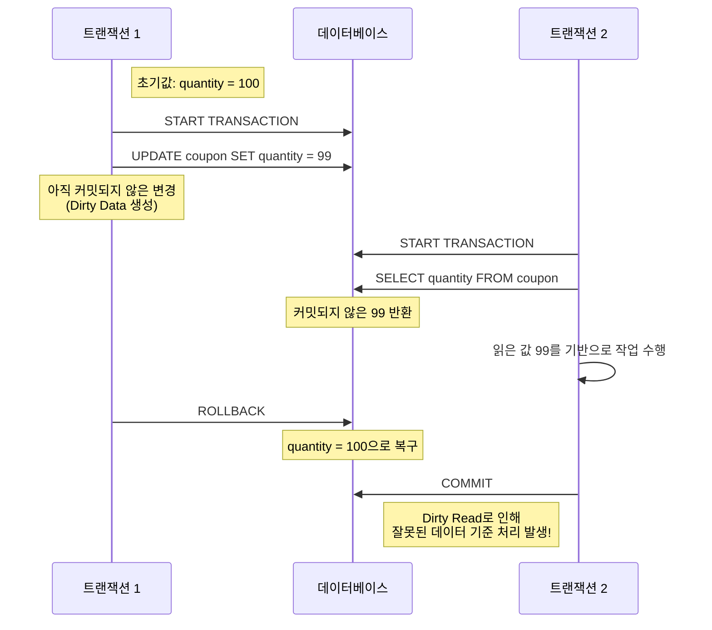
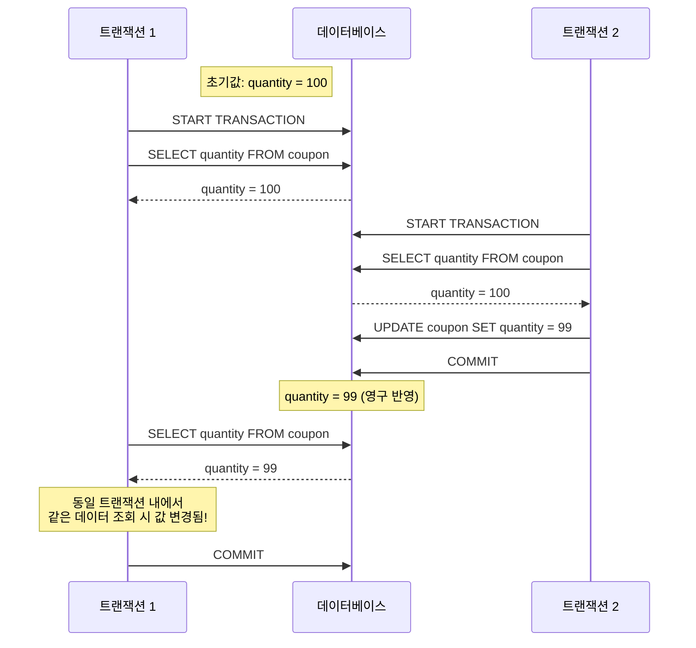
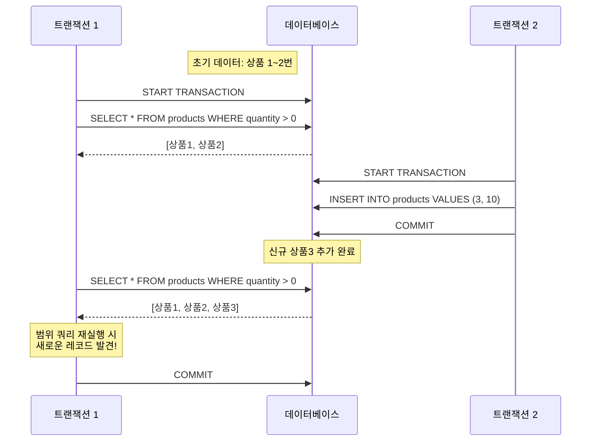

---
tags:
  - locking
  - transactioin
  - database
---
# 락의 종류
## 비관적락(perssimistic)
### 특징
비관적 락이란 DB 단에서 X-Lock(쓰기 락)을 설정해서 동시성을 제어하는 방법이다.
비관적 락을 설정하면 다른 트랙잭션은 Block이 되고 커밋될 때 까지 대기하게 된다.
이로 인해서 동시성을 제어해서 데이터의 무결성을 보장할 수 있다.
비관적락을 사용할 경우 2개 이상의 트랜잭션이 서로가 가진 락을 대기하면서 데드락이 발생할 수 있으며 타임아웃을 설정해서 트랜잭션을 롤백하고 다시 시도할 수 있다.
### 장점
- 데이터베이스에 락을 걸어 처리하므로 동시성 충돌을 완전히 방지할 수 있다.
- 트랜잭션에서 충돌 처리가 간단하다.
### 단점
- 데이터베이스 자체에 락을 거므로 성능이 떨어질 수 있다.
- 데드락이 발생할 수 있다.
- 트랜잭션이 길어질 수록 효율성이 떨어진다.
### 사용 예시
-  계좌의 잔액과 같은 민감한 금융시스템에서 사용을 한다.

## 낙관적락(optimistic)
### 특징
낙관적 락은 DB 단에서 실제 Lock을 설정하지 않고 애플리케이션 단에서 락을 처리한다.   
Version을 관리하는 컬럼을 테이블에 추가해서 데이터 수정 할 때 마다 맞는 버전의 데이터를 수정하는 지 판단하는 방식이다.
### 장점
- 실제로 DB에 락을 걸지 않기 때문에 성능이 좋다.
- 락을 걸지 않으므로 데드락도 발생하지 않는다.
### 단점
- 낙관적 락도 어플리케이션 레벨에서 롤백 로직을 처리 하므로 Scale-out에 취약할 수 있다. 
- 먼저 신청을 했어도 롤백으로 인해서 뒤로 가는 경우가 있을 수 있어서 순서가 고정되지 않을 수 있다.
- 충돌이 많이 발생하면 성능이 떨어질 수 있다.
### 사용 예시
- 상품 재고와 같이 자주 읽히지만 동시에 수정되는 경우가 드문 경우에서 사용을 한다.
## 비교 및 선택 기준
낙관적락은 충돌 가능성이 낮고 읽기 작업이 많은 환경에서 적합하고 성능적 이점이 크다. 하지만 비관적락은 충돌 가능성이 높고 데이터의 일관성이 중요한 경우에 사용이 된다.
# 락의 유형
## 읽기(공유) 락(S-Lock)
### 특징
읽기 작업을 위한 잠금이다. 여러 트랜잭션이 동시에 작업을 수행할 수 있으나 동시에 쓰기 작업은 수행할 수 없다.   
읽는 동안 수정이 되지 않도록 하는 것이다.
## 쓰기(베타) 락(X-Lock)
### 특징
쓰기 작업을 위한 잠금으로 읽기 작업과 쓰기 작업이 모두 잠기게 된다.   
쓰는 동안 수정이 되지 않도록 하는 것이다.
# 트랜잭션 레벨
## READ UNCOMMITTED
고립 수준이 가장 낮은 단계이다.   
트랜잭션은 자신이 접근하는 데이터에 대해서 아무런 S-Lock을 걸지 않는다.   
- `s-lock`을 걸지 않고 `x-lock`은 건다.
## READ COMMITTED
트랜잭션은 자신이 데이터를 읽는 동안에는 `s-lock`을 건다.   
하지만 트랜잭션이 끝나기 전에 해지가 가능하므로 `non-reapeatable read` 현상이 발생할 수 있다.
- `s-lock`을 걸긴 하지만 select문이 끝나면 바로 해지한다.
- `x-lock`은 건다.
## REPEATABLE READ
트랜잭션이 접근한 데이터에 대해서 `s-lock` 및 `x-lock`을 트랜잭션이 종료할 때 까지 유지하는 단계이다.   
하지만 다른 트랜잭션으로 부터 INSERT문을 허용하게 됨으로써 `phantom read`문제가 발생한다.
- `s-lock`을 걸고 트랜잭션 끝까지 유지한다.
- `x-lock`은 건다.
## SERIALIZABLE
격리 수준이 가장 높은 단계로 트랜잭션이 완전히 독립적으로 수행 된다.   
인덱스에 `s-lock`을 설정함으로써 다른 트랜잭션의 INSERT문이 금지된다.
- `s-lock`을 걸고 트랜잭션 끝까지 유지한다.
- `x-lock`은 건다.
# 트랜잭션 과정 중에 발생할 수 있는 문제
## Dirty Read
`READ UNCOMMITTED`레벨에서 발생할 수 있는 문제로 커밋되지 않은 데이터를 읽을 수 있는 문제가 있다.

## Non-Repeatable Read
`READ COMMITTED`레벨에서 발생할 수 있는 문제로 동일 트랜잭션에서 읽기 작업이 두 번 이상하게 되는 경우 다른 데이터를 읽게 되는 문제를 의미하게 된다.

## Phantom Read
`REPEATABLE READ`레벨에서 발생할 수 있는 문제로 하나의 트랜잭션에서  두 번의 READ를 할 때 나오는 ROW의 수가 중간의 커밋으로 인해서 변경되는 것을 의미하게 된다.

# 락 구현의 예시
[[락을 이용한 동시성 처리]]