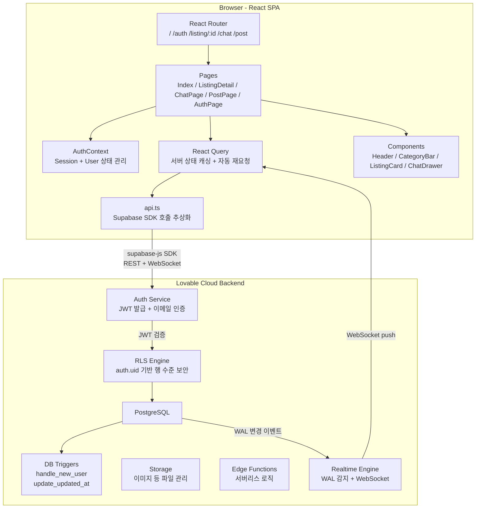
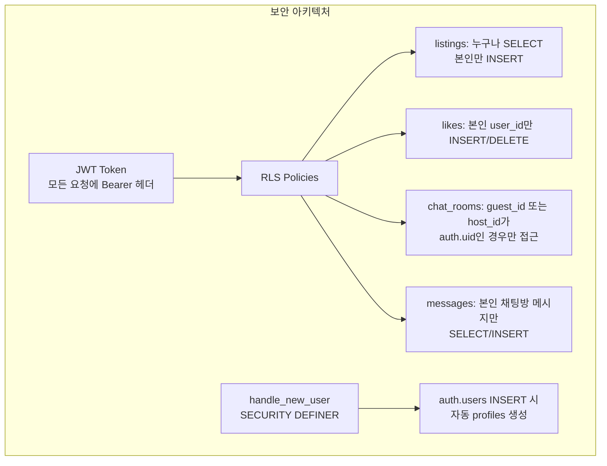

---
tags:
  - diagram
---
# 단일 채팅 프로그램

```mermaid
%%{init: {'theme': 'dark'}}%%
sequenceDiagram
    participant A as User A - Guest
    participant F as React Frontend
    participant J as Auth JWT
    participant R as RLS Policy
    participant P as PostgreSQL
    participant E as Realtime Engine
    participant B as User B - Host

    rect rgb(70, 70, 70)
        Note over A,B: 1단계 - 채팅방 생성
        A->>F: 숙소 상세에서 메시지 보내기 클릭
        F->>P: getOrCreateChatRoom(listingId, guestId, hostId)
        P-->>F: chat_room record 반환
    end

    rect rgb(70, 70, 70)
        Note over A,B: 2단계 - 메시지 전송
        A->>F: 메시지 입력 후 Enter
        F->>J: POST messages with Bearer JWT
        J->>R: auth.uid() = sender_id 검증
        R->>R: EXISTS chat_rooms WHERE guest_id OR host_id = auth.uid()
        R->>P: INSERT message
    end

    rect rgb(70, 70, 70)
        Note over A,B: 3단계 - 실시간 전달
        P->>E: WAL 변경 감지 via supabase_realtime publication
        E->>F: WebSocket push to channel room-xxx
        F->>F: setQueryData 중복 ID 체크
        F->>A: UI 업데이트 - 내 메시지 표시
        E->>B: WebSocket push to channel room-xxx
        B->>B: UI 업데이트 - 상대 메시지 표시
    end
```

## 요약
- Supabase의 RLS + Realtime을 활용한 채팅방 구조
	- RLS -> 보안 (본인만 메시지 전송 가능, 채팅창 멤버만 접근)
	- Realtime -> WebSocket 기반 양방향 실시간 메시지 전달

- 인증 부분

## ai가 추천하는 기능
현재 앱 구조를 기반으로 추가할 만한 기능 목록입니다:
### 🔍 검색 & 탐색
1. **숙소 검색 필터** — 가격 범위, 위치, 인원수, 편의시설 등 조건 필터링
2. **지도 기반 탐색** — 숙소 위치를 지도에 표시 (Mapbox/Google Maps)
3. **카테고리별 필터링** — CategoryBar 클릭 시 실제 태그 기반 필터 동작
### 🏠 숙소 관련
4. **이미지 다중 업로드** — 숙소당 여러 장의 사진 등록 + 갤러리 뷰
5. **숙소 수정/삭제** — 본인이 등록한 숙소 관리
6. **리뷰 & 별점** — 숙소별 리뷰 작성 및 평균 평점 표시
7. **예약 시스템** — 날짜 선택 + 예약 요청 + 승인/거절
### 👤 사용자
8. **프로필 페이지** — 프로필 사진, 자기소개 수정, 내 숙소/리뷰 목록
9. **소셜 로그인** — Google/카카오 로그인
10. **찜 목록 페이지** — 좋아요 누른 숙소 모아보기
### 💬 채팅
11. **읽음 표시** — 메시지 읽음/안읽음 상태
12. **안 읽은 메시지 알림 뱃지** — 헤더 채팅 아이콘에 미읽 수 표시
13. **마지막 메시지 미리보기** — 채팅 목록에서 최근 메시지 표시
### 📊 기타
14. **알림 시스템** — 새 메시지, 예약 요청 등 푸시 알림
15. **다국어 지원** — 한국어/영어 전환
16. **다크모드 토글** — 라이트/다크 테마 전환 UI
17. **관리자 대시보드** — 전체 숙소/유저 통계, 신고 관리

# 프로젝트 요약 — My Hometown (숙소 공유 플랫폼)

## 📋 목차
1. [프로젝트 개요](#프로젝트-개요)
2. [기술 스택](#기술-스택)
3. [구현된 기능](#구현된-기능)
4. [데이터베이스 스키마](#데이터베이스-스키마)
5. [주요 작업 내역](#주요-작업-내역)

---
