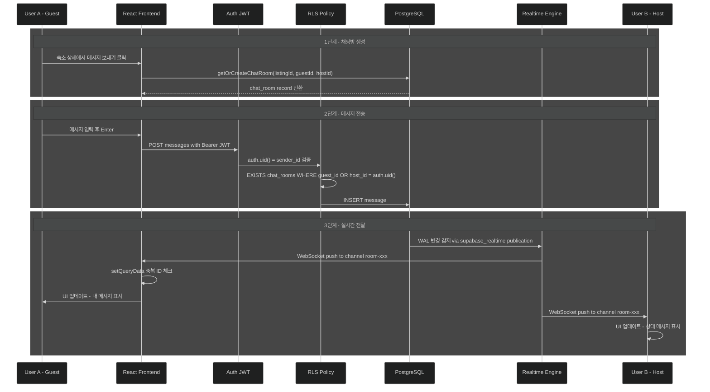

---
tags:
  - diagram
---
# 단일 채팅 프로그램

```mermaid
%%{init: {'theme': 'dark'}}%%
sequenceDiagram
    participant A as User A - Guest
    participant F as React Frontend
    participant J as Auth JWT
    participant R as RLS Policy
    participant P as PostgreSQL
    participant E as Realtime Engine
    participant B as User B - Host

    rect rgb(70, 70, 70)
        Note over A,B: 1단계 - 채팅방 생성
        A->>F: 숙소 상세에서 메시지 보내기 클릭
        F->>P: getOrCreateChatRoom(listingId, guestId, hostId)
        P-->>F: chat_room record 반환
    end

    rect rgb(70, 70, 70)
        Note over A,B: 2단계 - 메시지 전송
        A->>F: 메시지 입력 후 Enter
        F->>J: POST messages with Bearer JWT
        J->>R: auth.uid() = sender_id 검증
        R->>R: EXISTS chat_rooms WHERE guest_id OR host_id = auth.uid()
        R->>P: INSERT message
    end

    rect rgb(70, 70, 70)
        Note over A,B: 3단계 - 실시간 전달
        P->>E: WAL 변경 감지 via supabase_realtime publication
        E->>F: WebSocket push to channel room-xxx
        F->>F: setQueryData 중복 ID 체크
        F->>A: UI 업데이트 - 내 메시지 표시
        E->>B: WebSocket push to channel room-xxx
        B->>B: UI 업데이트 - 상대 메시지 표시
    end
```
## 요약
- Supabase의 RLS + Realtime을 활용한 채팅방 구조
	- RLS -> 보안 (본인만 메시지 전송 가능, 채팅창 멤버만 접근)
	- Realtime -> WebSocket 기반 양방향 실시간 메시지 전달