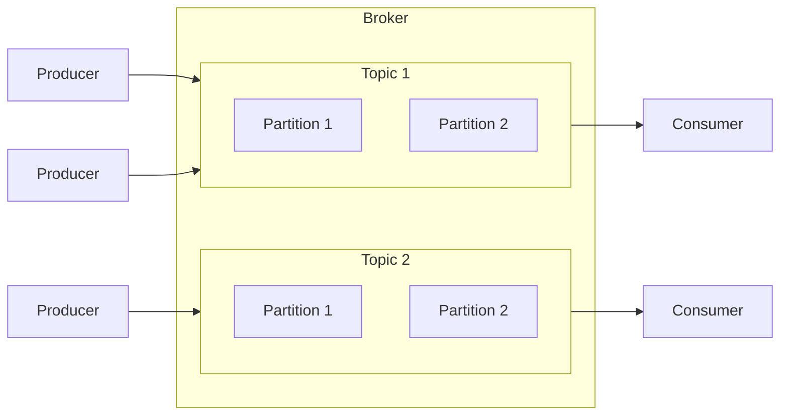
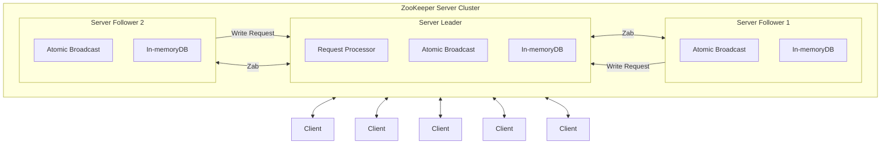

---
tags:
  - kafka
  - queue
---

# 개념 정리
카프카란 분산 스트리밍 플랫폼으로, 실시간 데이터 스트림의 수집, 저장, 처리, 분석을 목적으로 사용됩니다.
## 기본 구성 요소
- 메시지
    - 카프카를 통해서 전달되는 데이터 단위
    - 키, 데이터, 타임스태프 및 메타데이터로 구성이 된다.
- 프로듀서
    - 메시지를 생성하고 카프카에 보내는 역할을 한다.
    - 특정 토픽으로 메시지를 보낸다.
- 토픽
    - 메시지를 저장하는 장소
    - 토픽은 여러 파티션으로 나눠질 수 있으며 파티션은 메시지를 순서대로 저장한다.
- 파티션
    - 토픽을 물리적으로 나눈 단위로 파티션은 독립적으로 메시지를 저장하고 관리한다
- 키
    - 메시지를 특정 파티션에 할당하는데 사용되는 값
    - 동일한 키를 가진 메시지는 항상 동일한 파티션에 사용이 된다
- 컨슈머
    - 토픽에서 메시지를 갖고와서 처리하는 역할
    - 컨슈머는 특정 선슈머 그룹에 속하며 같은 그룹에 속한 컨슈머들은 토픽의 파티션을 분산 처리 한다
- 브로커
    - kafka 클러스터의 각 서버를 의미하며 메시지를 저장하고 전송하는 역할을 한다.

## 그래프



## 장점
- 높은 처리량과 확장성을 지원하여 대용량 데이터를 실시간으로 처리할 수 있습니다.
- 데이터 스트림을 장기간 저장하여 분석 및 재처리가 가능합니다.
- Publisher-Subscriber 구조를 통해 실시간 스트리밍 데이터를 효율적으로 전송합니다.

## 주키퍼
분산 코디네이션 서비스를 제공하는 오픈소스 프로젝트
#### 데이터 처리 방식
• Zookeeper는 처리하는 모든 데이터를 메모리에 저장하여 빠른 응답 속도를 제공합니다.
• 스냅샷 데이터는 주기적으로 로컬 디스크에 저장하여 장애 복구와 내구성을 보장합니다.
#### 각 어플리케이션의 정보를 중앙집중화 하고 아래의 서비스를 제공한다.
- 구성 관리
	- 분산 시스템의 설정 정보를 중앙에서 관리하고, 설정 변경 시 동기화 기능을 제공합니다.
- 그룹 관리 네이밍
	- 분산 환경에서 노드의 이름 지정 및 관리를 지원하며, 노드의 추가/제거를 추적합니다.
- 데이터 동기화 
	- 여러 노드 간 데이터의 일관성을 보장하며, 실시간으로 동기화 상태를 유지합니다.


### 분산 코디네이션 서비스

>ZAB(Zookeeper Atomic Broadcast protocol)
> Request Processor에서 처리한 요청을 트랜잭션을 생성하여 모든 서버에게 전파한다

Leader Follower구조를 갖게 되며 Leader가 Follower에게 동기화 명령을 내리게 된다.
주키퍼는 분산 시스템의 일부분이기 때문에 동작을 멈춘다면 분산 시스템이 멈출 수 있다. 따라서 안전성을 확보하기 위해서 홀수개의 클러스터로 구축을 한다.

### 동기화 과정
1. 클라이언트가 특정 서버에 접속하여 서버 데이터 업데이트
2. 해당 서버는 Leader 서버에 데이터가 업데이트 되었음을 전송
3. Leader 서버는 업데이트 신호를 받고, 다른 Follower 서버들에게 브로드캐스트 형식으로 전송
4. 나머지 Follower 서버들도 데이터 업데이트

## 카프카에서 주로 주키퍼를 사용하는 이유
Kafka는 Apache Zookeeper를 사용하여 클러스터를 관리합니다. 
- 브로커, 토픽, 파티션 등 Kafka의 메타데이터 정보를 저장하고 관리
-  Kafka 클러스터의 상태를 일관되게 유지
- 브로커의 실패 및 복구를 감지하는 등의 역할


## 인프라 도커 설정
### 주키퍼
```yaml
zookeeper:
	image: wurstmeister/zookeeper
	platform: linux/amd64
	ports:
	  - "2181:2181"
	environment:
	  ZOOKEEPER_CLIENT_PORT: 2181
	  # ZOOKEEPER_TICK_TIME: 2000
	  ZOOKEEPER_SERVER_ID: 1 # 이건 뭘까
```
- ZOOKEEPER_CLIENT_PORT
    - Zookeeper에 연결이 될 포트를 설정한다.
- ZOOKEEPER_SERVER_ID
    - 만약 Zookeeper를 클러스터 모드로 사용하게 될 경우 서버마다 고유한 ID를 갖고 가야 하므로 각 노드가 다른 값을 갖고 가도록 설정된다.
### Kafka
```yaml
kafka:
	image: confluentinc/cp-kafka:7.7.1.arm64
	container_name: iron-kafka
	ports:
	  - "9092:9092"
	  - "29092:29092"
	environment:
	  KAFKA_ADVERTISED_LISTENERS: INTERNAL://kafka:19092,EXTERNAL://${DOCKER_HOST_IP:-127.0.0.1}:9092,DOCKER://host.docker.internal:29092
	  KAFKA_LISTENER_SECURITY_PROTOCOL_MAP: INTERNAL:PLAINTEXT,EXTERNAL:PLAINTEXT,DOCKER:PLAINTEXT
	  KAFKA_INTER_BROKER_LISTENER_NAME: INTERNAL
	  KAFKA_ZOOKEEPER_CONNECT: "zookeeper:2181"
	  KAFKA_BROKER_ID: 1
	  KAFKA_OFFSETS_TOPIC_REPLICATION_FACTOR: 1
	depends_on:
	  - zookeeper
```

- KAFKA_ADVERTISED_LISTENERS
    - Kafka 브로커가 외부에서 접근할 수 있는 리스터를 정의하는 환경 변수
    - Kafka는 여러 네트워크에서 접근 될 수 있으므로 각 네트워크에 대해 리스너를 설정한다.
    - INTERNAL: 내부 내트워크, EXTERNAL: 로컬, DOCKER: host.docker.internal전용
- KAFKA_LISTENER_SECURITY_PROTOCOL_MAP
    - 각 리스터에 대한 보안 프로토콜을 정의하는 설정이다.
    - 현재는 내부 테스트 용이므로 보안 프로토콜을 정하지 않는다.
- KAFKA_INTER_BROKER_LISTENER_NAME
    - 카프카 브로커들 간의 통신에 사용할 리스터를 지정한다.
- KAFKA_ZOOKEEPER_CONNECT
    - 카프카는 클러스터 관리를 위해서 Zookeeper를 사용하게 되는데 이 설정을 통해서 Zookeepr와 연결할 주소와 포트를 정할 수 있다.
- KAFKA_BROKER_ID
    - 카프카 브로커의 고유 ID로 여러 브로커를 구성할 경우 각 브로커는 고유한 ID를 갖고 가야 한다.
- KAFKA_OFFSETS_TOPIC_REPLICATION_FACTOR
    - 토픽 파티션의 복제 개수
## 참고 블로그
[Kafka 개념과 Spring Boot + Kafka 간단한 연동](https://dkswnkk.tistory.com/705#google_vignette)
