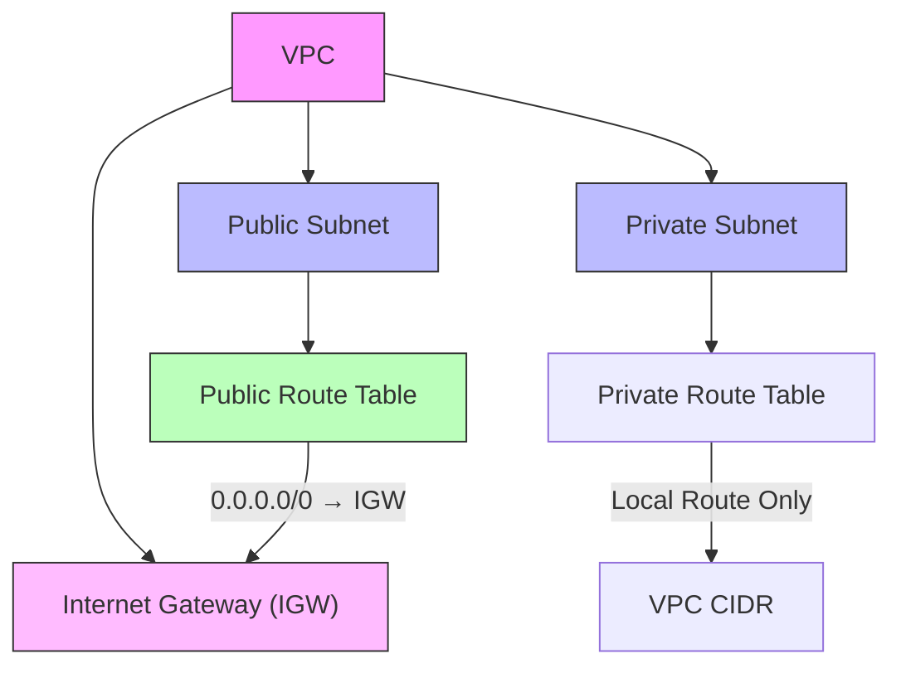

---
tags:
  - vpc
  - subnet
  - igw
  - routingTable
---
# VPC
## 개념
- AWS에서 제공하는 논리적으로 격리된 가상 네트워크
- 퍼블릭 클라우드 환경에서 내 리소스만 사용할 수 있는 독립적인 네트워크 공간을 제공하며
  IP 대역, 서브넷, 라우팅, 보안 설정 등을 직접 제어할 수 있다.
- VPC 안에 EC2, RDS, S3 등 다양한 AWS 리소스가 배치된다.
- 여러 가용영역(AZ, Availability Zone)에 걸쳐서 생성할 수 있다.
# Subnet
## 개념
- VPC 네트워크를 더 작은 개념으로 나눈 것이다.
- 각 서브넷은 특정 IP 대역(CIDR 블록)을 가집니다.
## 기준
- public subnet
	- 인터넷 게이트웨이와 연결되어 외부에서 접근 가능한 영역
- private subnet
	- 외부에서 직접 접근할 수 없고, 내부 리소스(예: DB) 보호에 사용
# 인터넷 게이트웨이(igw)
## 개념
- 인터넷 게이트웨이(IGW)는 AWS VPC(가상 사설 클라우드) 내의 리소스(EC2, RDS 등)와 외부 인터넷 간의 통신을 가능하게 해주는 네트워크 장치이다.
- VPC와 인터넷을 연결하는 출입구의 역할을 한다.
- IGW는 VPC 경계에서 동작하며, 퍼블릭 IP(또는 Elastic IP)가 할당된 인스턴스에 대해 NAT(Network Address Translation) 기능도 수행합니다.
# 라우팅 테이블
## 개념
- 라우팅 테이블은 네트워크 트래픽이 목적지에 도달하기 위해 어떤 경로를 거쳐야 하는지 정의한 표
- AWS VPC에서는 서브넷과 연결되어, 해당 서브넷의 리소스가 트래픽을 어디로 보낼지 결정한다.
## igw와의 관계
- 반드시 서브넷이 연결된 라우팅 테이블에 IGW로 향하는 경로(0.0.0.0/0 → IGW)가 있어야 한다.
- IGW 경로가 없는 서브넷은 인터넷 통신이 불가능하며, 이를 프라이빗 서브넷이라 부른다.

# 네트워크 구조 관계
## 다이어그램

## 특징
- 퍼블릭 서브넷은 명시적으로 Public Route Table과 연결됨
- 0.0.0.0/0 규칙으로 모든 외부 트래픽을 IGW로 전달
- 메인 라우트 테이블은 VPC 생성 시 자동 생성되며, 명시적 연결이 없는 서브넷에 적용
- 로컬 라우트는 VPC 내부 통신을 위해 항상 존재