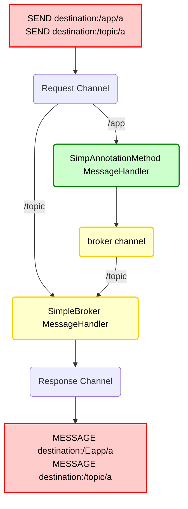

---
tags:
  - webSocket
  - stomp
draft: "false"
---
# Spring에서 Socket 기본 설정
## 기본 연결을 위한 Spring 설정
### WebSocketHandler
WebSocket 메시지를 처리하는 핸들러 구현   
클라이언트가 메시지를 전송하면 서버에서 메시지를 받아 로그를 출력하고 응답 메시지를 다시 클라이언트에 보낸다.
```Java
public class MyHandler extends TextWebSocketHandler {  
  
    @Override  
    protected void handleTextMessage(WebSocketSession session, TextMessage message)  
        throws Exception {  
		// 외부에서 보내는 입력을 확인 하기 위함
        String payload = message.getPayload();  
		System.out.println(payload);  

		// 받은 입력에 대한 답장을 전달
		session.sendMessage(new TextMessage("re : " + payload)); 
    }  
}
```
### WebSocketConfiguration
@EnableWebSocket : WebSocket 기능을 활성화하는 어노테이션   
registerWebSocketHandlers() : `/ws/${SOCKET URL}` URL을 WebSocket 핸들러에 매핑   
myHandler() : MyHandler를 WebSocket 핸들러로 등록
```Java
@Configuration  
@EnableWebSocket  
public class WebSocketConfig implements WebSocketConfigurer {  
  
    @Bean  
    public WebSocketHandler myHandler() {  
        return new MyHandler();  
    }
  
    @Override  
    public void registerWebSocketHandlers(WebSocketHandlerRegistry registry) {  
        registry.addHandler(myHandler(), "/${SOCKET URL}");  
  
    }  
  
}
```


# STOMP를 사용해서 Spring 연결
[[STOMP란]] 
## STOMP 사용가능하게 설정
외부와 연결된 socket url을 아래와 같이 설정해준다.
```Java
@Configuration  
@EnableWebSocketMessageBroker  
public class WebSocketStompConfig implements WebSocketMessageBrokerConfigurer {  
  
    @Override  
    public void registerStompEndpoints(StompEndpointRegistry registry) {  
        registry.addEndpoint("stomp-socket");  
    }  
  
	// 헤더에 따라서 메세지를 라우팅해준다.
    @Override  
    public void configureMessageBroker(MessageBrokerRegistry registry) {  
        // 목적지 헤더가 /app으로 시작되는 STOMP 메시지는 다음으로 라우팅 된다.  
        registry.setApplicationDestinationPrefixes("/app");  
  
        // 목적지 헤더가 topic, queue로 시작되는 메시지를 브로커에게 라우팅한다.  
        registry.enableSimpleBroker("/topic", "/queue");  
    }  
}
```
### sock.js를 사용한 소켓 통신 보완
- 클라이언트와 서버가 WebSocket으로 연결을 시도할 때, 브라우저나 네트워크 환경에 따라 WebSocket 프로토콜이 지원되지 않을 수 있다
- 이런 상황에서 정상적으로 양방향 통신을 할 수 있도록 하는 fallback(대체 통신) 기능을 활성화하는 설정이다.
- SockJS를 적용하면, 클라이언트가 우선 WebSocket으로 연결을 시도하지만, 브라우저가 WebSocket을 지원하지 않거나 방화벽, 프록시 등 환경적 제약으로 실패하면, HTTP Streaming, HTTP Long Polling 등 SockJS가 제공하는 다양한 대체 방식으로 자동 전환하여 메시지 통신을 이어나간다.
- SockJS 활성화 시 클라이언트와 서버 양쪽이 모두 SockJS 프레이밍을 기반으로 통신해야 한다
- 예시 코드
```Java
@Override  
public void registerStompEndpoints(StompEndpointRegistry registry) {  
    registry.addEndpoint("socket/chat").withSockJS();  
}
```
## 메시지의 전송 관련 설정
```Java
@Override
public void configureWebSocketTransport(WebSocketTransportRegistration registry) {
	// 전송할 수 있는 메시지의 최대 크기
	registry.setMessageSizeLimit(4 * 8192);
	
	// 첫 메시지의 타임아웃을 설정한다.
	// 처음 연결 이후 지정된 시간 만큼 메시지가 오지 않으면 연결을 끊는다.
	registry.setTimeToFirstMessage(30000);
}
```
## 서버 내부의 메시지 흐름
내장 메시지 브로커가 활성화 될 때 사용되는 구성요소이다.   
만약 외부 Broker을 사용하고 싶으면 SimpleBroker에서 외부와 연결하면 된다.    
(SimpleBroker -> StompBrokerRelay)

### 위의 다이어그램에서 3가지의 채널이 표시된다.
- clientInboundChannel(request)
	- WebSocket 클라이언트로부터 받은 메시지를 전달한다.
- clientOutboundChannel(response)
	- WebSocket 클라이언트에 서버 메시지를 전송한다.
- brokerChannel
	- 서버 측 애플리케이션 코드 내에서 메시지 브로커에 메시지를 전송한다.

WebSocket에 연결되서 메시지가 수신이 되면 STOMP 프레임으로 디코딩되고 스프링 메시지 표현으로 변경이 되면서 `clientboundChannel`로 전송되어서 처리가 된다.   
예를 들어, 대상 헤더가 `/app`으로 시작되는 STOMP 메시지는 `@MessageMapping` 메서드로 전달이 될 수 있지만 `/topic`, `/queue` 메시지는 메시지 브로커로 직접 라우팅 될 수 있다.   
	
## Controller에서 Socket에서 보낸 메시지 받기
클라이언트에서 보낸 Socket 메시지를 받기 위해서 아래와 같이 Controller를 설정한 다음에 아래와 같이 받기 원하는 url을 설정해준다.    
이후 클라이언트에서 요청할 때에는 `setApplicationDestinationPrefixes`에서 설정한 url에 더해서 아래 Mapping url을 연결해서 보내 주면 된다.
```Java
@RestController  
public class ChatSocketController {  
  
    @MessageMapping("/chat")  
    @SendTo("/topic/chat")  
    public String handler(String greeting) {  
        return "[" + getTimestamp() + ": " + greeting + "]";  
    }  
  
    private String getTimestamp() {  
        return new SimpleDateFormat("MM/dd/yyyy h:mm:ss a").format(new Date());  
    }  
}
```
아래는 예시 STOMP 메시지
```text
SEND
destination:/app/chat
content-length:23

"{\"user\":\"userOne\"}"[null]
```

### 클라이언트에서 구독하기
Controller에서 처리한 메시지를 클라이언트에서 받기 위해서는 먼저 전달하기 위한 구독 URL을 `sendTo` 어노테이션을 이용해서 설정을 해줘야 한다.   
```Java
@MessageMapping("/chat")  
@SendTo("/topic/chat")  
public String handler(String greeting) {  
	return "[" + getTimestamp() + ": " + greeting + "]";  
}  
```

#### 구독 처리시 주의 사항
클라이언트가 구독할 때는 `enableSimpleBroker("/topic", "/queue")`로 설정된 경로를 구독해야 한다. 
처음에 잘 모르고 설정할 때 어떤 URL이라도 된다고 생각하고 임의의 URL을 설정했었으나 클라이언트에서 메시지를 받을 수 없는 상황이 있었고 위와 같이 Broker에 연결된 url로 설정한 이후에 클라이언트에서 데이터를 받을 수 있었다.

## Spring Eureka 웹 소켓 Gateway 프록시 하기
### yaml 파일로 설정하기
config파일을 아래와 같이 설정을 함으로써 프록시 설정을 한다.
```yaml
spring:
  cloud:
    gateway:
      routes:
        - id: websocket-route
          uri: lb://USER-SERVICE
          predicates:
            - Path=/stomp-socket
          filters:
            - RemoveRequestHeader=Cookie
            - name: AuthorizationHeaderFilter
              args: {}
```
### Java 코드로 설정하기
아래와 같이 들어오는 route에서 라우팅 할 수 있는 위치를 지정할 수 있다.
```Java
@Bean  
public RouteLocator gatewayRoutes(RouteLocatorBuilder builder) {  
    return builder.routes()
		// socket 연결  
		.route("websocket-route", r -> r.path("/stomp-socket")  
		    .filters(f -> f  
		        .filter(authorizationHeaderFilter.apply(  
		            new AuthorizationHeaderFilter.Config()))  
		    )  // 필터 팩토리로 필터 생성  
		    .uri("lb://USER-SERVICE"))
```

# 구독한 클라이언트에게 메시지 전달
## SendTo
### 장점
- 선언적 프로그래밍으로 컨트롤러의 메소드의 반환값을 자동으로 전송해준다.
- 추가 템플릿을 주입할 필요 없이 어노테이션만 설정해주만 사용이 가능하다
- 컴파일 타임에서 검증이 가능하다.
### 단점
- 동적으로 라우팅이 불가능하다.
- 컨트롤러에서만 사용이 가능하다.
- 클라이언트의 요청에 대한 응답으로만 동작이 가능하다.
### 사용처
- 실시간 채팅창 메시지 알림(전체 알림)
- 주식 시세와 같은 정기적인 알림에서 사용
## SimpleMessagingTemplate
### 장점
- 어느 컴포넌트에서나 사용이 가능해서 유연한 메시지 전송이 기능하다.
- 세션 ID 기반으로 전송이 가능하다.
- 별도 스레드 풀을 사용해서 비동기로 전송이 가능하다.
### 단점
- 잘못된 destination 지정 시 디버깅에 어려움이 있어서 런타임 오류 가능성이 있다.
- 메시징 로직이 여러 컴포넌트에 분산될 수 있다.
### 사용처
- 사용자별 개인 메시지 알림 전송


# Web Socket의 토큰 인증
STOMP 메시지 프로토콜레벨에서는 헤더를 이용해서 토큰 인증이 가능하다.
1. STOMP 클라이언트를 사용해서 연결 시간에 인증 헤더를 전달한다.
2. `ChannelInterceptor`를 이용해서 인증헤더를 처리한다.

일반적인 http을 이용해서 header를 접근 할 경우 STOMP클라이언트로 전송된 헤더로 접근할 수가 없다. 따라서 아래와 같이 Spring Stomp에서 제공하는 interceptor를 사용해서 헤더에 접근해서 인증할 수 있다.
```Java
/*
	message: 클라이언트가 전송한 메시지 객체
	channel: 메시지가 전달이 될 채널
*/
@Override  
public Message<?> preSend(Message<?> message, MessageChannel channel) {  
	//STOMP 헤더를 더 쉽게 다룰 수 있도록 감싸준다.
    StompHeaderAccessor accessor = StompHeaderAccessor.wrap(message);  

	// 클라이언트가 WebSocket 연결을 시도할 때(CONNECT 프레임이 들어올 때) 실행되는 것을 의미한다.
    if (StompCommand.CONNECT.equals(accessor.getCommand())) {  
        String authHeader = accessor.getFirstNativeHeader("Authorization");  
        // 위에서 뽑아온 헤더를 확인할 수 있다.
        if (authHeader == null || !authHeader.startsWith("Bearer ")) {  
            throw new IllegalArgumentException("Missing or invalid Authorization header");  
        }
    }
}
```

> #### STOMP 존재하는 주요 프레임
>- CONNECT: 클라이언트가 서버에 WebSocket 연결 요청.
>- SUBSCRIBE: 특정 채널을 구독.
>- SEND: 메시지를 전송.
>- DISCONNECT: 연결 종료.
>- ... 이외에도 더 있다.

## 인터셉터와 EventHandler의 우선 순위
아래와 같이 접속 시 구분하는 코드가 있다고 했을 때
```Java
// 인터셉터로 소켓 연결 확인
@RequiredArgsConstructor  
@Component  
public class UserChatRoomJwtInterceptor implements ChannelInterceptor {

	@Override  
	public Message<?> preSend(Message<?> message, MessageChannel channel) {
		StompHeaderAccessor accessor = StompHeaderAccessor.wrap(message);  
  
		// 접속할 때에만 token 검증  
		if (StompCommand.CONNECT.equals(accessor.getCommand())) {
			...
		}
	}

}

// 이벤트 리스터로 소켓 연결 확인
@EventListener(SessionConnectEvent.class)  
public void onConnect(SessionConnectEvent event) {  
    StompHeaderAccessor accessor = StompHeaderAccessor.wrap(event.getMessage()); 
    ...
    }  
}
```
`ChannelInterceptor`와 `@EventListener(SessionConnectEvent.class)`를 사용해서 소켓이 연결 되었을 때 어떤 부분이 먼저 호출되는지 확인해 본 결과 `ChannelInterceptor`가 먼저 호출되는 것을 확인할 수 있었다.   
# 소켓 에러 핸들링
## SubProtocolErrorHandler
- WebSocket의 하위 프로토콜(STOMP 등) 통신 중 발생하는 에러를 처리하기 위한 인터페이스
```Java
public interface SubProtocolErrorHandler<P> {
    /**
     * 클라이언트 메시지 처리 중 발생한 에러를 처리
     * @param clientMessage 에러와 관련된 클라이언트 메시지 (null 가능)
     * @param ex 발생한 예외 (항상 존재)
     * @return 클라이언트에게 보낼 에러 메시지 (null이면 메시지 전송 안함)
     */
    @Nullable
    Message<P> handleClientMessageProcessingError(@Nullable Message<P> clientMessage, Throwable ex);

    /**
     * 서버에서 클라이언트로 전송되는 에러 메시지를 처리
     * @param errorMessage 서버에서 전송될 에러 메시지
     * @return 클라이언트에게 보낼 에러 메시지 (null이면 메시지 전송 안함)
     */
    @Nullable
    Message<P> handleErrorMessageToClient(Message<P> errorMessage);
}
```
## StompSubProtocolErrorHandler
- Spring에서 제공하는 STOMP 프로토콜용 기본 에러 핸들러
### 주요 특징
- **ERROR 프레임 생성** 
	- 클라이언트 메시지 처리 중 에러 발생 시 STOMP ERROR 프레임을 생성합니다.
- **Receipt ID 처리** 
	- 클라이언트가 보낸 메시지에 receipt ID가 있다면 에러 응답에도 포함합니다.
- **빈 페이로드**
	- 기본적으로 빈 바이트 배열을 페이로드로 사용합니다.
### 메소드 별 동작
#### handleClientMessageProcessingError
```Java
public Message<byte[]> handleClientMessageProcessingError(@Nullable Message<byte[]> clientMessage, Throwable ex) {
    // 1. ERROR 명령어로 STOMP 헤더 접근자 생성
    StompHeaderAccessor accessor = StompHeaderAccessor.create(StompCommand.ERROR);
    ...

    // 2. 클라이언트 메시지에서 receipt ID 추출 및 설정
    StompHeaderAccessor clientHeaderAccessor = null;
    ...

    // 3. 내부 처리 메서드 호출
    return handleInternal(accessor, EMPTY_PAYLOAD, ex, clientHeaderAccessor);
}
```
#### handleErrorMessageToClient
```Java
public Message<byte[]> handleErrorMessageToClient(Message<byte[]> errorMessage) {
    // 1. 기존 에러 메시지에서 STOMP 헤더 접근자 추출
    StompHeaderAccessor accessor = MessageHeaderAccessor.getAccessor(errorMessage, StompHeaderAccessor.class);
    Assert.notNull(accessor, "No StompHeaderAccessor");
    
    // 2. 변경 가능한 상태로 만들기
    if (!accessor.isMutable()) {
        accessor = StompHeaderAccessor.wrap(errorMessage);
    }
    
    // 3. 내부 처리 메서드 호출
    return handleInternal(accessor, errorMessage.getPayload(), null, null);
}
```

## 에러 처리 과정
###  연결을 유지하면서 에러 알림
- 일반적인 메시지 처리 에러의 경우 연결을 끊지 말고 일반 메시지로 에러를 전달
```Java
// 에러를 일반 메시지로 전달 (연결 유지)
@MessageMapping("/chat/send")
public void handleMessage(@Payload ChatMessage message, Principal principal) {
    try {
        // 메시지 처리 로직
        chatService.processMessage(message);
    } catch (ChatException e) {
        // ERROR 헤더 대신 일반 메시지로 에러 응답
        template.convertAndSendToUser(
            principal.getName(),
            "/queue/errors",  // 에러 전용 큐
            ErrorResponse.builder()
                .type("CHAT_ERROR")
                .message("메시지 처리 중 오류가 발생했습니다.")
                .build()
        );
    }
}
```
### 연결을 끊어야 하는 심각한 에러
- 인증과 같은 심각한 오류의 경우 소켓을 차단한다.
```Java
public Message<byte[]> handleClientMessageProcessingError(
    @Nullable Message<byte[]> clientMessage, Throwable ex) {
    
    Throwable rootCause = getRootCause(ex);
    
    if (rootCause instanceof UserException) {
        // 인증/권한 에러 - 연결 종료 필요
        StompHeaderAccessor accessor = StompHeaderAccessor.create(StompCommand.ERROR);
        accessor.setMessage("인증이 필요합니다. 연결을 종료합니다.");
        return handleInternal(accessor, EMPTY_PAYLOAD, ex, null);
    } else {
        // 일반 에러 - 연결 유지하며 에러 응답
        return handleGeneralError(rootCause, clientMessage);
    }
}
```
### 에러 전용 엔드포인트를 아래와 같이 선언할 수 있다.
```Java
@Component
@RequiredArgsConstructor
public class SocketErrorHandler {
    
    private final SimpMessagingTemplate template;
    
    // 연결을 유지하면서 에러 전달
    public void sendErrorToUser(String sessionId, String errorType, String message) {
        template.convertAndSendToUser(
            sessionId,
            "/queue/errors",
            Map.of(
                "type", errorType,
                "message", message,
                "timestamp", System.currentTimeMillis()
            )
        );
    }
    //...
}

```
# Socket 적용 중에 발생한 문제
## STOMP 헤더에 addNativeHeader를 추가했는데 controller에서 못차는 경우
### 문제 접근
소켓의 인증을 구현하기 위해서 소켓이 연결되었을 때 JWT 토큰에서 userId를 갖고 와서 Header에 넣어 주고 Controller 및 `@EventListener`에서 userId를 접근 하려고 하였다.   
이를 위해서 `StompHeaderAccessor`에서 `addNativeHeader`를 사용해서 Header에 추가를 해줬다.
```Java
StompHeaderAccessor accessor = StompHeaderAccessor.wrap(message);  
  
// 접속할 때에만 token 검증  
if (StompCommand.CONNECT.equals(accessor.getCommand())) {  
	... // 비즈니스 로직

	// accessor 헤더에 유저 정보를 넘겨준다.
	accessor.addNativeHeader("userId", dto.userId());

}
```
이후 Controller에서 아래와 같이 접근하려고 하였으나 계속 null로 나왔다.
```Java
        String userId = (String) accessor
	        .getSessionAttributes().get("senderUserId");
```
### 해결 방법 및 과정
```Java
// Interceptor에서 userId를 넣어주는 방법
accessor.getSessionAttributes().put("userId", dto.userId());


// 아래와 같이 접근 하게 된다.
sessions.put(sessionId, (String) accessor.getSessionAttributes().get("userId"));
```
addNativeHeader를 이용해서 헤더에 추가를 하면 STMOP 메시지의 헤더에 저장이 된다. 그러나 native header는 자동으로 WebSocket session의 attributes에 복사되거나 매핑되지 않습니다
따라서 sessionAttributes를 사용해서 전달하는 방식으로 처리할 수 있다.

### Header의 특징
- **Native Header의 특성**  
	- STOMP 프로토콜에서 native header는 클라이언트가 처음에 전송한 헤더를 의미하며, 이 값들은 메시지 변환 시점에 파싱되고 그 상태로 어플리케이션에 전달됩니다. 
	- interceptor나 특정 이벤트에서 `setNativeHeader("userId", "Hello world")`로 값을 추가하더라도 이 변경 사항은 현재 메시지 처리 흐름 내에서만 적용되고, 이후 컨트롤러에 도달하는 별도의 메시지 accessor에는 반영되지 않습니다.
    
- **메시지 재구성**  
	- WebSocket 메시지는 내부적으로 여러 단계의 변환 과정을 거치며, interceptor에서 수정한 header 값은 최초 CONNECT 프레임에서만 유효합니다. 
	- 즉, 컨트롤러로 도달하는 메시지는 클라이언트가 전송한 원본 header와 새로운 어태치먼트가 합쳐진 형태로 변환되기 때문에 interceptor에서 임의로 추가한 native header는 사라집니다.
# 소켓 에서 이벤트 캐치하기
## 구독 연결 시
-  SessionSubscribeEvent
	- 이벤트에 sessionId, subscriptionId, destination (예: /topic/room/123)이 포함
```Java
@EventListener
public void onSubscribe(SessionSubscribeEvent ev) {
	StompHeaderAccessor acc = StompHeaderAccessor.wrap(ev.getMessage());
	String sid = acc.getSessionId();
	String subId = acc.getNativeHeader("id").get(0);
}
```
## 구독 해제 시
- SessionUnsubscribeEvent
	- subscriptionId와 sessionId는 포함되지만, 대부분의 경우 destination은 null
```Java
@EventListener
public void onUnsubscribe(SessionUnsubscribeEvent ev) {
	StompHeaderAccessor acc = StompHeaderAccessor.wrap(ev.getMessage());
	String sid = acc.getSessionId();
	String subId = acc.getNativeHeader("id").get(0);
}
```


