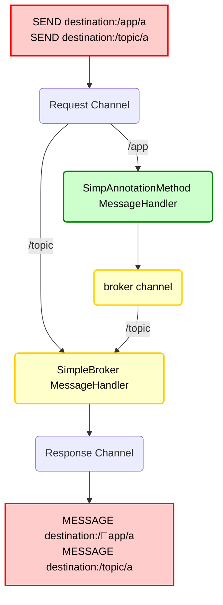

---
tags:
  - webSocket
  - stomp
draft: "false"
---
# Spring에서 Socket 기본 설정
## 기본 연결을 위한 Spring 설정
### WebSocketHandler
WebSocket 메시지를 처리하는 핸들러 구현   
클라이언트가 메시지를 전송하면 서버에서 메시지를 받아 로그를 출력하고 응답 메시지를 다시 클라이언트에 보낸다.
```Java
public class MyHandler extends TextWebSocketHandler {  
  
    @Override  
    protected void handleTextMessage(WebSocketSession session, TextMessage message)  
        throws Exception {  
		// 외부에서 보내는 입력을 확인 하기 위함
        String payload = message.getPayload();  
		System.out.println(payload);  

		// 받은 입력에 대한 답장을 전달
		session.sendMessage(new TextMessage("re : " + payload)); 
    }  
}
```
### WebSocketConfiguration
@EnableWebSocket : WebSocket 기능을 활성화하는 어노테이션   
registerWebSocketHandlers() : `/ws/${SOCKET URL}` URL을 WebSocket 핸들러에 매핑   
myHandler() : MyHandler를 WebSocket 핸들러로 등록
```Java
@Configuration  
@EnableWebSocket  
public class WebSocketConfig implements WebSocketConfigurer {  
  
    @Bean  
    public WebSocketHandler myHandler() {  
        return new MyHandler();  
    }
  
    @Override  
    public void registerWebSocketHandlers(WebSocketHandlerRegistry registry) {  
        registry.addHandler(myHandler(), "/${SOCKET URL}");  
  
    }  
  
}
```


# STOMP를 사용해서 Spring 연결
## STOMP 사용가능하게 설정
외부와 연결된 socket url을 아래와 같이 설정해준다.
```Java
@Configuration  
@EnableWebSocketMessageBroker  
public class WebSocketStompConfig implements WebSocketMessageBrokerConfigurer {  
  
    @Override  
    public void registerStompEndpoints(StompEndpointRegistry registry) {  
        registry.addEndpoint("stomp-socket");  
    }  
  
    // TODO: 테스트를 한 번 해본다.
	// 헤더에 따라서 메세지를 라우팅해준다.
    @Override  
    public void configureMessageBroker(MessageBrokerRegistry registry) {  
        // 목적지 헤더가 /app으로 시작되는 STOMP 메시지는 다음으로 라우팅 된다.  
        registry.setApplicationDestinationPrefixes("/app");  
  
        // 목적지 헤더가 topic, queue로 시작되는 메시지를 브로커에게 라우팅한다.  
        registry.enableSimpleBroker("/topic", "/queue");  
    }  
}
```
## 메시지의 전송 관련 설정
```Java
@Override
public void configureWebSocketTransport(WebSocketTransportRegistration registry) {
	// 전송할 수 있는 메시지의 최대 크기
	registry.setMessageSizeLimit(4 * 8192);
	
	// 첫 메시지의 타임아웃을 설정한다.
	// 처음 연결 이후 지정된 시간 만큼 메시지가 오지 않으면 연결을 끊는다.
	registry.setTimeToFirstMessage(30000);
}
```
## 서버 내부의 메시지 흐름
내장 메시지 브로커가 활성화 될 때 사용되는 구성요소이다.   
만약 외부 Broker을 사용하고 싶으면 SimpleBroker에서 외부와 연결하면 된다.    
(SimpleBroker -> StompBrokerRelay)

### 위의 다이어그램에서 3가지의 채널이 표시된다.
- clientInboundChannel(request)
	- WebSocket 클라이언트로부터 받은 메시지를 전달한다.
- clientOutboundChannel(response)
	- WebSocket 클라이언트에 서버 메시지를 전송한다.
- brokerChannel
	- 서버 측 애플리케이션 코드 내에서 메시지 브로커에 메시지를 전송한다.

WebSocket에 연결되서 메시지가 수신이 되면 STOMP 프레임으로 디코딩되고 스프링 메시지 표현으로 변경이 되면서 `clientboundChannel`로 전송되어서 처리가 된다.   
예를 들어, 대상 헤더가 /app으로 시작되는 STOMP 메시지는 `@MessageMapping` 메서드로 전달이 될 수 있지만 `/topic`, `/queue` 메시지는 메시지 브로커로 직접 라우팅 될 수 있다.   
	
## Controller에서 Socket에서 보낸 메시지 받기
클라이언트에서 보낸 Socket 메시지를 받기 위해서 아래와 같이 Controller를 설정한 다음에 아래와 같이 받기 원하는 url을 설정해준다.    
이후 클라이언트에서 요청할 때에는 `setApplicationDestinationPrefixes`에서 설정한 url에 더해서 아래 Mapping url을 연결해서 보내 주면 된다.
```Java
@RestController  
public class ChatSocketController {  
  
    @MessageMapping("/chat")  
    @SendTo("/topic/chat")  
    public String handler(String greeting) {  
        return "[" + getTimestamp() + ": " + greeting + "]";  
    }  
  
    private String getTimestamp() {  
        return new SimpleDateFormat("MM/dd/yyyy h:mm:ss a").format(new Date());  
    }  
}
```
아래는 예시 STOMP 메시지
```text
SEND
destination:/app/chat
content-length:23

"{\"user\":\"userOne\"}"[null]
```

### 클라이언트에서 구독하기
Controller에서 처리한 메시지를 클라이언트에서 받기 위해서는 먼저 전달하기 위한 구독 URL을 `sendTo` 어노테이션을 이용해서 설정을 해줘야 한다.   
```Java
@MessageMapping("/chat")  
@SendTo("/topic/chat")  
public String handler(String greeting) {  
	return "[" + getTimestamp() + ": " + greeting + "]";  
}  
```

#### 구독 처리시 주의 사항
클라이언트가 구독할 때는 enableSimpleBroker("/topic", "/queue")로 설정된 경로를 구독해야 한다.   
처음에 잘 모르고 설정할 때 어떤 URL이라도 된다고 생각하고 임의의 URL을 설정했었으나 클라이언트에서 메시지를 받을 수 없는 상황이 있었고 위와 같이 Broker에 연결된 url로 설정한 이후에 클라이언트에서 데이터를 받을 수 있었다.

## Spring Eureka 웹 소켓 Gateway 프록시 하기
### yaml 파일로 설정하기
config파일을 아래와 같이 설정을 함으로써 프록시 설정을 한다.
```yaml
spring:
  cloud:
    gateway:
      routes:
        - id: websocket-route
          uri: lb://USER-SERVICE
          predicates:
            - Path=/stomp-socket
          filters:
            - RemoveRequestHeader=Cookie
            - name: AuthorizationHeaderFilter
              args: {}
```
### Java 코드로 설정하기
아래와 같이 들어오는 route에서 라우팅 할 수 있는 위치를 지정할 수 있다.
```Java
@Bean  
public RouteLocator gatewayRoutes(RouteLocatorBuilder builder) {  
    return builder.routes()
		// socket 연결  
		.route("websocket-route", r -> r.path("/stomp-socket")  
		    .filters(f -> f  
		        .removeRequestHeader("Cookie")  
		        .filter(authorizationHeaderFilter.apply(  
		            new AuthorizationHeaderFilter.Config()))  
		    )  // 필터 팩토리로 필터 생성  
		    .uri("lb://USER-SERVICE"))
```


# Web Socket의 토큰 인증
STOMP 메시지 프로토콜레벨에서는 헤더를 이용해서 토큰 인증이 가능하다.
1. STOMP 클라이언트를 사용해서 연결 시간에 인증 헤더를 전달한다.
2. `ChannelInterceptor`를 이용해서 인증헤더를 처리한다.

일반적인 http을 이용해서 header를 접근 할 경우 STOMP클라이언트로 전송된 헤더로 접근할 수가 없다. 따라서 아래와 같이 Spring Stomp에서 제공하는 interceptor를 사용해서 헤더에 접근해서 인증할 수 있다.
```Java
/*
	message: 클라이언트가 전송한 메시지 객체
	channel: 메시지가 전달이 될 채널
*/
@Override  
public Message<?> preSend(Message<?> message, MessageChannel channel) {  
	//STOMP 헤더를 더 쉽게 다룰 수 있도록 감싸준다.
    StompHeaderAccessor accessor = StompHeaderAccessor.wrap(message);  

	// 클라이언트가 WebSocket 연결을 시도할 때(CONNECT 프레임이 들어올 때) 실행되는 것을 의미한다.
    if (StompCommand.CONNECT.equals(accessor.getCommand())) {  
        String authHeader = accessor.getFirstNativeHeader("Authorization");  
        // 위에서 뽑아온 헤더를 확인할 수 있다.
        if (authHeader == null || !authHeader.startsWith("Bearer ")) {  
            throw new IllegalArgumentException("Missing or invalid Authorization header");  
        }
    }
}
```

> #### STOMP 존재하는 주요 프레임
>- CONNECT: 클라이언트가 서버에 WebSocket 연결 요청.
>- SUBSCRIBE: 특정 채널을 구독.
>- SEND: 메시지를 전송.
>- DISCONNECT: 연결 종료.
>- ... 이외에도 더 있다.