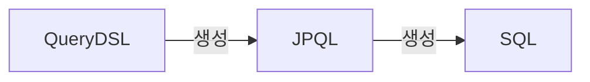

---
tags:
  - spring/querydsl
---

## 개념
QueryDSL은 하이버네이트 쿼리 언어(HQL: Hibernate Query Language)의 쿼리를 타입에 안전하게 생성 및 관리해주는 프레임워크다.  
QueryDSL은 정적 타입을 이용하여 SQL과 같은 쿼리를 생성할 수 있게 해준다.
## 사용하는 이유
기존의 JPQL을 사용하거나 Spring Data Jpa를 사용하게 되면 기본적으로 String 형식으로 들어가게 되어서 컴파일 상에서 문제가 발생하는지 확인이 불가능하다. ⇒ String을 보고 Type 체크도 불가능하며 중간에 Space 여부도 확인이 불가능해서 `"from p__table" + "where id = 1";` 와 같이 String을 사용할 경우 에러가 발생할 경우도 많다.

이를 위해서 Type Safe 즉 컴파일 상에서 에러 체크를 가능하게 하는 것이 QueryDSL이다.

또한 조건에 따른 동적 쿼리를 작성하기 위해서는 조건문을 사용해서 String 문자열을 다뤄서 런타임에러가 발생할 확률이 거나 경우에 수에 맞춰서 모든 쿼리를 작성하는 등 비효율 적으로 코드를 작성해야 했다.

이를 해결하기 위해서 QueryDSL은 `BooleanBuilder`를 사용해서 where 조건을 간편히 적용할 수 있다.
### 장점
- 쿼리 및 도메인 특화 언어
- 단순하고 간결하게 작성할 수 있다.
- 타입을 확인하면서 조립할 수 있다.
### 단점
- 쿼리를 작성하기 전에 빌드를 해서 Q코드를 생성해야 함
- 설정이 귀찮음
### 동작 방식

### 설정 방법
아래와 같이 `build.gradle`에 코드를 추가해 준다.
```gradle
dependencies {
 //Querydsl 추가
  implementation 'com.querydsl:querydsl-jpa:5.0.0:jakarta'
  annotationProcessor "com.querydsl:querydsl-apt:${dependencyManagement.importedProperties['querydsl.version']}:jakarta"
  annotationProcessor "jakarta.annotation:jakarta.annotation-api"
  annotationProcessor "jakarta.persistence:jakarta.persistence-api"
}
```

QueryDSL은 build마다 자동으로 생성이 되야 하기 때문에 clean을 실행 시 기존의 파일들을 지우기 위한 코드
QueryDSL을 사용하기 위해서는 clean → build를 진행해줘야 한다.
```gradle
clean { 
	delete file('src/main/generated') 
}
```

이후 build → generated → annotationProcessor의 원하는 파일 위치로 가시면 Q파일이 생성되어 있는 것을 확인할 수 있다.

>build 방식을 인텔리제이로 두면 변경될 수 있다고 한다.