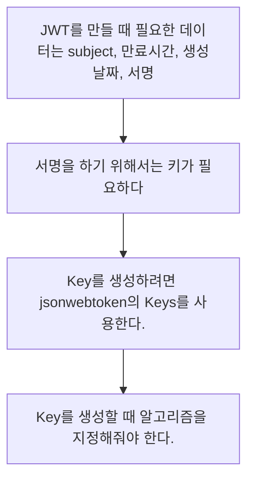

## Gradle 설정  추가
```gradle
// spring security
implementation 'org.springframework.boot:spring-boot-starter-security'

// jwt  
implementation 'io.jsonwebtoken:jjwt-api:0.12.5'  
implementation 'io.jsonwebtoken:jjwt-impl:0.12.5'  
implementation 'io.jsonwebtoken:jjwt-jackson:0.12.5'

```


## 필요한 기능
```Java
public class JwtUtils {

    // 토큰 생성

    // header에서 토큰 갖고 오기

    // 토큰 검증

    // 토큰에서 body 갖고 오기

}
```

### Jwt를 코딩할 때 생각 흐름


## JWT Utils 메서드
### 토큰 생성 방법
```Java
public String generateToken(String username, UserRoles roles) {
    Date currentTime = new Date();
    return PREFIX_BEARER + Jwts.builder()  
                .subject(username)  
                .issuedAt(currentTime)  
                .claim("Role", roles)  
                .expiration(new Date(currentTime.getTime() + EXPIRE_TIME))  
                .signWith(key)  
                .compact();
}
```
### 헤더에서 토큰 갖고 오기
```Java
public String getJwtTokenFromHeader(HttpServletRequest request) {
		// 헤더 정보로 부터 갖고 오자 
    String bearerToken = request.getHeader(AUTH_HEADER);
    if (StringUtils.hasText(bearerToken) && bearerToken.startsWith(PREFIX_BEARER)) {
        return bearerToken.substring(7);
    }
    return null;
}
```
### 토큰 검증하기
```Java
public boolean checkValidJwtToken(String jwtToken) {
  try {
      Jwts.parser().verifyWith(key).build().parseSignedClaims(jwtToken);
      return true;
  } catch(Exception e){
      log.error("에러 원인 : {} 에러 설명 : {}", e.getCause(), e.getMessage());
  }
  return false;
}
```
### Body 정보 갖고 오기
```Java
public Claims getBodyFromJwt(String jwtToken) {  
        return Jwts.parser().verifyWith(key).build().parseSignedClaims(jwtToken).getPayload();  
    }
```

## JWT를 필터에 적용을 해보자

Jwt 필터는 인증과 인가 두 종류가 기본적으로 사용이 된다.
- 인증을 통해서 들어온 요청이 적합한 요청인지 확인을 하고 JWT Token을 내려주게 된다.
- 인가는 인증된 유저를 확인해서 적절한 유저인지 확인을 해서 접근제어를 하는 것을 의미한다.
따라서 인증에서는 유저의 로그인 처리가 진행이 되어서 JWT를 발급해주는 역할을 하게 되며 인가에서는 발급된 JWT 토큰을 기반으로 접근 해도 되는지 확인하는 역할을 하게 된다.
### 인가 구현
JWT 토큰을 확인 한 후에 이를 SecurityContext에 넣어 준다.
Filter가 끝난 이후에 인증 객체(Authentication)가 없으면 접근 불가 에러가 발생한다.
```Java
protected void doFilterInternal(HttpServletRequest request, HttpServletResponse response, FilterChain filterChain)  
        throws ServletException, IOException {  
	// 토큰이 있는지 확인한다.
    String jwtToken = jwtUtils.getJwtTokenFromHeader(request);  
    
    // 토큰이 없으면 넘긴다.
    if (StringUtils.hasText(jwtToken)) {  
        boolean isValid = jwtUtils.checkValidJwtToken(jwtToken);  
        if (!isValid) {  
            response.setStatus(HttpServletResponse.SC_UNAUTHORIZED);  
            return;  
        }  
  
        Claims jwtBodyInfo = jwtUtils.getBodyFromJwt(jwtToken);  
  
        try {  
            putAuthentication(jwtBodyInfo.getSubject());  
        } catch (Exception e) {  
            logger.error("Context Holder 생성 중 에러 {}", e.getMessage());  
            return;  
        }  
    }
}

// 생성된 인증 객체를 Security Context Holder 넣어준다.  
public void putAuthentication(String username) {  
    SecurityContext context = SecurityContextHolder.getContext();  
    context.setAuthentication(generateAuthentication(username));  
    SecurityContextHolder.setContext(context);  
}  
  
// 인증 객체 생성  
private Authentication generateAuthentication(String username) {  
    UserDetails userDetails = userDetailsService.loadUserByUsername(username);  
    return new UsernamePasswordAuthenticationToken(  
            userDetails, null, userDetails.getAuthorities()  
    );  
}
```

### 인증 구현
Body에서 로그인 requestDto를 갖고 와서 UsernamePasswordAuthenticationToken을 생성하는데 여기서 UserDetailsService를 내부적으로 호출해서 로그인 정보가 적합한지 확인한다.
```Java
@Override
public Authentication attemptAuthentication(HttpServletRequest request, HttpServletResponse response) throws AuthenticationException {

    try {
        LoginRequestDto requestDto = new ObjectMapper().readValue(request.getInputStream(), LoginRequestDto.class);

        return getAuthenticationManager().authenticate(
                new UsernamePasswordAuthenticationToken(requestDto.getUsername(), requestDto.getPassword()));

    } catch (IOException e) {
        log.error("인증 에러 발생 : {}", e.getMessage());
        throw new RuntimeException(e);
    }

}
```

#### 여기서 했던 실수
1 
>Filter로 등록하는 것을 까먹고 405Method가 나와서 순간 헷갈렸었는데 Filter로 사용하려면 꼭 등록해주자

2
>💡 No content to map due to end-of-input ⇒ 에러 발생 원인 확인

위의 에러가 나서 json의 변환 오류인지 아니면 Body 값이 제대로 읽히지 않은 것이 원인인지

아래와 같이 Body 값을 확인해도 제대로 출력이 되어서 찾는 것이 오래 걸렸지만 원인은 DTO 클래스의 기본 생성자가 없는 것이 원인이였다.