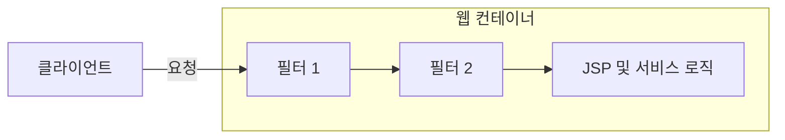
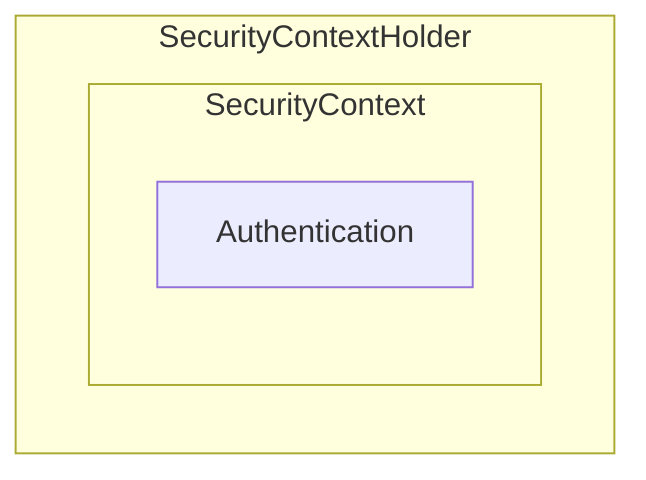

## 정의
API가 실행될 때 마다 해야하는 인증을 구현해 놓은 것으로 비즈니스 로직과 인증 로직을 분리하는 역할을 한다.
스프링 기반의 애플리케이션의 보안을 담당하는 스프링 하위 프레임워크이다. 
인증과 인가를 담당하는 역할을 한다.
Filter를 기반으로 동작한다.

## 기본 용어
- 접근 주체(Principal)
	- 원하는 리소스에 접근 하려는 유저
- 인증(Authentication)
	- 유저가 자신의 권한을 증명하는 것
- 인가(Authorization)
	- 유저가 리소스에 접근하는 것을 허용하느 ㄴ것
- 권한(Role)
	- 리소스 마다 주어지는 인증의 레벨

## 흐름


Spring Security는 다양한 기능을 가진 필터들을 10개 이상 제공을 하게 되며 이렇게 제공하는 필터들을
Security Filter Chain이라고 한다.


## 모듈


### SpringContextHolder
SecurityContextHolder는 보안 주체의 세부 정보를 포함하여 응용프로그램의 현재 보안 건텍스트에 대한 세부 정보가 저장된다.

- MODE_THREADLOCAL(기본값)
    - 스레드랑 SecurityContext 객체를 할당
- MODE_INHERITABLETHREADLOCAL
    - 메인, 자식 스레드에서 동일한 SecurityContext 사용
- MODE_GLOBAL
    - 프로그램에서 딱 하나의 SecurityContext만 저장

### SecurityContext
Authentication을 보관하는 역할을 한다. SecurityContext를 통해 Authentication 객체를 꺼내올 수 있다.

### Authentication
Authentication은 현재 접근하는 주체의 정보와 권한을 담는 인터페이스이다. Authentication 객체는 Security Context에 저장되며 SecurityContextHolder를 통해 SecurityContext에 접근하고, SecurityContext를 통해 Authentication에 접근할 수 있다.

### UserDetails

인증에 성공하여 생성된 UserDetails객체는 Authentication 객체를 구현한 UsernamePasswordAuthenticationToken을 생성하기 위해 사용된다.
UserDetails 인터페이스를 살펴보면 아래와 같은 정보들을 반환하는 메소드를 보여준다.

```java
public interface UserDetails extends Serializable {

    Collection<? extends GrantedAuthority> getAuthorities();
    String getPassword();
    String getUsername();
    boolean isAccountNonExpired();
    boolean isAccountNonLocked();
    boolean isCredentialsNonExpired();
    boolean isEnabled();
    
}
```

### UserDetailsService

UserDetailsService 인터페이스는 UserDetails 객체를 반환하는 단 하나의 메소드를 갖고 있는데 이는 일반적으로 이를 구현한 클래스 내부의 UserRepository를 주입받아서 DB와 연결하여 처리한다.
```Java
public class UserDetailsServiceImpl implements UserDetailsService {  
    private final UserRepository userRepository;  
  
    @Override  
    public UserDetails loadUserByUsername(String username) throws UsernameNotFoundException {  
  
        User user = userRepository.findById(username)  
                .orElseThrow(() -> new UsernameNotFoundException("없는 유저 입니다."));  
  
        return new UserDetailsImpl(user);  
    }  
}
```

### SecurityContextHolder에 저장되는 순서

1. `SecurityContextHolder`에서 전략에 맞는 createEmptyContext를 호출해주고 여기서 새로운 `SecurityContextImpl` 객체를 반환해준다.
2. `SecurityContextImpl`로 들어가서 SecurityContext의 authentication을 setMethod로 설정해준다.
3. SecurityContextHolder에서 전략에 맞춰서 context를 넣어준다.
4. Default는 `ThreadLocalSecurityContextHolderStrategy` 이므로 해당 클래스의 setContext를 호출하게 되고 `contextHolder.set(() → context)`를 호출하게 된다.
## UsernamePassword 필터의 인증 예시

### 인증 처리 과정
1. 유저가 로그인을 시도한다.
2. AuthenticationFilter에서 인증을 처리한다.
3. UsernameAuthenticationToken 발급
    1. AuthenticationFilter는 HttpServletRequest 아이디와 비밀번호를 추출해서 위의 토큰을 발급
4. AuthenticationManager에 인증 객체 전
5. 인증을 위해 AuthenticationProvider에게 인증 객체를 전달
6. 전달받은 인증 객체 정보를 UserDetailsService에 전달
7. UserDetails 구현 객체 생성
8. UserDetails객체를 AuthenticationProvider에 전달
9. ProviderManager에게 권한을 담은 검증된 인증 객체를 전달
10. 검증된 인증 객체를 AuthenticationFilter에 전달
11. 검증된 인증 객체를 SecurityContextHolder의 SecurityContext에 저장
    1. 사용자 정보를 저장한다는 것은 Spring Security가 전통적인 세션-쿠키 기반의 인증 방식을 사용한다.


## User의 Authentication의 초기화 시기
DB를 거치지 않고 인증 정보를 저장하려고 할 때 Request 마다 인증 객체를 생성해 주어야 한다.
User정보 그 자체로 UserDetails를 생성해 주고 있는데 이것을 위해서는 User를 호출하는 방법뿐이 없는 것으로 보여졌다.
그래서 Authentication 객체의 라이프 사이클에 대해서 알아보게 되었다.
Authentication이 얼마나 유지되는지 Debug를 통해서 확인을 해 보았더니 JwtAuthorizationFilter 부터 Response로 나가는 중간에 SecurityContextHolderFilter 를 통과하면서 contextHolder를 clearContext를 진행하면서 초기화해주는 것을 확인할 수 있었다.
```Java
private void doFilter(HttpServletRequest request, HttpServletResponse response, FilterChain chain)  
       throws ServletException, IOException {  
    if (request.getAttribute(FILTER_APPLIED) != null) {  
       chain.doFilter(request, response);  
       return;  
    }  
    request.setAttribute(FILTER_APPLIED, Boolean.TRUE);  
    Supplier<SecurityContext> deferredContext = this.securityContextRepository.loadDeferredContext(request);  
    try {  
       this.securityContextHolderStrategy.setDeferredContext(deferredContext);  
       chain.doFilter(request, response);  
    }  
    finally {  
       this.securityContextHolderStrategy.clearContext();  
       request.removeAttribute(FILTER_APPLIED);  
    }  
}
```


## 스프링 필터

J2EE 표준 스펙 기능으로 Dispatcher Servlet에 요청이 전달되기 전 / 후에 url패턴에 맞는 모든 요청에 대해서 부가작업을 처리할 수 있는 기능을 제공한다.

Dispatcher Servlet은 스프링의 가장 앞단에 존재하는 것인데 여기에 전달되기 전이므로 필터의 위치는 Spring의 밖에 된다. Web Context에 포함이 되는 것이다.
### 메소드
- init
- doFilter
- destroy
