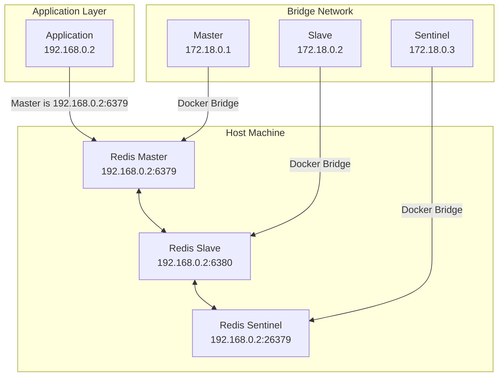

---
tags:
  - sentinel
publish: false
---
Sentinel에 대한 자세한 내용은 해당 링크로 확인할 수 있다. [[Redis-Sentinel]]
# Spring에서 Redis Sentinel 설정 방법
Redis Config를 설정할 때 아래와 같이 Connection Factory를 설정해주면 된다.
```Java
@Bean
public RedisConnectionFactory lettuceConnectionFactory() {
  RedisSentinelConfiguration sentinelConfig = new RedisSentinelConfiguration()
  .master("mymaster")
  .sentinel("127.0.0.1", 26379)
  .sentinel("127.0.0.1", 26380);
  return new LettuceConnectionFactory(sentinelConfig);
}
```


## Sentinel에서 Docker 내부 호스트 IP 전달해주는 문제 발생
### 문제 발생
Sentinel을 Docker로 설정하고 로컬에서 Spring 서버를 실행한 후에 위와 같이 Sentinel을 연결했을 때   
Sentinel과의 연결은 성공적으로 가능하나 Sentinel에서는 Master의 위치를 IP와 port로 알려주게 되는데   
Docker 내부의 네트워크는 호스트의 네트워크와 분리되어 있어서 IP와 port로는 접근하지 못하는 문제가 발생하였다.    
서버를 Docker화 시켜서 같은 네트워크로 배포 진행하게 되면 해결될 문제였지만 로컬 상황에서 테스트를 해보고 싶어서   
아래와 같이 해결을 진행하였다.
### 해결 방법
[참고 블로그](https://blog.xavierz.dev/blog/posts/docker-redis-sentinel)    




#### 호스트 네트워크를 추출한다.
```shell
IP=`ifconfig 
| grep -Eo 'inet (addr:)?([0-9]*\.){3}[0-9]*' 
| grep -Eo '([0-9]*\.){3}[0-9]*' 
| grep -v '127.0.0.1'`
```
#### 추출한 네트워크 IP를 Sentinel에서 마스터를 지정하는 ip로 지정해준다.
sentinel을 실행하는 shell code
``` shell
#!/bin/bash

set -e
sed -i "s/\$HOST_IP/${HOST_IP}/g" /etc/redis/sentinel.conf
cat /etc/redis/sentinel.conf
exec docker-entrypoint.sh redis-server /etc/redis/sentinel.conf --sentinel
```
sentinel.conf파일 설정의 master 위치 설정 부분
```conf
port 26379
sentinel monitor mymaster $HOST_IP 6379 2
```

이렇게 할 경우 호스트 머신의 IP를 사용해서 통신이 가능해진다.


