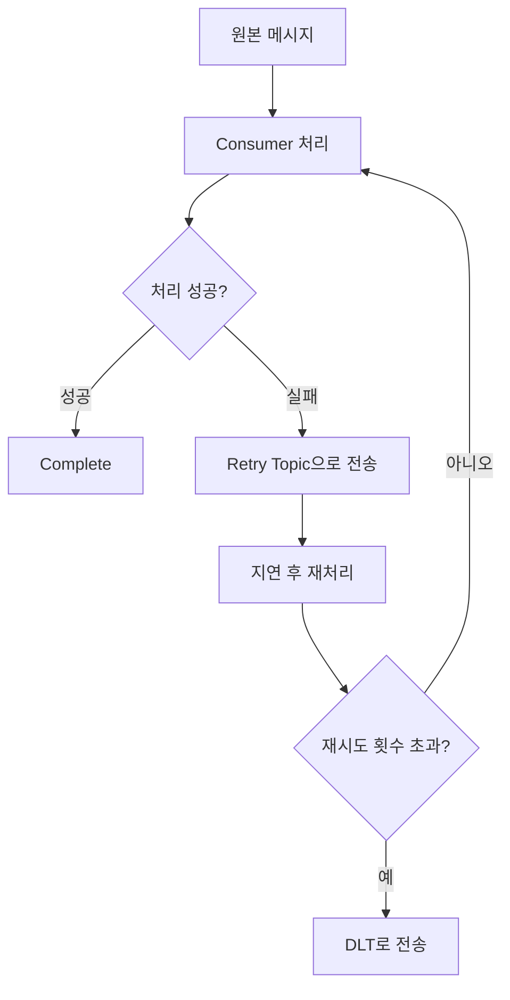

---
tags:
  - kafka
  - retry
  - spring-kafka
---
# Spring Kafka에서 효과적인 Retry 처리 전략
## 재시도 정책의 종류
## 고정 BackOff (Fixed BackOff)
- **개념**: 재시도 간격을 일정하게 유지하는 방식
- **특징**: 매번 동일한 시간 간격으로 재시도
- **장점**: 예측 가능한 패턴, 구현이 간단
- **단점**: 서버 부하가 지속될 수 있음
```java
// 1초 간격, 최대 3회 재시도
FixedBackOff backOff = new FixedBackOff(1000L, 3L);
```

## 증가 BackOff (Exponential BackOff)  
- **개념**: 재시도할 때마다 대기 시간을 증가시키는 방식
- **특징**: 첫 시도 후 시간을 점진적으로 늘려감 (예: 1초 → 2초 → 4초)
- **장점**: 서버 부하를 점진적으로 완화, 일시적 장애에 효과적
- **단점**: 복구 시간이 길어질 수 있음
```java
// 2초 시작, 2배씩 증가, 최대 10초
RetryTopicConfigurationBuilder
    .newInstance()
    .exponentialBackoff(2000, 2.0, 10000)
```

## 랜덤 BackOff (Random BackOff)
- **개념**: 재시도 간격에 임의성을 추가하는 방식
- **특징**: 기본 간격에 랜덤 요소를 더해 분산시킴
- **장점**: 동시 재시도로 인한 서버 부하 집중 방지 (Thundering Herd 방지)
- **단점**: 예측하기 어려운 패턴
```java
// 기본 간격 + 랜덤 요소 추가
ExponentialBackOff backOff = new ExponentialBackOff(1000L, 2.0);
backOff.setRandomizeMultiplier(true); // 랜덤 요소 활성화
```

## 재시도 정책 선택 가이드
- **고정 BackOff**: 빠른 복구가 예상되는 일시적 네트워크 오류
- **증가 BackOff**: 서버 과부하나 외부 시스템 장애 시
- **랜덤 BackOff**: 대량의 동시 요청이 예상되는 환경에서

---

# Spring Kafka 재시도 처리 방식 비교

## 1. DefaultErrorHandler (블로킹 재시도)

### 특징
- 카프카 내부에서 토픽 생성 없이 컨슈머 스레드에서 재시도
- **블로킹 방식**: 재시도하는 동안 해당 파티션의 다른 메시지 처리 차단
- 간단한 설정으로 빠른 구현 가능
- 메시지 순서 보장

### 언제 사용할까?
- 빠른 복구가 예상되는 일시적 오류 (네트워크 타임아웃 등)
- 메시지 처리 순서가 중요한 경우
- 재시도 로직이 단순한 경우

### 구현 예시
```Java
@Configuration
public class BlockingRetryConfig {
    
    @Bean
    public ConcurrentKafkaListenerContainerFactory<String, ChatMessage> 
           kafkaListenerContainerFactory (
           ConsumerFactory<String, String> consumerFactory,
           KafkaTemplate<String, String> kafkaTemplate
   ) {
        ConcurrentKafkaListenerContainerFactory<String, String> factory =  
		    new ConcurrentKafkaListenerContainerFactory<>();  
		factory.setConsumerFactory(consumerFactory);
        factory.getContainerProperties().setAckMode(AckMode.MANUAL_IMMEDIATE);
        
        // DLT 전송을 위한 Recoverer
        DeadLetterPublishingRecoverer recoverer = 
            new DeadLetterPublishingRecoverer(kafkaTemplate,
                (record, exception) -> {
                    if (exception instanceof ValidationException) {
                        return new TopicPartition("chat-validation-errors", 0);
                    }
                    return new TopicPartition(record.topic() + ".dlt", record.partition());
                });
        
        // 블로킹 재시도: 1초 간격, 최대 2회
        DefaultErrorHandler errorHandler = 
            new DefaultErrorHandler(recoverer, new FixedBackOff(1000L, 2L));
        
        // 재시도 가능한 예외 지정
        errorHandler.addRetryableExceptions(RecoverableException.class);
        errorHandler.addNotRetryableExceptions(ValidationException.class);
        
        factory.setCommonErrorHandler(errorHandler);
        return factory;
    }
}

```
}

## 2. RetryTopic (논블로킹 재시도)

### 특징
- **별도의 재시도 토픽 생성**: 원본 토픽과 분리된 재시도 전용 토픽 사용
- **논블로킹 방식**: 재시도하는 동안 다른 메시지 처리 계속 진행
- 더 복잡한 재시도 로직 구현 가능
- 토픽 분리로 인한 모니터링 용이성

### 언제 사용할까?
- 재시도 시간이 긴 경우 (외부 API 호출, DB 연결 복구 등)
- 높은 처리량(throughput)이 중요한 경우
- 재시도 메시지와 일반 메시지를 분리해서 관리하고 싶은 경우
- 복잡한 재시도 정책이 필요한 경우

### RetryTopic 동작 원리



### 구현 방법

#### 방법 1: 어노테이션 사용
```Java
@KafkaListener(topics = "chat-topic")
@RetryableTopic(  
    attempts = "3",  // 최대 3회 시도
    backoff = @Backoff(delay = 2000, multiplier = 2.0), // 2초 시작, 2배씩 증가
    dltStrategy = DltStrategy.FAIL_ON_ERROR,  // DLT 전략
    include = {RecoverableException.class}, // 재시도할 예외
    exclude = {ValidationException.class}   // 즉시 DLT로 보낼 예외
)
public void processChatMessage(ChatMessage message) {
    // 메시지 처리 로직
    if (message.isInvalid()) {
        throw new ValidationException("잘못된 메시지"); // 즉시 DLT
    }
    
    if (externalService.isDown()) {
        throw new RecoverableException("서비스 일시 불가"); // 재시도
    }
    
    // 정상 처리
    chatService.process(message);
}
```

#### 방법 2: 빌더 패턴 사용
```Java
@Configuration
@EnableKafkaRetryTopic
public class NonBlockingRetryConfig {
    
    @Bean
    public RetryTopicConfiguration chatRetryConfiguration(
            KafkaTemplate<String, String> kafkaTemplate) {
        
        return RetryTopicConfigurationBuilder
            .newInstance()
            .maxAttempts(3)
            .exponentialBackoff(2000, 2.0, 10000) // 2초 시작, 2배씩 증가, 최대 10초
            .dltSuffix(".dlt") // 지정된 Topic에서 dlt 추가
            .retryOn(RecoverableException.class) // 재시도 할 Exception
            .notRetryOn(ValidationException.class) // 재시도 하지 않을 Exception
            .includeTopics("chat-topic") // 적용할 토픽
            .autoCreateTopics(true) // 자동 토픽 생성
            .numPartitions(3)
            .replicationFactor(2)
            .create(kafkaTemplate);
    }
}
```

---

## RetryTopic 생성되는 토픽 구조

RetryTopic을 사용하면 자동으로 다음과 같은 토픽들이 생성됩니다:

```
원본 토픽: chat-topic

자동 생성되는 토픽들:
├── chat-topic-retry-0  (첫 번째 재시도, 2초 후)
├── chat-topic-retry-1  (두 번째 재시도, 4초 후)  
└── chat-topic.dlt      (최종 실패 시 DLT)
```

## 실무 적용 가이드

### 1. 블로킹 vs 논블로킹 선택 기준

| 구분            | DefaultErrorHandler (블로킹) | RetryTopic (논블로킹) |
| ------------- | ------------------------- | ----------------- |
| **처리량 우선순위**  | 낮음                        | 높음                |
| **메시지 순서 보장** | 필수                        | 불필요               |
| **재시도 시간**    | 짧음 (수초 이내)                | 길음 (분/시간 단위 가능)   |
| **설정 복잡도**    | 간단                        | 복잡                |
| **토픽 관리**     | 불필요                       | 추가 토픽 관리 필요       |
### 2. DLT(Dead Letter Topic) 활용

```Java
@DltHandler
public void handleDltMessage(ChatMessage message, 
                           @Header(KafkaHeaders.RECEIVED_TOPIC) String topic,
                           @Header(KafkaHeaders.EXCEPTION_MESSAGE) String errorMessage) {
    // DLT로 온 메시지 별도 처리
    log.error("최종 처리 실패 - 토픽: {}, 메시지: {}, 오류: {}", topic, message, errorMessage);
    
    // 알림 발송, 별도 저장소 저장 등
    notificationService.sendFailureAlert(message, errorMessage);
    failureRepository.save(new FailedMessage(message, errorMessage));
}
```
## 결론

Spring Kafka의 재시도 처리는 시스템의 안정성과 성능에 직접적인 영향을 미칩니다. 

- **간단하고 빠른 재시도**가 필요하다면 → **DefaultErrorHandler**
- **복잡하고 유연한 재시도**가 필요하다면 → **RetryTopic**

각각의 특성을 이해하고 비즈니스 요구사항에 맞는 선택을 하는 것이 중요합니다.

