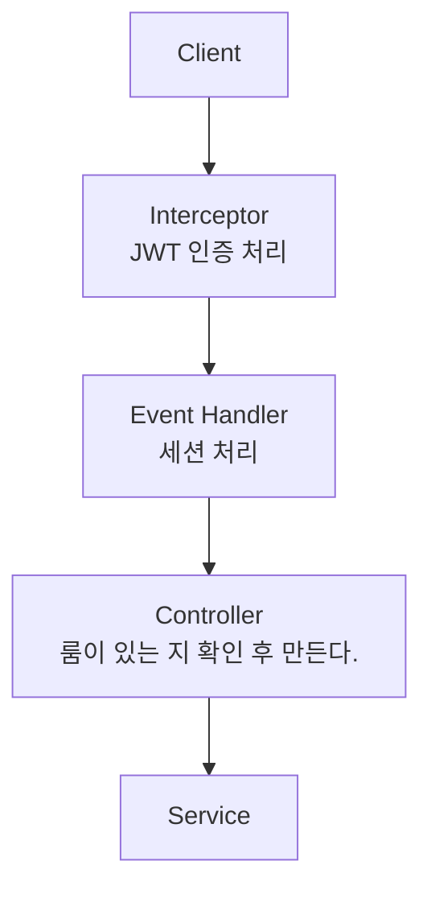

# 채팅 시스템의 목적
유저와 가게 주인만이 채팅을 할 수 있게 한다.   
유저와 유저는 불가능 하다.
# 필요 기능
- 로그인 한 유저만 채팅창을 할 수 있어야 한다.
- 유저가 가게 주인을 대상으로 채팅창을 열어야 한다.
- 채팅 기록들을 남겨야 한다
- 채팅은 1:1만 가능하다
- 채팅 방의 기준은 가게주인 이어야 한다.
# 테이블 
- 유저가 속한 채팅 룸
- 유저 채팅 기록 남길 테이블
## 컬럼
### 채팅 룸
- id(채팅 룸 아이디)
- 룸의 주인
- 룸 참가자
### 채팅 기록
- id
- 채팅창 룸 아이디
- 작성 내용
- 작성한 유저 아이디
# 접근 API 기능
# 소켓이 연결되었을 때 ChatRoom을 만들어 볼까
## Session을 처리 하는 방법
Session이 연결되었을 때 Map을 사용해서 session과 userId를 저장한다.
```Java
@EventListener(SessionConnectEvent.class)  
public void onConnect(SessionConnectEvent event) {  
    StompHeaderAccessor accessor = StompHeaderAccessor.wrap(event.getMessage());  
    String accessToken = accessor.getFirstNativeHeader("Authorization");  
  
    if (accessToken != null && accessToken.startsWith("Bearer ")) {  
  
        String token = accessToken.substring(7);  
  
        // 토큰 검증  
        if (!jwtUtils.validateToken(token)) {  
            throw new IllegalArgumentException("잘못된 JWT 토큰입니다.");  
        }  
  
        Claims claims = jwtUtils.extractClaims(token);  
  
        // 세션 추가  
        sessions.put(accessor.getSessionId(), claims.get("userId").toString());  
    }  
}
```
이후 연결이 끊겼을 때 session에서 userId를 삭제해준다.
```Java
@EventListener(SessionDisconnectEvent.class)  
public void onDisconnect(SessionDisconnectEvent event) {  
    sessions.remove(event.getSessionId());  
}
```

## 인터셉터와 EventHandler의 우선 순위
`ChannelInterceptor`와 `@EventListener(SessionConnectEvent.class)`를 사용해서 소켓이 연결 되었을 때 어떤 부분이 먼저 호출되는지 확인해 본 결과 `ChannelInterceptor`가 먼저 호출되는 것을 확인할 수 있었다.   
따라서 JWT의 인증은 interceptor에서 처리한 다음에 Session은 EventListener에서 처리하는 것으로 결정하였다.

## 채팅이 가능한 경우
유저가 가게 주인한테만 가능하다.

# 유저 Chat 기능 소켓 처음 연결 시

# 채팅을 저장을 한 후에 구독된 클라이언트로 전달한다.
기존에는 SendTo 어노테이션을 사용해서 구독된 클라이언트에게 메시지를 전달하고 싶었다. 하지만 동적으로 경로를 지정할 수 없는 문제가 있었기 때문에 SimpleMessageTemplate을 사용하기로 하였다.
```Java
// 구독된 클라이언트에 전달  
String destination = "/topic/chat/" + chatRoom.getId();  
messagingTemplate.convertAndSend(destination,  
	    new ChatLogResponseDto(requestDto.chatData(), writer, LocalDateTime.now().toString()));
```