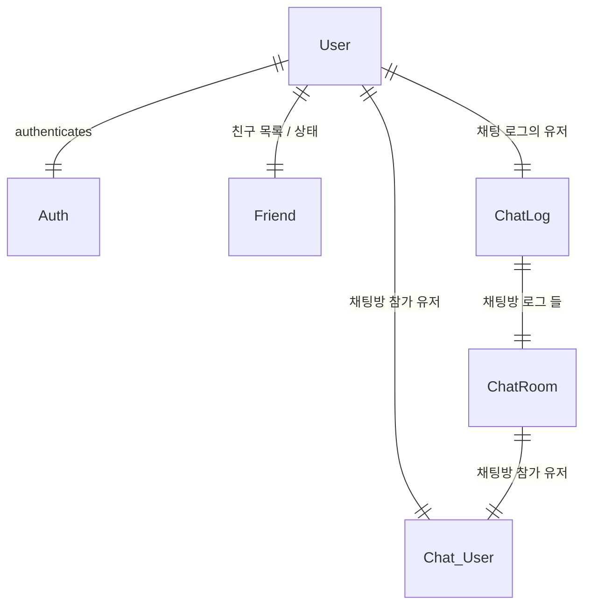
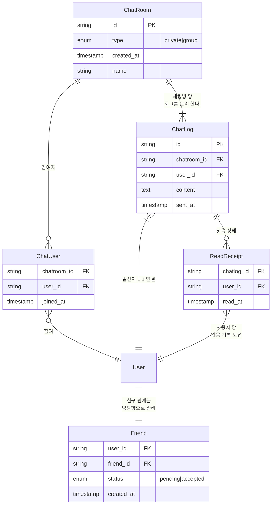

---
tags:
  - project
draft: "false"
---
# Model diagram

```mermaid
erDiagram
    User ||--|| Auth : "authenticates"
	User ||--|| Friend : "친구 목록 / 상태"
	User ||--|| Chat_User : "채팅방 참가 유저"
	ChatRoom ||--|| Chat_User : "채팅방 참가 유저"
	ChatLog ||--|| ChatRoom : "채팅방 로그 들"
	User ||--|| ChatLog : "채팅 로그의 유저"
```

# 주요 기능
- 유저는 친구를 추가할 수 있다.
- 친구들과 1:1 채팅을 할 수 있다.
- 그룹챗을 만들 수 있다.
- 그룹챗의 주요 기능
	- 친구 초대
	- 채팅 로그들을 어떻게 관리 하지
	- 채팅을 읽은 사람들을 표시해야 함

```mermaid
erDiagram
    %% 채팅 시스템 %%
    ChatRoom {
        string id PK
        enum type "private|group"
        timestamp created_at
        string name
    }

    %% 관계 테이블 %%
    Friend {
        string user_id FK
        string friend_id FK
        enum status "pending|accepted"
        timestamp created_at
    }

    ChatUser {
        string chatroom_id FK
        string user_id FK
        timestamp joined_at
    }

    ChatLog {
        string id PK
        string chatroom_id FK
        string user_id FK
        text content
        timestamp sent_at
    }

    ReadReceipt {
        string chatlog_id FK
        string user_id FK
        timestamp read_at
    }

	%% 관계 설명 - 1 %%
	ChatRoom ||--o{ ChatUser : "참여자"
    ChatLog ||--o{ ReadReceipt : "읽음 상태"
    
    %% 관계 설명 - 2 %%
    ChatUser }o--|| User : "참여"
    User ||--|| Friend : "친구 관계는<br/>양방향으로 관리"
    ChatRoom ||--|{ ChatLog : "채팅방 당<br/>로그를 관리 한다."
    ChatLog }|--|| User : "발신자 1:1 연결"
    ReadReceipt }|--|| User : "사용자 당<br/>읽음 기록 보유"

```
