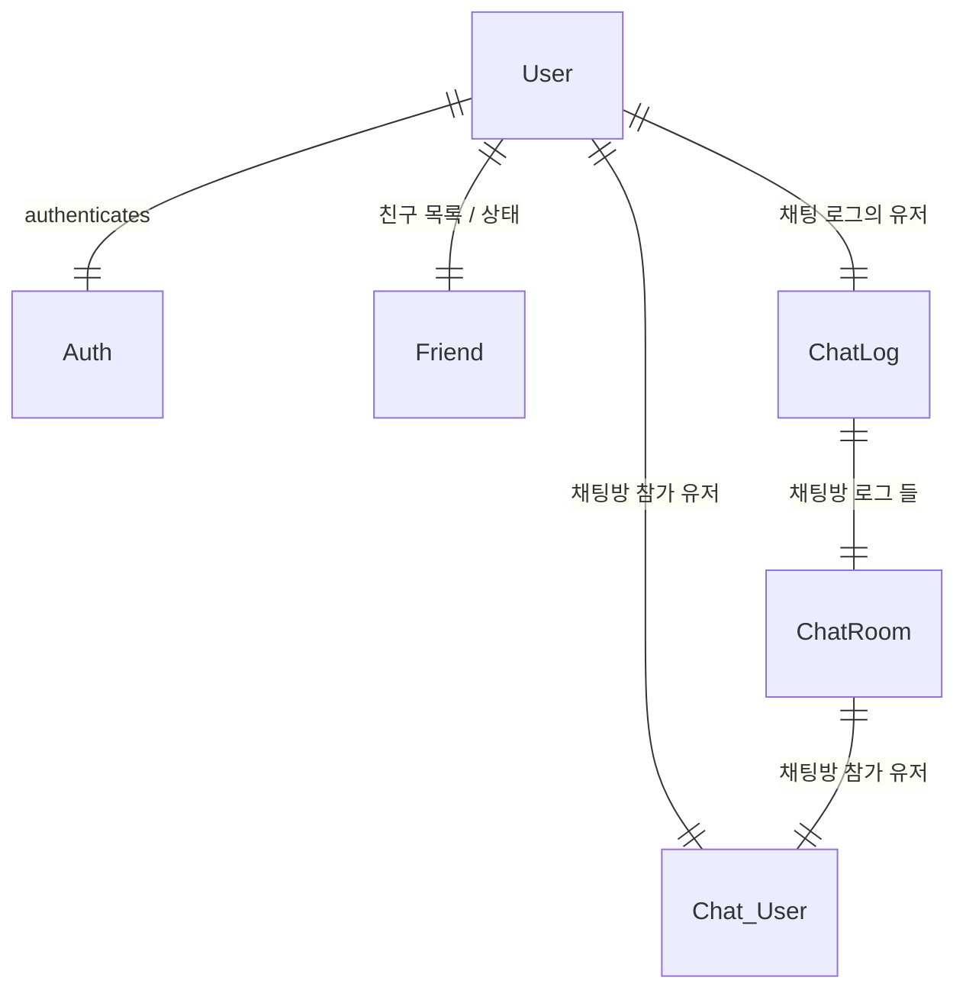
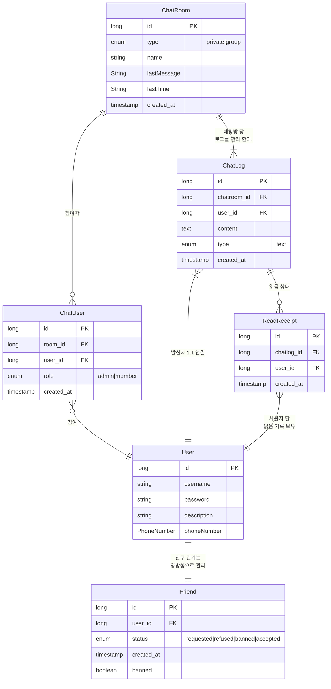
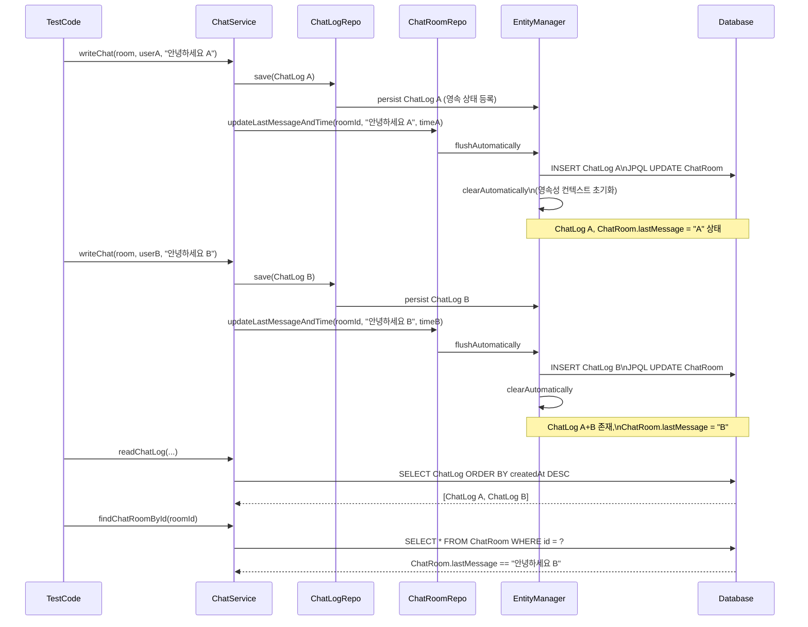
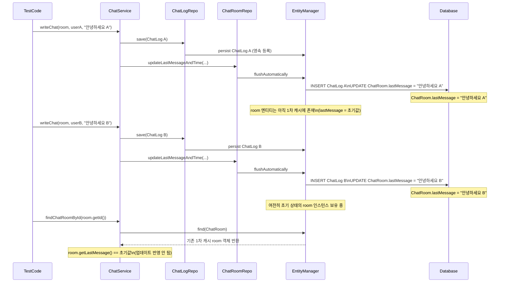
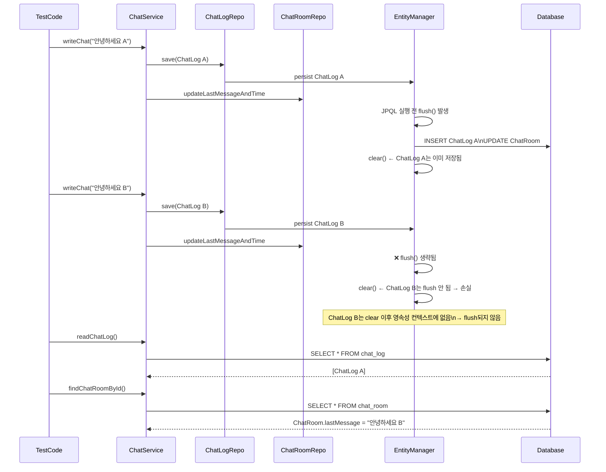

---
tags:
  - project
  - chat/program
  - pub/sub
draft: "false"
---
# Model diagram


# 주요 기능
- 유저는 친구를 추가할 수 있다.
- 친구들과 1:1 채팅을 할 수 있다.
- 그룹챗을 만들 수 있다.
- 그룹챗의 주요 기능
	- 친구 초대
	- 채팅 로그들을 어떻게 관리 하지
	- 채팅을 읽은 사람들을 표시해야 함
	- 어디까지 읽었는지 알아야 한다.


# 유저 로그인 기능(세션 활용)
[[인터셉터와 세션를 이용한 로그인 확인]]
# 채팅 서비스 주요 기능
## 개인 채팅 방
- 채팅 방 생성
- 대화 기록 저장
- 읽음 여부 표시
## 그룹 채팅 방
# css파일을 구조적으로 분리
## components.css
- 개별 UI 컴포넌트(버튼, 카드, 모달 등)에 대한 스타일만 정의한다.
- 컴포넌트 단위로 재사용이 가능하도록 설계한다.
- 클래스명이나 컴포넌트명에 맞춰 스타일을 작성하며, 다른 컴포넌트와의 의존성을 최소화한다.
## layout.css
- 전체 페이지의 구조와 배치(헤더, 네비게이션, 메인, 푸터 등)와 관련된 스타일을 담당한다.
- Flexbox, Grid, Position, Float 등 레이아웃 속성을 주로 사용한다.
- 페이지의 큰 틀을 잡는 역할을 한다.
## pages.css
- 특정 페이지(예: 홈, 로그인, 마이페이지 등)에서만 사용되는 스타일을 정의한다.
- 페이지별로 고유한 스타일이 필요할 때 사용하며, components나 layout에서 포함되지 않는 예외적인 스타일을 포함한다.
## base.css
- 전체 사이트에 공통적으로 적용되는 기본 스타일을 정의한다.
## responsive.css
- 반응형 웹을 위한 미디어 쿼리와 관련된 스타일을 담당한다.
- 화면 크기(데스크탑, 모바일 등)에 따라 레이아웃이나 컴포넌트의 스타일이 다르게 적용되도록 설정한다.

# 의사 결정
## 채팅의 안읽은 유저를 표시하기
- 각 메시지별로 누가 읽었는지 기록하는 테이블을 두는 방식이다.
### 장점
- 누가 읽었는지 정확한 정보를 제공한다.
- 그룹 채팅에서 누가 읽었는지 상세히 보여줄 수 있다.
### 단점
- 데이터가 폭증한다.
- 쿼리가 복잡해지며 쓰기 부하가 올 수 있다.
### ReadRecipt 테이블 활용
### 채팅방 멤버별 마지막 읽인 메시지 처리 방식
- 각 사용자가 해당 채팅방에서 마지막으로 읽은 메시지의 ID를 저장한다.
### 장점
- 효율적인 저장
- 빠른 쿼리 및 쓰기 부하 감소
### 단점
- 메시지별 읽음을 처리할 수 없다.
# 채팅 Flow 테스트 중에 영속성 컨텍스트와 DB 흐름 정리
## 예제 코드
- 채팅 테스트 코드
```Java
ChatRoom room = chatService  
    .createChatRoom(userA, List.of(userB), RoomType.PRIVATE, "secretRoom");  
String firstChatData = "안녕하세요 B";  
  
// when  
chatService.writeChat(room, userA, "안녕하세요 A", ChatContentType.TEXT);  
chatService.writeChat(room, userB, firstChatData, ChatContentType.TEXT);  
  
// then  
List<ChatLogResponseDto> chatLogs = chatService  
    .readChatLog(userA, room, PageRequest.of(0, 20));  
  
// 채팅방의 최근 채팅을 확인  
room = chatService.findChatRoomById(room.getId());  
assertThat(room.getLastMessage()).isEqualTo(firstChatData);
```
- WriteChat Method 코드
```Java
// 저장  
ChatLog chatLog = chatLogRepository.save(ChatLog.createLog(room, user, chatData, type));  

...
  
if (isUpdate) {  
    // 최근 메시지 업데이트  
    chatRoomRepository.updateLastMessageAndTime(  
        room.getId(), chatLog.getContent(), chatLog.getCreatedAt());  
}
```
- updateLastMessageAndTime Jpa 코드
```Java
@Modifying(flushAutomatically = true, clearAutomatically = true)  
@Query("UPDATE chat_room c SET c.lastMessage = :content, c.lastTime = :lastTime WHERE c.id = :id AND c.lastTime < :lastTime")  
void updateLastMessageAndTime(Long id, String content, LocalDateTime lastTime);
```
## Flow 설명

### createChatRoom()
- ChatRoom 객체가 생성되고 chatRoomRepository.save(...)를 통해 **영속성 컨텍스트에 저장**
- 트랜잭션 내에서 아직 flush되지 않았기 때문에 **DB에는 미반영 상태**
- 단, 이후의 chatLogRepository.save(...)에서 참조할 수 있음
### **writeChat(room, userA, "안녕하세요 A", ...)**
- ChatLog 엔티티가 **영속성 컨텍스트에 저장됨**
- 아직 flush()되지 않았으므로 DB에는 반영되지 않았을 수 있음
- `chatRoomRepository.updateLastMessageAndTime(...)`를 실행하면 flush와 clear가 실행된다.
```Java
@Modifying(flushAutomatically = true, clearAutomatically = true)
```
아래와 같이 진행된다.

| **단계**                        | **설명**                                                                                                  |
| ----------------------------- | ------------------------------------------------------------------------------------------------------- |
| **flushAutomatically = true** | EntityManager.flush() 호출 → **현재 영속성 컨텍스트에 있는 모든 변경사항(DB로 write)**→ ChatLog가 DB에 INSERT됨                 |
| **clearAutomatically = true** | EntityManager.clear() 호출 → **영속성 컨텍스트가 완전히 초기화됨**→ 기존에 저장된 ChatRoom, ChatLog 모두 **비영속(detached)** 상태가 됨 |
### readChatLog(...) 및 findChatRoomById(room.getId())
- ChatLog를 **DB로부터 페이지네이션 조회**
- 이전 단계에서 flush()가 되어 DB에 2개의 ChatLog가 존재하므로 정상적으로 2개가 조회됨
## 흐름을 다이어그램으로 표현


## flush만 한 경우
- flushAutomatically = true는 ChatLog와 ChatRoom에 대한 DB 업데이트를 **제대로 수행**함
- 그러나 EntityManager는 여전히 이전 ChatRoom 인스턴스를 보유한다.
- findChatRoomById()는 DB가 아닌 **1차 캐시의 저장된 엔티티**를 반환
- assertThat(room.getLastMessage())에서 **테스트가 실패한다**.

## clear만 한 경우
- clearAutomatically = true는 **영속성 컨텍스트(1차 캐시)를 비웁니다**
- 하지만 flushAutomatically = false이기 때문에, ChatLog.save(...) 등 **이전에 저장된 영속성 컨텍스트 내 엔티티는 아직 DB에 반영되지 않았을 수 있습니다**
- clear()가 먼저 실행되면 → 아직 flush되지 않은 ChatLog, ChatRoom 등의 변경 내역이 사라집니다 (rollback)

# Refresh Token 적용하기
## Redis로 jpa 적용
### DB가 아니라 Redis를 선택이유
- RefreshToken은 만료 이후에 오래 저장해서 관리를 할 필요가 없음
- TTL을 사용해서 일정시간이 지나면 자동으로 삭제되어 메모리 관리를 효율적으로 할 수 있음
### 코드
```Java
@RedisHash(value = "token", timeToLive = (REFRESH_TOKEN_TIME / 1000))  
@NoArgsConstructor  
@AllArgsConstructor  
@Builder  
@Getter  
public class RefreshToken {  
  
    @Id  
    private Long userId;  
  
    @Indexed  
    private String token;  
  
    private LocalDateTime createdAt;  
}
```

# 외부 브로커 연결
## Redis를 사용한 pub/sub
- [[redis를 사용한 pub,sub]]
## 카프카를 사용한 pub/sub
- [[Kafka Offset 처리]]
- [[Retry 처리 방법]]