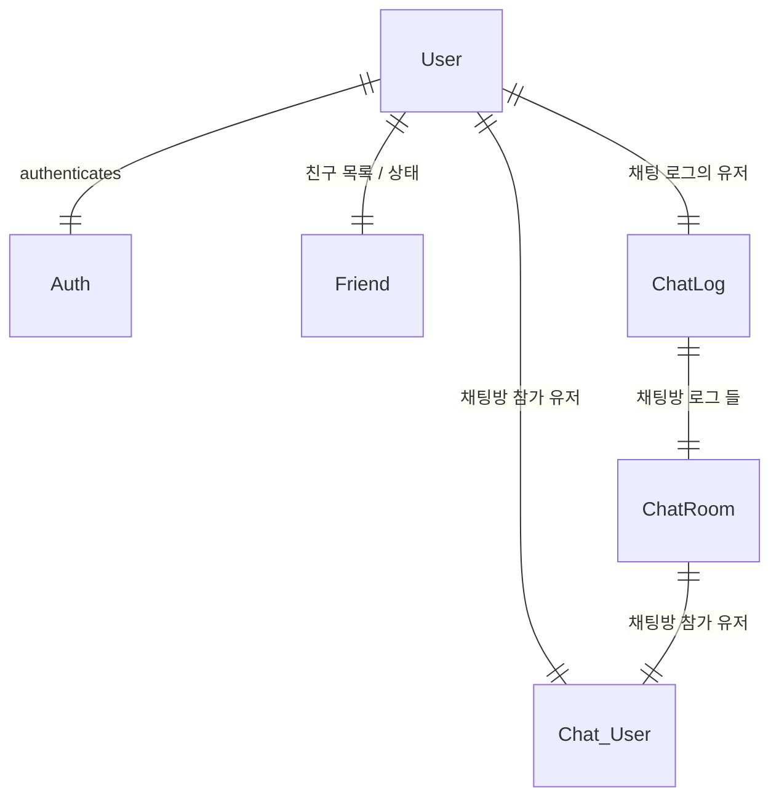

---
tags:
  - project
draft: "true"
---
# Model diagram

```mermaid
erDiagram
    User ||--|| Auth : "authenticates"
	User ||--|| Friend : "친구 목록 / 상태"
	User ||--|| Chat_User : "채팅방 참가 유저"
	ChatRoom ||--|| Chat_User : "채팅방 참가 유저"
	ChatLog ||--|| ChatRoom : "채팅방 로그 들"
	User ||--|| ChatLog : "채팅 로그의 유저"
```

# API Flow
