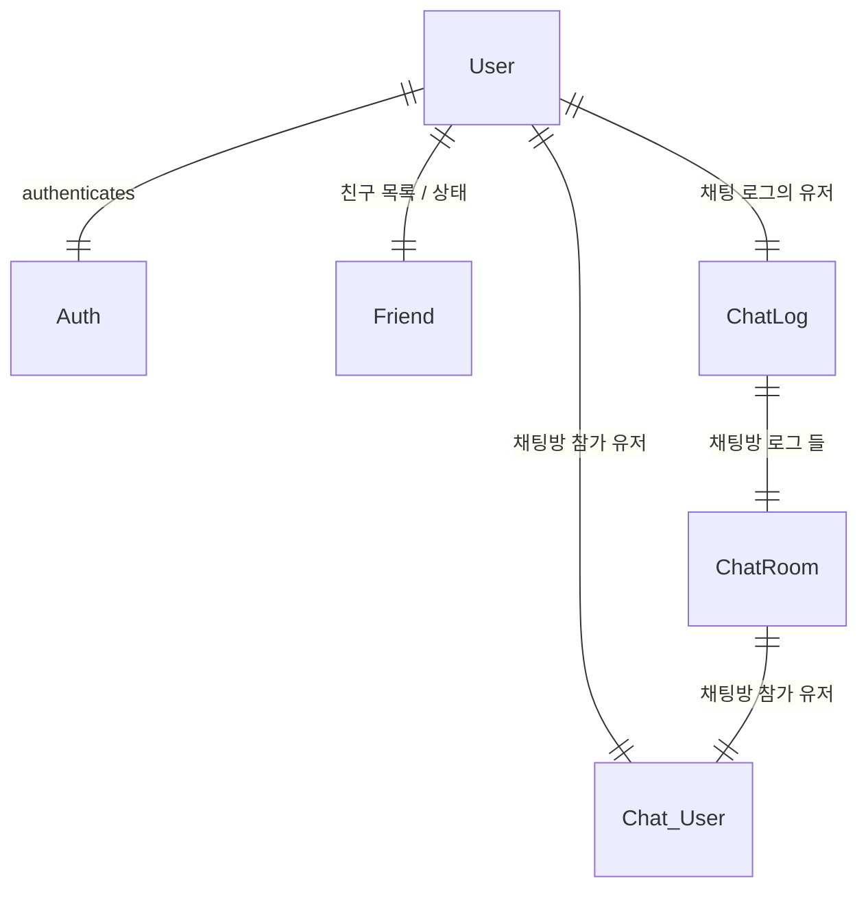
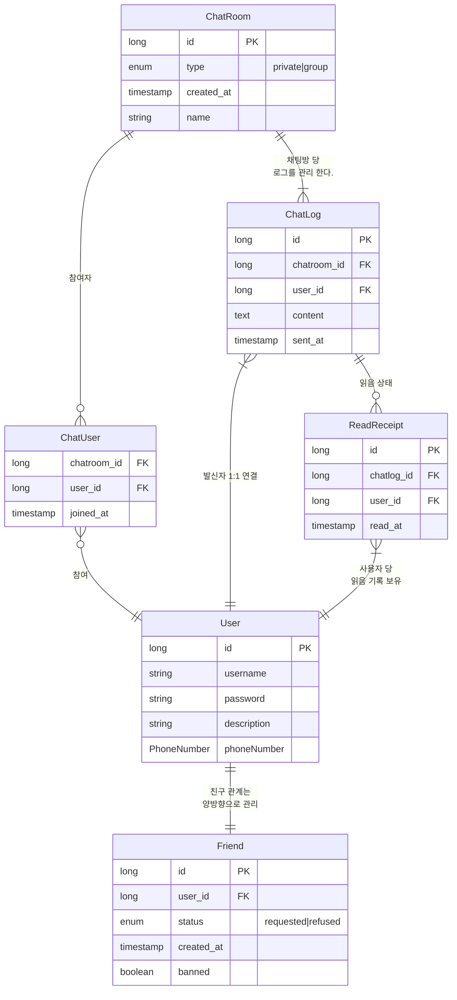

---
tags:
  - project
  - chat/program
draft: "false"
---
# Model diagram

# 주요 기능
- 유저는 친구를 추가할 수 있다.
- 친구들과 1:1 채팅을 할 수 있다.
- 그룹챗을 만들 수 있다.
- 그룹챗의 주요 기능
	- 친구 초대
	- 채팅 로그들을 어떻게 관리 하지
	- 채팅을 읽은 사람들을 표시해야 함

# 유저 로그인 기능(세션 활용)
[[인터셉터와 세션를 이용한 로그인 확인]]
# css파일을 구조적으로 분리
## components.css
- 개별 UI 컴포넌트(버튼, 카드, 모달 등)에 대한 스타일만 정의한다.
- 컴포넌트 단위로 재사용이 가능하도록 설계한다.
- 클래스명이나 컴포넌트명에 맞춰 스타일을 작성하며, 다른 컴포넌트와의 의존성을 최소화한다.
## layout.css
- 전체 페이지의 구조와 배치(헤더, 네비게이션, 메인, 푸터 등)와 관련된 스타일을 담당한다.
- Flexbox, Grid, Position, Float 등 레이아웃 속성을 주로 사용한다.
- 페이지의 큰 틀을 잡는 역할을 한다.
## pages.css
- 특정 페이지(예: 홈, 로그인, 마이페이지 등)에서만 사용되는 스타일을 정의한다.
- 페이지별로 고유한 스타일이 필요할 때 사용하며, components나 layout에서 포함되지 않는 예외적인 스타일을 포함한다.
## base.css
- 전체 사이트에 공통적으로 적용되는 기본 스타일을 정의한다.
## responsive.css
- 반응형 웹을 위한 미디어 쿼리와 관련된 스타일을 담당한다.
- 화면 크기(데스크탑, 모바일 등)에 따라 레이아웃이나 컴포넌트의 스타일이 다르게 적용되도록 설정한다.