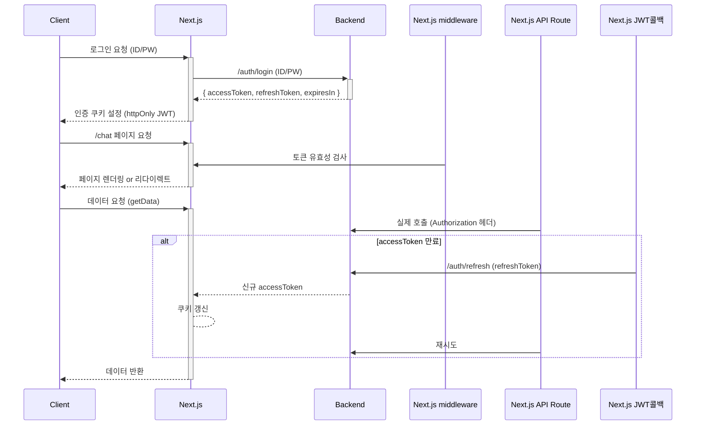

---
tags:
  - chat/program
  - chat/program/client
---
# Client 개발하면서 적어놓기
## 페이지 이동을 할 때에는 Link 컴포넌트 사용
- 클라이언트 사이드 라우팅
	- Link 컴포넌트를 사용하면 전체 페이지를 새로고침하지 않고, 필요한 부분만 빠르게 전환할 수 있어 부드러운 사용자 경험을 제공합니다
- SEO(검색 엔진 최적화) 지원 
	- Link는 Next.js의 서버 사이드 렌더링 구조와 잘 맞아 SEO에 유리하며, 검색 엔진이 페이지 구조를 잘 인식할 수 있도록 돕는다.
- Prefetch(사전 로딩) 
	- Link는 이동할 페이지의 리소스를 미리 불러와서, 클릭 시 즉시 페이지가 전환되도록 지원합니다
- 최적화된 코드 분할 및 접근성
	- 자동 코드 스플리팅, 웹 접근성 준수 등 Next.js의 다양한 최적화 기능이 내장되어 있다.
# 인증 구조
## 로그인 이후 token 정보 제출
```tsx
// 사용자가 로그인 폼 제출
const signinResult = await signIn('credentials', {
  redirect: false,
  accessToken,
  refreshToken,
});
```
## `authorize`함수 실행
- NextAuth가 `CredentialsProvider`의 `authorize`함수 호출
- 토큰 유효성 확인 후 사용자 객체 반환
```ts
async authorize(credentials) {
  // 전달받은 토큰 사용
  return {
    id: "user-id",
    accessToken: credentials.accessToken,
    refreshToken: credentials.refreshToken,
  };
}
```
## JWT 콜백 실행
- 첫 번째로 호출되는 콜백
- `authorize`에서 반환된 사용자 객체가 `user` 매개변수로 전달됨
- JWT 토큰에 필요한 정보 저장
```ts
async jwt({ token, user }) {
  if (user) {
    token.accessToken = user.accessToken;
    token.refreshToken = user.refreshToken;
  }
  return token;
}
```
## Session 콜백 실행
- 두 번째로 호출되는 콜백
- 위의 jwt에서 반환 된 토큰이 token 매개변수로 전달됨
- 클라이언트에서 전송할 세션 객체 구성
```ts
async session({ session, token }) {
  session.accessToken = token.accessToken;
  session.refreshToken = token.refreshToken;
  return session;
}
```
## 이후 페이지 접근 시
- 미들웨어 실행(`middleware.ts`)
	- 요청시마다 토큰 유효성 확인
	- `getToken()`함수는 내부적으로 JWT 검증 진행
- JWT 검증 시
	- 저장된 JWT 토큰을 디버깅하고 검증
- 세션 요청 시
	- `useSession()`훅 사용 시 세션 정보 요청
	- 다시 session 콜백 호출하여 최신 세션 데이터 구성
## 다이어그램

