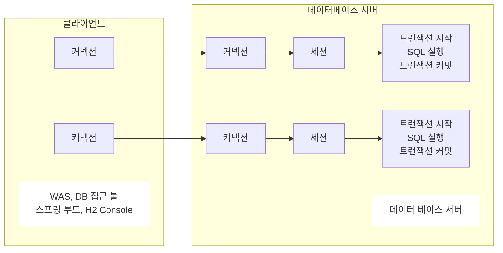

---
tags:
  - jdbc
---
# JDBC의 이해
## 도입 이유
- 데이터베이스를 다른 종류의 데이터베이스로 변경하면 애플리케이션 서버에 개발된 데이터베이스 사용 코드도 함께 변경해야 한다.
- 개발자가 각각의 데이터베이스마다 커넥션 연결, SQL 전달, 그리고 그 결과를 응답 받는 방법을 새로 학습해야 한다.
## 표준 인터페이스
- JDBC(Java Database Connectivity)는 자바에서 데이터베이스에 접속할 수 있도록 하는 자바 API다. 
- JDBC는 데이터베이스에서 자료를 쿼리하거나 업데이트하는 방법을 제공한다.
### 종류
- `java.sql.Connection` - 연결
- `java.sql.Statement` - SQL을 담은 내용
- `java.sql.ResultSet` - SQL 요청 응답
### 정리
- 애플리케이션 로직은 이제 JDBC 표준 인터페이스에만 의존한다.(추상화에 의존한다.)
  따라서 데이터베이스를 다른 종류의 데이터베이스로 변경하고 싶으면 JDBC 구현 라이브러리만 변경하면 된다. 따라서 다른 종류의 데이터베이스로 변경해도 애플리케이션 서버의 사용 코드를 그대로 유지할 수 있다.
- 개발자는 JDBC 표준 인터페이스 사용법만 학습하면 된다. 한번 배워두면 수십개의 데이터베이스에 모두 동일하게 적용할 수 있다.
## JDBC 연결
- driver가 제공하는 `getConnection`을 사용하면 된다.
```Java
public static Connection getConnection() {  
    try {  
        Connection connection = DriverManager.getConnection(URL, USERNAME, PASSWORD);  
        log.info("get connection {}, class = {}", connection, connection.getClass());  
        return connection;  
    } catch (SQLException e) {  
        throw new RuntimeException(e);  
    }  
}
```
### 과정
- 애플리케이션 로직에서 커넥션이 필요하면 `DriverManager.getConnection()` 을 호출한다.
- `DriverManager` 는 라이브러리에 등록된 드라이버 목록을 자동으로 인식 및 관리하며
  이 드라이버들에게 순서대로 다음 정보를 넘겨서 커넥션을 획득할 수 있는지 확인한다.
- 이렇게 찾은 커넥션 구현체가 클라이언트에 반환된다.
### ResultSet이란
테이블의 형태로 데이터를 관리하는 자료구조

| MEMBER_ID | MONEY |
| --------- | ----- |
| hi1       | 10000 |
| hi2       | 20000 |
| MemberV0  | 10000 |
아래와 같은 cursor를 통해서 데이터를 조회할 수 있다.
```Java
if (rs.next()) {  
    Member member = new Member();  
    member.setMemberId(rs.getString("member_id"));  
    member.setMoney(rs.getInt("money"));  
    return member;  
} else {  
    throw new NoSuchElementException("member not found memberId=" + memberId);  
}
```
# 커넥션 풀
## 커넥션 풀의 이해
모든 SQL 요청에 대해서 커넥션을 새로 만들게 될 경우 항상 `TCP/IP` 커넥션을 새로 만들어야 하므로 비효율적이다. 이는 SQL을 실행하는 시간 뿐만 아니라 커넥션을 새로 만드는 시간이 추가 되기 때문에 응답속도에 영향을 주므로 사용자에게 좋지 않은 경험을 줄 수 있다.   
이 문제를 해결하기 위해 나온 것이 미리 커넥션을 생성해 두고 사용하는 커넥션 풀이라는 방식이다.
## DataSource 이해
기존에 DriverManager을 사용하고 있었을 때 HikariCP 커넥션 풀로 변경하려면 커넥션을 획득하는 애플리케이션 코드도 함께 변경을 해야 한다.    
이런 문제를 해결하기 위해서 커넥션을 획득하는 방법을 추상화 한 것이 `DataSource` 이다. 
### 핵심 기능
```Java
public interface DataSource {
	Connection getConnection() throws SQLException;
}
```
## DriverManager
### 기존의 DriverManager 사용
```Java
Connection con1 = DriverManager.getConnection(URL, USERNAME, PASSWORD);  
Connection con2 = DriverManager.getConnection(URL, USERNAME, PASSWORD);
```
### DataSource를 사용
```Java
DriverManagerDataSource dataSource =  
    new DriverManagerDataSource(URL, USERNAME, PASSWORD);

Connection con1 = dataSource.getConnection();  
Connection con2 = dataSource.getConnection();
```
### 특징
- 설정과 사용을 분리할 수 있으므로 향후 변경에 더 유용하게 대처할 수 있다.
- 리포지토리는 DataSource만 의존하고 파라미터 속성들을 몰라도 된다.
## DI의 장점
- 의존하는 클래스를 변경할때도 사용하는 클래스는 전혀 변경할 필요가 없다.
```Java
void beforeEach() {  
        // 기본 DriverManger를 통한 새로운 커넥션을 획득  
        DriverManagerDataSource dataSource = new DriverManagerDataSource(URL, USERNAME, PASSWORD);  

		// Hikari DataSource 사용
        HikariDataSource dataSource = new HikariDataSource();  
        dataSource.setJdbcUrl(URL);  
        dataSource.setUsername(USERNAME);  
        dataSource.setPassword(PASSWORD);  

		// 필요한 dataSource를 주입하는 부분
        repository = new MemberRepositoryV1(dataSource);  
    }
```
# 트랜잭션
## 기본 개념
- 데이터의 정합성을 지키기 위함이다. 신뢰성 상승
- 트랜잭션 ACID
- 트랜잭션 격리 수준
	- READ UNCOMMITED
	- READ COMMITTED
	- REPEATABLE READ
	- SERIALZABLE
## 데이터베이스 연결 구조와 DB 세션
- 사용자는 WAS나 DB 접근 툴을 사용하여서 데이터베이스 서버와 연결을 요청 이후 커넥션을 맺게 된다.
- 이 때 데이터베이스 서버 내부에는 세션을 생성 하고 이후 커넥션을 통한 모든 요청은 세션을 통해서 실행이 된다.
- 세션은 트랜잭션을 시작하고 커밋 도는 롤백을 통해서 트랜잭션을 종료한다.


## 자동 커밋, 수동 커밋
기본은 자동 커밋이므로 수동 커밋모드로 설정 하는 것을 트랜잭션을 시작한다고 표현을 한다.   
중요한 데이터를 다룰 때에는 수동 커밋 모드를 사용해서 수동으로 커밋, 롤백 할 수 있도록 해야 한다
## 락을 다루기
### 락의 기본 개념
- 트랜잭션을 시작하고 데이터를 수정하는 동안 아직 커밋을 수행하지 않았는데 다른 세션에서 동시에 데이터를 수정하려고 하는 경우에 문제가 발생할 수 있다.
- 이를 보완하기 위해서 커밋이나 롤백 전까지 다른 세션에서 해당 데이터를 수정할 수 없게 막는 것을 락이라고 한다.
### 락의 종류
- 수동 커밋을 시작하고 수정하는 동안에는 lock을 획득 할 수 있다.
```Java
set autocommit true;
delete from member;
insert into member(member_id, money) values ('memberA',10000);
```
- `for update` 구문을 사용해서 select 할 때에도 lock을 획득할 수 있다
```Java
set autocommit false;
select * from member where member_id='memberA' for update;
```
## 트랜잭션 적용해보기
- 비즈니스 로직이 전체가 트랜잭션이 걸려야 하기 때문에 서비스 레이어에서 시작을 해야 한다.
- 애플리케이션에서 트랜잭션을 사용하려면 트랜잭션을 사용하는 동안 같은 커넥션을 유지해야 한다.
# 스프링 안에서 트랜잭션과 문제 해결
## 기존에 트랜잭션 사용 시 문제
- 비즈니스 로직은 최대한 변경 없이 유지되어야 한다. 이렇게 하려면 특정 기술에 종속적이지 않게 개발해야한다. 하지만 트랜잭션은 서비스 레이어에서 시작해야 하기 때문에 서비스 계층에 해당 기능이 존재하게 된다.
- 예외 처리가 JDBC의 의존하는 전영 기술인데 향후 JPA와 같은 다른 기술로 변경 시 그에 맞는 예외 처리로 변경해야 한다.
- JDBC는 유사한 코드의 반벅이 너무 많다.
	- try, catch, final
	- 지속적으로 커넥션을 열고 닫는 코드가 반복된다.
## 트랜잭션의 추상화
### 트랜잭션의 기본 기능
- 우리가 하고자 하는 추상화
```Java
public interface TxManager {
	begin();
	commit();
	rollback();
}
```
- Spring 트랜잭션 추상화
```Java
public interface PlatformTransactionManager extends TransactionManager {  
    TransactionStatus getTransaction(@Nullable TransactionDefinition definition) throws TransactionException; 
    void commit(TransactionStatus status) throws TransactionException;   
    void rollback(TransactionStatus status) throws TransactionException;  
}
```
## 트랜잭션 동기화
### 커넥션 보관
- 스프링은 트랜잭션 동기화 매니저를 제공한다.
- 이것은 쓰레드 로컬을 사용해서 커넥션을 동기화 해준다.
- 트랜잭션 매니저는 내부에서 이 동기화 매니저를 사용한다.
### 커넥션 사용
- 트랜잭션 동기화 매니저는 쓰레드 로컬을 사용하기 때문에 멀티 쓰레드 환경에서 안전하게 커넥션을 동기화 할 수 있다. 
- 커넥션이 필요하면 트랜잭션 동기화 매니저를 통해서 커넥션을 획득하게 된다.
### 동작 방식
- 트랜잭션을 시작하기 위해서 커넥션이 필요하다.
  트랜잭션 매니저는 데이터소스를 통해 커넥션을 만들고 트랜잭션을 시작한다.
- 트랜잭션 매니저는 트랜잭션이 시작된 커넥션을 **트랜잭션 동기화 매니저**에 보관한다.
  `org.springframework.transaction.support.TransactionSynchronizationManager`
- 리포지토리는 **트랜잭션 동기화 매니저**에 보관된 커넥션을 꺼내서 사용한다.
  파라미터로 커넥션을 전달할 필요가 없음.
- 트랜잭션이 종료되면 트랜잭션 매니저는 트랜잭션 동기화 매니저에 보관된 커넥션을 통해 트랜잭션을 종료하고 커넥션도 종료한다.
