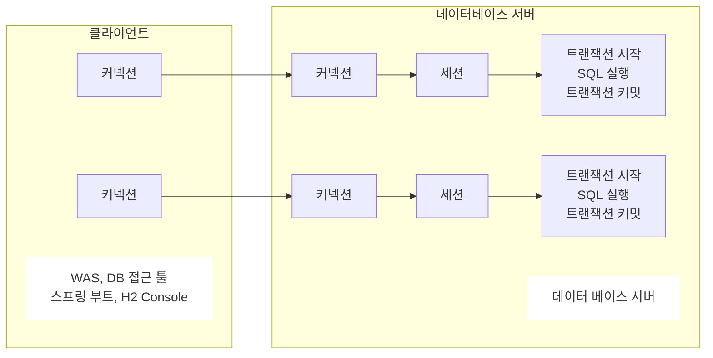
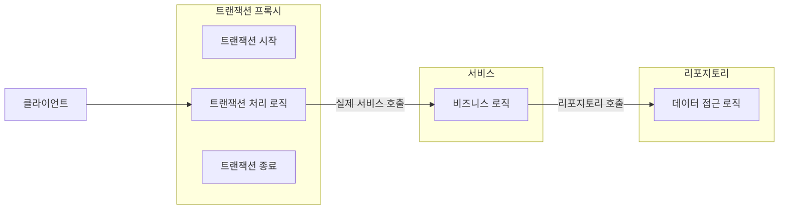
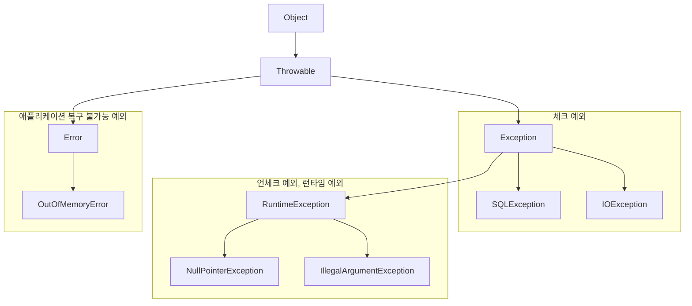

---
tags:
  - jdbc
---
# JDBC의 이해
## 도입 이유
- 데이터베이스를 다른 종류의 데이터베이스로 변경하면 애플리케이션 서버에 개발된 데이터베이스 사용 코드도 함께 변경해야 한다.
- 개발자가 각각의 데이터베이스마다 커넥션 연결, SQL 전달, 그리고 그 결과를 응답 받는 방법을 새로 학습해야 한다.
## 표준 인터페이스
- JDBC(Java Database Connectivity)는 자바에서 데이터베이스에 접속할 수 있도록 하는 자바 API다. 
- JDBC는 데이터베이스에서 자료를 쿼리하거나 업데이트하는 방법을 제공한다.
### 종류
- `java.sql.Connection` - 연결
- `java.sql.Statement` - SQL을 담은 내용
- `java.sql.ResultSet` - SQL 요청 응답
### 정리
- 애플리케이션 로직은 이제 JDBC 표준 인터페이스에만 의존한다.(추상화에 의존한다.)
  따라서 데이터베이스를 다른 종류의 데이터베이스로 변경하고 싶으면 JDBC 구현 라이브러리만 변경하면 된다. 따라서 다른 종류의 데이터베이스로 변경해도 애플리케이션 서버의 사용 코드를 그대로 유지할 수 있다.
- 개발자는 JDBC 표준 인터페이스 사용법만 학습하면 된다. 한번 배워두면 수십개의 데이터베이스에 모두 동일하게 적용할 수 있다.
## JDBC 연결
- driver가 제공하는 `getConnection`을 사용하면 된다.
```Java
public static Connection getConnection() {  
    try {  
        Connection connection = DriverManager.getConnection(URL, USERNAME, PASSWORD);  
        log.info("get connection {}, class = {}", connection, connection.getClass());  
        return connection;  
    } catch (SQLException e) {  
        throw new RuntimeException(e);  
    }  
}
```
### 과정
- 애플리케이션 로직에서 커넥션이 필요하면 `DriverManager.getConnection()` 을 호출한다.
- `DriverManager` 는 라이브러리에 등록된 드라이버 목록을 자동으로 인식 및 관리하며
  이 드라이버들에게 순서대로 다음 정보를 넘겨서 커넥션을 획득할 수 있는지 확인한다.
- 이렇게 찾은 커넥션 구현체가 클라이언트에 반환된다.
### ResultSet이란
테이블의 형태로 데이터를 관리하는 자료구조

| MEMBER_ID | MONEY |
| --------- | ----- |
| hi1       | 10000 |
| hi2       | 20000 |
| MemberV0  | 10000 |
아래와 같은 cursor를 통해서 데이터를 조회할 수 있다.
```Java
if (rs.next()) {  
    Member member = new Member();  
    member.setMemberId(rs.getString("member_id"));  
    member.setMoney(rs.getInt("money"));  
    return member;  
} else {  
    throw new NoSuchElementException("member not found memberId=" + memberId);  
}
```
# 커넥션 풀
## 커넥션 풀의 이해
모든 SQL 요청에 대해서 커넥션을 새로 만들게 될 경우 항상 `TCP/IP` 커넥션을 새로 만들어야 하므로 비효율적이다. 이는 SQL을 실행하는 시간 뿐만 아니라 커넥션을 새로 만드는 시간이 추가 되기 때문에 응답속도에 영향을 주므로 사용자에게 좋지 않은 경험을 줄 수 있다.   
이 문제를 해결하기 위해 나온 것이 미리 커넥션을 생성해 두고 사용하는 커넥션 풀이라는 방식이다.
## DataSource 이해
기존에 DriverManager을 사용하고 있었을 때 HikariCP 커넥션 풀로 변경하려면 커넥션을 획득하는 애플리케이션 코드도 함께 변경을 해야 한다.    
이런 문제를 해결하기 위해서 커넥션을 획득하는 방법을 추상화 한 것이 `DataSource` 이다. 
### 핵심 기능
```Java
public interface DataSource {
	Connection getConnection() throws SQLException;
}
```
## DriverManager
### 기존의 DriverManager 사용
```Java
Connection con1 = DriverManager.getConnection(URL, USERNAME, PASSWORD);  
Connection con2 = DriverManager.getConnection(URL, USERNAME, PASSWORD);
```
### DataSource를 사용
```Java
DriverManagerDataSource dataSource =  
    new DriverManagerDataSource(URL, USERNAME, PASSWORD);

Connection con1 = dataSource.getConnection();  
Connection con2 = dataSource.getConnection();
```
### 특징
- 설정과 사용을 분리할 수 있으므로 향후 변경에 더 유용하게 대처할 수 있다.
- 리포지토리는 DataSource만 의존하고 파라미터 속성들을 몰라도 된다.
## DI의 장점
- 의존하는 클래스를 변경할때도 사용하는 클래스는 전혀 변경할 필요가 없다.
```Java
void beforeEach() {  
        // 기본 DriverManger를 통한 새로운 커넥션을 획득  
        DriverManagerDataSource dataSource = new DriverManagerDataSource(URL, USERNAME, PASSWORD);  

		// Hikari DataSource 사용
        HikariDataSource dataSource = new HikariDataSource();  
        dataSource.setJdbcUrl(URL);  
        dataSource.setUsername(USERNAME);  
        dataSource.setPassword(PASSWORD);  

		// 필요한 dataSource를 주입하는 부분
        repository = new MemberRepositoryV1(dataSource);  
    }
```
# 트랜잭션
## 기본 개념
- 데이터의 정합성을 지키기 위함이다. 신뢰성 상승
- 트랜잭션 ACID
- 트랜잭션 격리 수준
	- READ UNCOMMITED
	- READ COMMITTED
	- REPEATABLE READ
	- SERIALZABLE
## 데이터베이스 연결 구조와 DB 세션
- 사용자는 WAS나 DB 접근 툴을 사용하여서 데이터베이스 서버와 연결을 요청 이후 커넥션을 맺게 된다.
- 이 때 데이터베이스 서버 내부에는 세션을 생성 하고 이후 커넥션을 통한 모든 요청은 세션을 통해서 실행이 된다.
- 세션은 트랜잭션을 시작하고 커밋 도는 롤백을 통해서 트랜잭션을 종료한다.


## 자동 커밋, 수동 커밋
기본은 자동 커밋이므로 수동 커밋모드로 설정 하는 것을 트랜잭션을 시작한다고 표현을 한다.   
중요한 데이터를 다룰 때에는 수동 커밋 모드를 사용해서 수동으로 커밋, 롤백 할 수 있도록 해야 한다
## 락을 다루기
### 락의 기본 개념
- 트랜잭션을 시작하고 데이터를 수정하는 동안 아직 커밋을 수행하지 않았는데 다른 세션에서 동시에 데이터를 수정하려고 하는 경우에 문제가 발생할 수 있다.
- 이를 보완하기 위해서 커밋이나 롤백 전까지 다른 세션에서 해당 데이터를 수정할 수 없게 막는 것을 락이라고 한다.
### 락의 종류
- 수동 커밋을 시작하고 수정하는 동안에는 lock을 획득 할 수 있다.
```Java
set autocommit true;
delete from member;
insert into member(member_id, money) values ('memberA',10000);
```
- `for update` 구문을 사용해서 select 할 때에도 lock을 획득할 수 있다
```Java
set autocommit false;
select * from member where member_id='memberA' for update;
```
## 트랜잭션 적용해보기
- 비즈니스 로직이 전체가 트랜잭션이 걸려야 하기 때문에 서비스 레이어에서 시작을 해야 한다.
- 애플리케이션에서 트랜잭션을 사용하려면 트랜잭션을 사용하는 동안 같은 커넥션을 유지해야 한다.
# 스프링 안에서 트랜잭션과 문제 해결
## 기존에 트랜잭션 사용 시 문제
- 비즈니스 로직은 최대한 변경 없이 유지되어야 한다. 이렇게 하려면 특정 기술에 종속적이지 않게 개발해야한다. 하지만 트랜잭션은 서비스 레이어에서 시작해야 하기 때문에 서비스 계층에 해당 기능이 존재하게 된다.
- 예외 처리가 JDBC의 의존하는 전영 기술인데 향후 JPA와 같은 다른 기술로 변경 시 그에 맞는 예외 처리로 변경해야 한다.
- JDBC는 유사한 코드의 반벅이 너무 많다.
	- try, catch, final
	- 지속적으로 커넥션을 열고 닫는 코드가 반복된다.
## 트랜잭션의 추상화
### 트랜잭션의 기본 기능
- 우리가 하고자 하는 추상화
```Java
public interface TxManager {
	begin();
	commit();
	rollback();
}
```
- Spring 트랜잭션 추상화
```Java
public interface PlatformTransactionManager extends TransactionManager {  
    TransactionStatus getTransaction(@Nullable TransactionDefinition definition) throws TransactionException; 
    void commit(TransactionStatus status) throws TransactionException;   
    void rollback(TransactionStatus status) throws TransactionException;  
}
```
## 트랜잭션 동기화
### 커넥션 보관
- 스프링은 트랜잭션 동기화 매니저를 제공한다.
- 이것은 쓰레드 로컬을 사용해서 커넥션을 동기화 해준다.
- 트랜잭션 매니저는 내부에서 이 동기화 매니저를 사용한다.
### 커넥션 사용
- 트랜잭션 동기화 매니저는 쓰레드 로컬을 사용하기 때문에 멀티 쓰레드 환경에서 안전하게 커넥션을 동기화 할 수 있다. 
- 커넥션이 필요하면 트랜잭션 동기화 매니저를 통해서 커넥션을 획득하게 된다.
### 동작 방식
- 트랜잭션을 시작하기 위해서 커넥션이 필요하다.
  트랜잭션 매니저는 데이터소스를 통해 커넥션을 만들고 트랜잭션을 시작한다.
- 트랜잭션 매니저는 트랜잭션이 시작된 커넥션을 **트랜잭션 동기화 매니저**에 보관한다.
  `org.springframework.transaction.support.TransactionSynchronizationManager`
- 리포지토리는 **트랜잭션 동기화 매니저**에 보관된 커넥션을 꺼내서 사용한다.
  파라미터로 커넥션을 전달할 필요가 없음.
- 트랜잭션이 종료되면 트랜잭션 매니저는 트랜잭션 동기화 매니저에 보관된 커넥션을 통해 트랜잭션을 종료하고 커넥션도 종료한다.
## 트랜잭션 매니저 적용
- 트랜잭션 DataSource의 connection을 갖고 온다.
	- 트랜잭션 동기화 매니저가 관리하는 커넥션이 있으면 해당 커넥션을 반환한다.
	- 만약 커넥션이 없으면 새로운 커넥션을 생성해서 반환한다.
```Java
private Connection getConnection() throws SQLException {   
    // 주의! 트랜잭션 동기화를 사용하려면 DataSourceUtils를 사용해야 한다.  
    Connection con = DataSourceUtils.getConnection(dataSource);  
    log.info("get connection={}, class={}", con,  
        con.getClass());  
    return con;  
}
```
- 트랜잭션 동기화를 사용할 때 release 하는 방법
	- 커넥션을 닫아버리면 안되고 롤백이나 커밋 할 때까지 살아있어야 한다.
	- 따라서 바로 닫아버리지 않고 그대로 유지해준다
```Java
private void close(Connection con, Statement stmt, ResultSet rs) {  
    JdbcUtils.closeResultSet(rs);  
    JdbcUtils.closeStatement(stmt);  
    DataSourceUtils.releaseConnection(con, dataSource);  
}
```
## 트랜잭션 상세 순서
1. 클라이언트 요청으로 서비스 로직을 싱행
2. 서비스 계층에서 `transactionManager.getTransaction()`을 호출해서 트랜잭션을 실행한다.
3. 트랜잭션은 먼저 데이터베이스 커넥션이 필요하다. 
   트랜잭션 매니저는 내부에서 데이터 소스를 사용해서 커넥션을 생성한다.
4. 커넥션을 수동 커밋 모드로 변경해서 실제 데이터베이스 트랜잭션을 시작한다.
5. 커넥션을 트랜잭션 동기화 매니저에서 보관한다.
6. 트랜잭션 동기화 매니저는 쓰레드 로컬에 보관한다.
   멀티 쓰레드 환경에서 안전하게 커넥션을 보관할 수 있다.
7. 서비스는 비즈니스 로직을 실행하면서 리포지토리의 메소드들을 호출한다.
8. 리포지토리 메서드들은 트랜잭션이 시작된 커넥셔닝 필요하다.
   리포지토리는 `DataSourceUtils.getConnection()`을 사용해서 트랜잭션 동기화 매니저에 보관된 커넥션을 갖고 와서 사용한다.
   이 과정에서 같은 커넥션을 사용하고 트랜잭션이 유지가 된다.
9. 위에서 획득한 커넥션을 사용해서 SQL을 데이터베이스에 전달한다.
10. 비즈니스 로직이 끝나면 트랜잭션을 종료한다.(커밋 or 롤백)
11. 트랜잭션을 종료하려면 동기화된 커넥션이 필요하다.
    트랜잭션 동기화 매니저를 통해서 동기화된 커넥션을 획득한다.
12. 획득한 커넥션을 통해 데이터베이스에 트랜잭션을 커밋하거나 롤백한다.
13. 전체 리소스를 정리한다.
	1. 트랜잭션 동기화 매니저를 정리한다.(쓰레드 로컬을 사용 후 꼭 정리해야 한다.)
	2. `con.setAutoCommit(true)`로 되돌린다.
## 트랜잭션 템플릿
try-catch와 같은 구문이 반복되는 구조를 막기 위해서 트랜잭션 템플릿이라는 클래스를 스프링이 제공해준다.
```Java
public class TransactionTemplate {
	private PlatformTransactionManager transactionManager;
	
	public <T> T execute(TransactionCallback<T> action){..}
	void executeWithoutResult(Consumer<TransactionStatus> action){..}
}
```
- execute()
	- 응답값이 있을 때 사용
- executeWithoutResult
	- 응답값이 없을 때 사용
## 트랜잭션 AOP
- 프록시를 도입 한 후에는 트랜잭션 처리 로직을 서비스에서 추출해서 프록시에서 처리를 하게 된다.


### 동작 원리
```text
memberService class=class hello.jdbc.service.MemberServiceV3_3$ $EnhancerBySpringCGLIB$$... // spring에서 proxy 형식으로 자체적으로 처리한 클래스

// 아래와 같은 방식으로 AOP proxy 걸렸는데 확인할 수 있다.
Assertions.assertThat(AopUtils.isAopProxy(memberService)).isTrue();
```
먼저 AOP 프록시가 적용되었는지 확인해보자. `AopCheck()` 의 실행 결과를 보면 `memberService` 부분에 `EnhancerBySpringCGLIB..` 라는 부분을 통해 프록시(CGLIB)가 적용된 것을 확인할 수 있다.
`memberRepository` 에는 AOP를 적용하지 않았기 때문에 프록시가 적용되지 않는다.
## 스프링 부트의 자동 리소스 등록
- 데이터 소스와 트랜잭션 매니저를 스프링 빈으로 직접 등록하는 부분
```Java
@Bean
DataSource dataSource() {
	return new DriverManagerDataSource(URL, USERNAME, PASSWORD);
}

@Bean
PlatformTransactionManager transactionManager() {
	return new DataSourceTransactionManager(dataSource());
}
```
### DataSource 특징
- 스프링 부트는 데이터소스(`DataSource` )를 스프링 빈에 자동으로 등록한다
- 스프링 빈 이름 : `dataSource`
- 개발자가 직접 데이터소스를 빈으로 등록하면 스프링 부트는 데이터소스를 자동으로 등록하지 않는다
- 부트는 `application.yaml(properties)`에 있는 속성을 갖고 `DataSource`를 생성 후 빈에 등록한다
### TransactionManager 특징
- 스프링 부트는 적절한 트랜잭션 매니저(`PlatformTransactionManager` )를 자동으로 스프링 빈에 등록한다
- 등록되는 스프링 빈 이름: `transactionManager`
- 개발자가 직접 트랜잭션 매니저를 빈으로 등록하면 스프링 부트는 트랜잭션 매니저를 자동으로 등록하지 않는다.
- TransactionManager를 등록하는 판단 기준
	- JDBC를 기술을 사용하면 `DataSourceTransactionManager` 를 빈으로 등록하고, 
	- JPA를 사용하면 `JpaTransactionManager` 를 빈으로 등록한다. 
	- 둘다 사용하는 경우 `JpaTransactionManager` 를 등록한다.
		- `JpaTransactionManager` 는 `DataSourceTransactionManager` 가 제공하는 
		  기능도 대부분 지원한다
# 자바 예외
## 자바 에러 구조 다이어그램

- Error는 예외로 잡으면 안된다. => `Throwable`예외를 잡으면 안된다.
- 언체크 에러를 런타임 에러라고 부른다.
## 예외 기본 규칙
- 예외를 처리하지 못하면 호출한 곳으로 예외를 계속 던지게 된다.
- 지정한 예외 뿐만 아니라 하위 예외 들도 모두 잡게 된다.
- 예외는 잡거나 처리하는 두 가지 방법으로 처리해야 한다.
## 체크 예외 활용
### 기준
- 기본적으로는 언체크 예외를 사용하자
- 체크 예외는 비즈니스 로직상 의도적으로 던지는 예외에만 사용하자.
- 체크 예외 예시
	- 계좌 이체 실패
	- 결제시 포인트 부족
	- 로그인 불일치
### 체크 예외의 문제점
- 시스템 아래에서 발생하는 심각한 문제들은 대부분의 애플리케이션 로직에서 처리할 방법이 없다.
- 예를 들어 Infra layer에서 `SQlException`, `ConnectException`을 발생한다고 하면 서비스레이어에서 처리를 할 수가 없어서 Controller로 던져야 한다.
- 따라서 처리할 수 없는 상황임에도 무조건 코드에 명시를 해서 던져줘야 하는 번거로움이 존재한다.
  불필요한 코드의 작성이 필요하다.
- ControllerAdvice와 같은 곳에서 예외를 공통 처리한다.
```Java
// 서비스 및 controller에서 아래의 예외들을 계속해서 잡고 가야 한다.
public void request() throws SQLException, ConnectException {  
    service.logic();  
}

static class NetworkClient {  
  
    public void call() throws ConnectException {  
        throw new ConnectException("연결 실패");  
    }  
}  
  
static class Repository {  
  
    public void call() throws SQLException {  
        throw new SQLException("ex");  
    }  
}
```
### 2가지 문제
- 복구 불가능 문제
	- 대부분의 서비스나 컨트롤러에서는 이런 문제를 해결할 수 없다.
	- 이런 문제들은 일관성 있게 공통으로 처리를 해줘야 한다.
		- 서블릿 필터, 스프링 인터셉터, `ControllerAdvice`이런 곳에서 공통 처리 해야 한다.
- 의존 관계에 대한 문제
	- 서비스나 컨트롤러에서 처리할 수 없어도 `throws`를 선언해서 던지는 예외를 선언해야 한다.
	- 이러다보면 service나 controller에서 `SQLException`과 같은 다른 레이어에 의존을 하게 된다.
## 언체크 예외 활용
### 개념
- 서비스나 컨트롤러에서는 처리를 할 수 없기 때문에 런타임으로 둔다.
- 이후에 공통 처리 로직에서 해당 런타임 에러를 받아서 처리한다.
- 예외를 던질 때 기존 예외를 포함시켜줘야 예외 출력 시 스택 트레이스에서 기존 예외도 함께 확인할 수 있다.
### 특징
- 런타임 예외를 사용하면 중간에 기술이 변경되어도 해당 예외를 사용하지 않는 컨트롤러, 서비스에서는 코드를 변경하지 않아도 된다.
- 구현 기술이 변경되어도 공통 처리하는 한곳만 변경하면 되기 때문에 변경의 영향 범위는 최소화 된다.
## 예외 포함 및 스택 트레이스
### 기준
- 예외를 전환할 때에는 꼭 기존 예외를 포함해야 한다.
# 스프링과 문제해결 - 예외 처리, 반복
## 체크 예외와 인터페이스
- 인터페이스의 구현체가 체크 예외를 던지려면, 인터페이스 메서드에 먼저 체크 예외를 던지는 부분이 선언 되어있어야 한다. => 특정 구현에 종속적이 될 수 밖에 없다.
- 예를 들어 `SQLException`이 선언되어 있을 때 기술을 JDBC -> JPA로 변경하게 되는 경우
  모든 예외 처리 부분을 기술 변경에 맞게 바꿔줘야 한다.