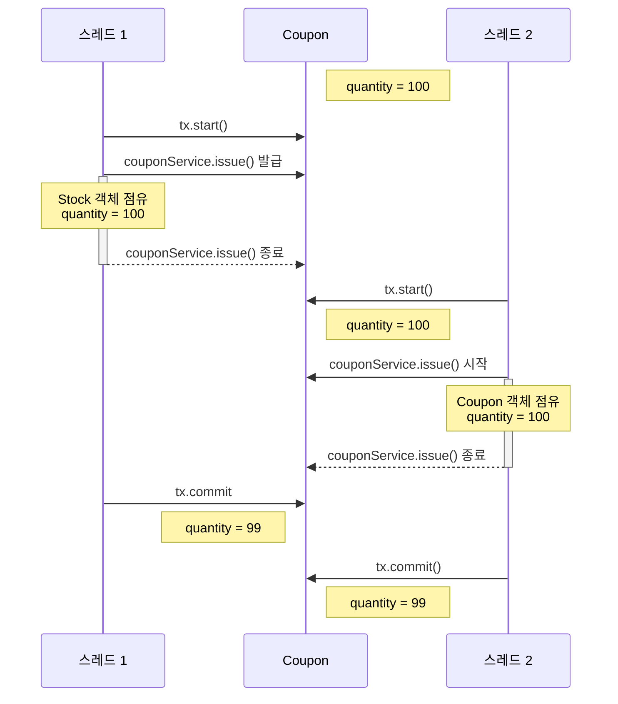

# 락을 테스트할 테스트 코드
쓰레드를 일정 갯수만큼 동시에 실행시키위한 코드이다
```Java
final int threadCount = 100;
ExecutorService executorService = Executors.newFixedThreadPool(32);
CountDownLatch latch = new CountDownLatch(threadCount);
// when
final Long currentMemberId = 1L;
for (int i = 0; i < threadCount; i++) {
    int ad = i + 1;
    executorService.submit(() -> {
        try {
            boolean b = couponUserService.issueCouponToUser(couponId, currentMemberId);

        } catch (Exception e) {
//                    System.out.println("에러 확인 : " + ad + " : " + e);
        } finally {
            latch.countDown();
        }

    });
}
latch.await();
```

# 락의 종류
## synchronized
### synchronized를 사용하는 방법
1. 메서드 선언부에 사용
아래의 그림과 같이 메서드를 작성할 때 선언함으로써 들어갈 때 락을 걸어줄 수 있다.
```Java
@Transactional
public synchronized boolean issueCouponToUser(Long couponId, Long userId) {
	
	    Coupon coupon = couponByIdAndCheck(couponId);

	    // issue coupon
	    LocalDateTime expiredTime = coupon.issueCoupon();
		...
	
	    return true;            
}
```

### 여기서 문제
다만 위와 같이 작성을 하는 경우 Transactional은 Spring AOP 형식으로 동작을 하게 되는데 커밋 되기 전에 락이 풀려서 다른 쓰레드가 쿠폰 객체를 점유할 수 있어서 문제가 발생한다.


2. synchronized 블록에 사용
아래와 같이 블록을 만들어서 적용할 수 있다.
Transactional과 함께 묶어 주기 위해서 controller에서 락을 진행한 것을 볼 수 있다.
```Java
// Controller
public ResponseEntity<?> 쿠폰_발급() {
	synchronized(this) {
		this.couponService.issueCouponToUser(couponId, userId);
	}
}

@Transactional
public boolean issueCouponToUser(Long couponId, Long userId) {
	    ...
	    return true;            
}
```
### 단점
synchronized를 사용하게 되면 하나의 프로세스에서만 Lock이 걸리게 되므로 서버를 여러 대 사용할 경우 동시성을 방지할 수 없다.
## perssimistic(비관적) Lock
비관적 락이란 DB 단에서 X-Lock(쓰기 락)을 설정해서 동시성을 제어하는 방법이다.
비관적 락을 설정하면 다른 트랙잭션은 Block이 되고 커밋될 때 까지 대기하게 된다.
이로 인해서 동시성을 제어해서 데이터의 무결성을 보장할 수 있다.
다만 비관적락을 사용할 경우 2개 이상의 트랜잭션이 서로가 가진 락을 대기하면서 데드락이 발생할 수 있다.
이처럼 데드락이 발생할 경우를 대비해서 timeout을 설정하면 트랜잭션을 롤백하고 다시 시도할 수 있다.

> MySql에서 기본 설정 시간 확인하기 <br>
> select @@innodb_lock_wait_timeout

아래와 같이 JPA에서 비관적 락을 적용하여 쿼리를 하는 것을 확인할 수 있다. 
또한 문제가 발생해서 트랜잭션이 데드락이 걸리는 경우 5초내로 나올 수 있도록 설정하였다.
```Java
@Lock(LockModeType.PESSIMISTIC_WRITE)
@QueryHints({@QueryHint(name = "jakarta.persistence.lock.timeout", value = "5000")})
Optional<Coupon> findCouponByCouponId(Long id);
```
비관적락을 적용한 후 발생하는 쿼리를 확인하면 `for update`가 적용되어 있는 모습을 볼 수 있다.
```sql
select
    c1_0.id,
    ...
    c1_0.updated_by 
from
    p_coupon c1_0 
where
    (
        c1_0.is_deleted = false
    ) 
    and c1_0.id=? for update
```
### 장점
- 데이터베이스에 락을 걸어 처리하므로 동시성 충돌을 완전히 방지할 수 있다.
- 트랜잭션에서 충돌 처리가 간단하다.
### 단점
- 데이터베이스 자체에 락을 거므로 성능이 떨어질 수 있다.
- 데드락이 발생할 수 있다.
- 트랜잭션이 길어질 수록 효율성이 떨어진다.

## optimistic(낙관적) Lock
낙관적 락은 DB 단에서 실제 Lock을 설정하지 않고 Version을 관리하는 컬럼을 테이블에 추가해서 데이터 수정 할 때 마다 맞는 버전의 데이터를 수정하는 지 판단하는 방식이다.
### JPA에서 낙관적 락 적용하기
발생하는 쿼리에 LockMode를 설정해준다.
```Java
/**
 * find By Id with 낙관적 락
 */
@Lock(LockModeType.OPTIMISTIC)
Optional<Coupon> findCouponByCouponId(Long id);
```
낙관적 락을 위한 버저닝 컬럼을 Entity에서 설정해준다.
```Java
/**
 * 낙관적 락을 위한 버저닝
 */
@Version
private Long version;
```
이후 어플리케이션에서 자체적으로 롤백 로직을 구현해 줘야 한다.
먼저 AOP 적용을 위한 애노테이션을 만들어준다.
```Java
@Retention(RetentionPolicy.RUNTIME)
@Target(ElementType.METHOD)
public @interface RetryCoupon {

    int maxRetries() default 100;

    int retryDelay() default 500;
```
위에서 작성한 어노테이션을 적용해서 AOP를 붙여서 재시도 로직을 붙여준다.
```Java
@Order(Ordered.LOWEST_PRECEDENCE - 1)
@Aspect
@Component
public class OptimisticLockRetryAspect {

    @Pointcut("@annotation(com.webest.coupon.common.aop.RetryCoupon)")
    private void couponRetry() {

    }

    @Around("@annotation(retryCoupon)")
    public Object retryCouponMethod(ProceedingJoinPoint joinPoint, RetryCoupon retryCoupon)
        throws Throwable {

        Exception exceptionHolder = null;

        for (int attemp = 0; attemp < retryCoupon.maxRetries(); attemp++) {
            try {
                return joinPoint.proceed();
            } catch (ObjectOptimisticLockingFailureException e) {
                exceptionHolder = e;
                Thread.sleep(retryCoupon.retryDelay());
            }
        }

        throw exceptionHolder;

    }
}
```
이후에 원하는 Method로 가서 적용해 줄 수 있다.
```Java
@Transactional
@RetryCoupon
public boolean issueCouponToUser(Long couponId, Long userId) {
	...
}
```
### 장점
- 실제로 DB에 락을 걸지 않기 때문에 성능이 좋다.
- 락을 걸지 않으므로 데드락도 발생하지 않는다.
### 단점
- 낙관적 락도 어플리케이션 레벨에서 롤백 로직을 처리 하므로 Scale-out에 취약할 수 있다. 
- 먼저 신청을 했어도 롤백으로 인해서 뒤로 가는 경우가 있을 수 있어서 순서가 고정되지 않을 수 있다.
- 충돌이 많이 발생하면 성능이 떨어질 수 있다.

## 분산 락
분산 시스템 환경에서 여러 인스턴스나 서버가 동일한 자원에 동시에 접근하지 못하도록 제어하는 락 메커니즘입니다. 
분산된 여러 노드(서버, 애플리케이션 인스턴스 등) 간에 데이터의 일관성을 유지하면서 동시에 특정 리소스를 하나의 노드만 수정할 수 있도록 보장하는 방식

### 분산락을 적용시 Redis 접근 라이브러리 차이
#### Lettuce
setnx를 활용한 스핀락을 사용해서 락을 적용한다.
`(SET IF NOT EXISTS)` => 레디스에서 제공하는 기본적인 연산이다.
해당 명령어를 통해서 반복을 사용해서 현재 락이 걸려있는지 확인을 한다.

#### Redisson
pub-sub방식으로 락을 구성한다.
```Java
// 현재 쓰레드 아이디를 구독에 등록한다.
CompletableFuture<RedissonLockEntry> subscribeFuture = subscribe(currentThreadId);
// 락이 해제 되기 까지 등록을 한다.
pubSub.timeout(subscribeFuture);

```

### 적용과정
#### redisson 클라이언트 설정
```Java
private static final String REDISSON_HOST_PREFIX = "redis://";

private final RedisProperty redisProperty;

@Bean
public RedissonClient redissonClient() {
    Config config = new Config();
    config.useSingleServer()
        .setAddress(REDISSON_HOST_PREFIX + redisProperty.host() + ":" + redisProperty.port())
        .setUsername(redisProperty.username()).setPassword(redisProperty.password());
    return Redisson.create(config);
}
```
#### 어노테이션 설정
```Java
@Target({ElementType.METHOD, ElementType.TYPE})
@Retention(RetentionPolicy.RUNTIME)
@Documented
public @interface RedissonLock {

    String value(); // Lock의 고유 이름

    long waitTime() default 5000L; // Lock획득 시도하는 최대 시간 (ms)

    long leaseTime() default 2000L; // Lock을 획득한 후 점유하는 최대 시간 (ms)
    
}
```
#### AOP 코드 작성
메서드로 부터 이름과 파라미터를 갖고 Redis 키를 지정해준다.
```Java
private final RedissonClient redissonClient;

@Around("@annotation(com.webest.coupon.common.aop.RedissonLock)")
public void redissonLock(ProceedingJoinPoint joinPoint) throws Throwable {

    MethodSignature signature = (MethodSignature) joinPoint.getSignature();
    Method method = signature.getMethod();
    RedissonLock lockAnnotation = method.getAnnotation(RedissonLock.class);

    String lockKey =
        method.getName() + "-" + CustomSpringELParser.getDynamicValue(
            signature.getParameterNames(),
            joinPoint.getArgs(), lockAnnotation.value());

    RLock lock = redissonClient.getLock(lockKey);

    try {
        boolean lockable = lock.tryLock(
            lockAnnotation.waitTime(), lockAnnotation.leaseTime(), TimeUnit.MILLISECONDS);

        if (!lockable) {
            // 대기 시간 초과
            log.info("Lock 획득 실패 : {}", lockKey);
            return;
        }

        joinPoint.proceed();

    } catch (InterruptedException e) {
        log.error("에러 발생" + e);
        throw e;
    } finally {
        // 락 해제
        lock.unlock();
    }

}
```
Lock이 Transactional을 감싸줘야 하므로 가장 먼저 실행되도록 한다.
```Java
@Order(Ordered.LOWEST_PRECEDENCE - 1)
```


## 참고 블로그
- [Callable, Executors, ExecutorService 의 이해 및 사용법](https://velog.io/@ssssujini99/Java-Callable-Executors-ExecutorService-%EC%9D%98-%EC%9D%B4%ED%95%B4-%EB%B0%8F-%EC%82%AC%EC%9A%A9%EB%B2%95#3-executor-%EC%9D%B8%ED%84%B0%ED%8E%98%EC%9D%B4%EC%8A%A4)​
- [쿠폰 발급의 동시성 처리 (1) - synchronized, pessimistic Lock ...](https://strong-park.tistory.com/entry/쿠폰-발급에-대한-동시성-처리-1-synchronized-pessimisti-Lock-optimistic-Lockhttps://ksh-coding.tistory.com/125)
- [풀필먼트 입고 서비스팀에서 분산락을 사용하는 방법 - Spring Redisson](https://helloworld.kurly.com/blog/distributed-redisson-lock/)​