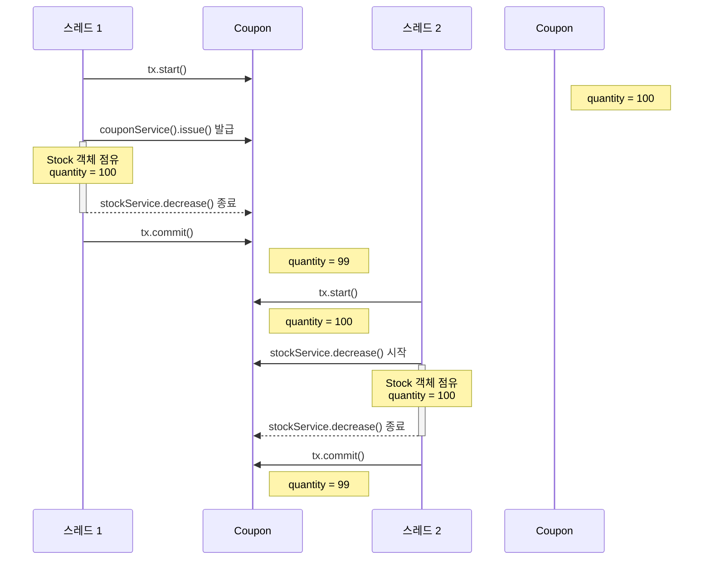

# 락을 테스트할 테스트 코드
쓰레드를 일정 갯수만큼 동시에 실행시키위한 코드이다
```Java
final int threadCount = 100;
ExecutorService executorService = Executors.newFixedThreadPool(32);
CountDownLatch latch = new CountDownLatch(threadCount);
// when
final Long currentMemberId = 1L;
for (int i = 0; i < threadCount; i++) {
    int ad = i + 1;
    executorService.submit(() -> {
        try {
            boolean b = couponUserService.issueCouponToUser(couponId, currentMemberId);

        } catch (Exception e) {
//                    System.out.println("에러 확인 : " + ad + " : " + e);
        } finally {
            latch.countDown();
        }

    });
}
latch.await();
```

# 락의 종류
## synchronized
### synchronized를 사용하는 방법
1. 메서드 선언부에 사용
아래의 그림과 같이 메서드를 작성할 때 선언함으로써 들어갈 때 락을 걸어줄 수 있다.
```Java
@Transactional
public synchronized boolean issueCouponToUser(Long couponId, Long userId) {
	
	    Coupon coupon = couponByIdAndCheck(couponId);

	    // issue coupon
	    LocalDateTime expiredTime = coupon.issueCoupon();
		...
	
	    return true;            
}
```

### 여기서 문제
다만 위와 같이 작성을 하는 경우 Transactional은 Spring AOP 형식으로 동작을 하게 되는데 커밋 되기 전에 다른 쓰레드가 데이터에 접근을 할 수 있어서 문제가 발생할 수 있다.


2. synchronized 블록에 사용
아래와 같이 블록을 만들어서 적용할 수 있다.
Transactional과 함께 묶어 주기 위해서 controller에서 락을 진행한 것을 볼 수 있다.
```Java
// Controller
public ResponseEntity<?> 쿠폰_발급() {
	synchronized(this) {
		this.couponService.issueCouponToUser(couponId, userId);
	}
}

@Transactional
public boolean issueCouponToUser(Long couponId, Long userId) {
	    ...
	    return true;            
}
```
