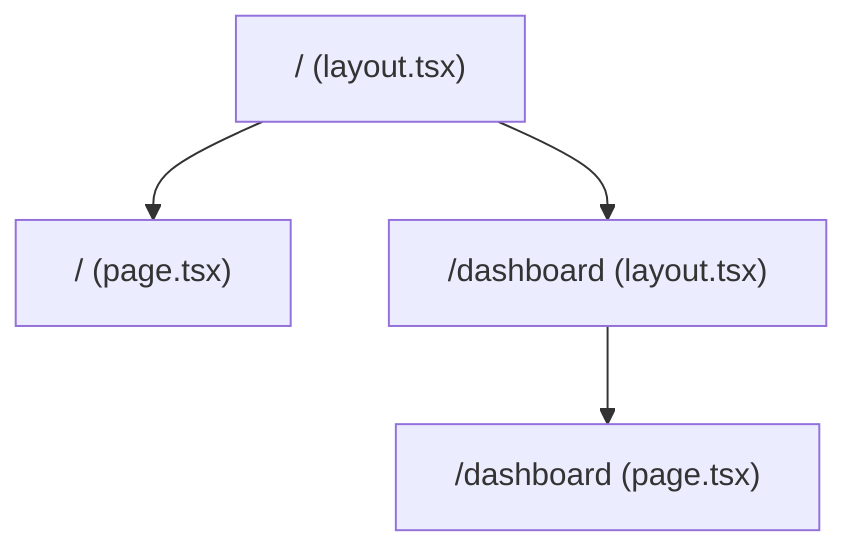

---
tags:
  - nextjs/rootlayout
---
# 의문점
```tsx
// app/layout.tsx
import '@/app/ui/global.css';
import { inter } from '@/app/ui/fonts';

export default function RootLayout({
  children,
}: {
  children: React.ReactNode;
}) {
  return (
    <html lang="en">
      <body className={`${inter.className} antialiased`}>
        {children}
      </body>
    </html>
  );
}
```
- 위의 코드를 살펴보면 children만 있고 실제 화면(`page.tsx`)과 연결된 정보가 없는데 실제로 로드해보면 `/`로 접속하면 `page.tsx` 화면이 로드되는 이유가 뭘까
# 파일 시스템 기반 라우팅
## 현재 폴더 구조

| **폴더·파일**  | **의미**                               |
| ---------- | ------------------------------------ |
| /app       | 최상위 세그먼트                             |
| layout.tsx | 해당 세그먼트를 감싸는 **레이아웃**                |
| page.tsx   | 실제 **페이지 컴포넌트**                      |
| 중첩 폴더      | URL 세그먼트( /dashboard, /posts/[id] 등) |
### 생성 다이어 그램
Next.js는 빌드 시 /app 폴더를 풀 스캔해서 아래와 같은 라우트 트리를 생성한다.

# 결론
 Next.js App Router는  **폴더 구조 → React 컴포넌트 트리**를 자동 변환합니다.   
 그 과정에서 page.tsx는 가장 가까운 layout.tsx의 children prop으로 **자동 주입**되므로,   
별도의 import·props 전달 코드를 작성할 필요가 없습니다.