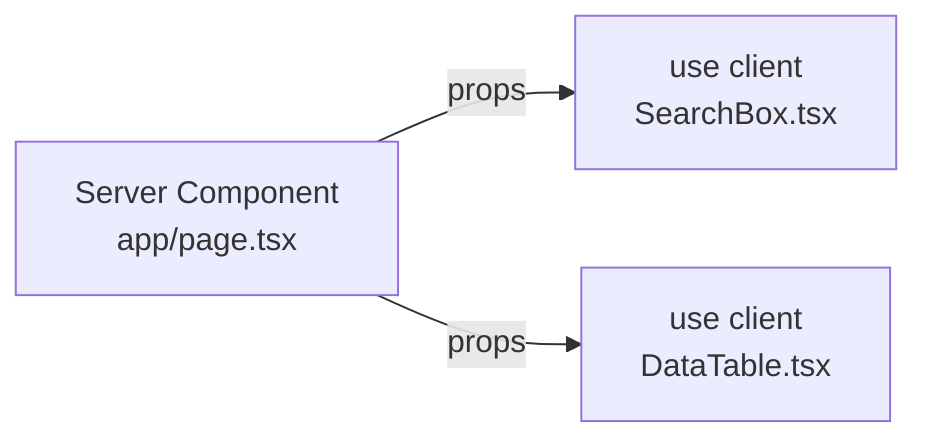

---
tags:
  - props
---
# Props란
## 정의
- Prop는 부모 컴포넌트에서 자식 컴포넌트로 값을 전달하기 위해 사용하는 읽기 전용 데이터
## 특징
- 단방향 데이터 흐름(Parent -> Child)
- 불변(자식이 직접 수정 불가능)
- Typescript로 타입 선언 가능
## 예시
```tsx
export default async function Page(props: {
  searchParams?: Promise<{
    query?: string;
    page?: string;
  }>;
}) {
  const searchParams = await props.searchParams;
  const query = searchParams?.query || '';
  const currentPage = Number(searchParams?.page) || 1;

	...
}
```
## Next.js만의 특징
- 페이지와 레이아웃에서는 `Next.js`가 자동으로 `props.params`, `props.searchParam`, `props.children`등을 자동 주입
## 사용 이유
- UI 재사용
	- 같은 컴포넌트를 다른 데이터로 여러번 렌더링
- 명시적 데이터 흐름
	- 코드 가독성, 디버깅 용이
- 정적 최적화
	- 값이 변하지 않으므로 React가 불필요한 리렌더를 건너뛸 수 있음
# 서버 컴포넌트와 클라이언트 컴포넌트의 차이
| **항목**  | **Server Component**                 | **Client Component**                                              |
| ------- | ------------------------------------ | ----------------------------------------------------------------- |
| 선언 방법   | 기본값                                  | 파일 첫 줄에 "use client"                                              |
| 실행 위치   | Node.js(서버), 빌드 단계 & 요청 시점           | 브라우저 (Hydration 이후)                                               |
| 가능한 일   | • DB/FS 접근<br>• 비공개 API 호출 및 무거운 연산  | • 브라우저 API(이벤트, localStorage)<br>• 상태 관리(useState)  • 인터랙션(클릭·입력) |
| 불가능/제약  | DOM 이벤트·useState 등 클라이언트 훅 사용 불가     | 서버 전용 기능(DB/FS) 직접 호출 불가 <br>(API 경유 필요)                          |
| 번들 크기   | 0 KB (HTML로만 전송)                     | JS 번들 필요 (크기 ↑)                                                   |
| Prop 전달 | **서버 → 클라이언트**: JSON 직렬화하여 props로 전달 | **클라이언트 → 서버**: 직접 호출 불가, API fetch 또는 RSC action 사용              |
### 예시에서의 props의 흐름

- 서버 컴포넌트에서 DB 조회 -> 결과를 prop으로 클라이언트 컴포넌트에 전달
- 클라이언트 컴포넌트는 해당 데이터를 렌더링 하고 사용자의 검색, 클릭 이벤트 처리