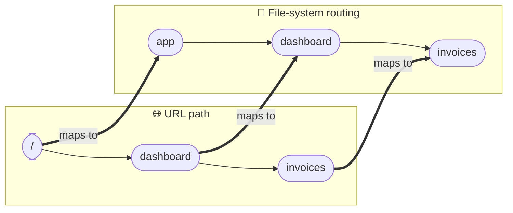
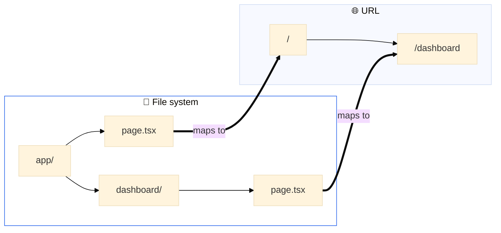

---
tags:
  - nextjs
---
[링크](https://nextjs.org/learn)
# 폴더 구조
- `/app`
	- 응용 프로그램의 모든 경로, 구성 요소 및 로직이 포함되어 있다.
	- 주요 작업 공간이다
- `/app/lib`
	- 재사용 가능한 유틸리티 함수 및 데이터 페치 기능과 같은 응용프로그램에 사용되는 기능이 포함되어 있다.
- `app/ui`
	- 카드 및 테이블 양식과 같은 응용 프로그램의 모든 UI 구성 요소가 포함되어 있다.
- `public`
	- 이미지와 같은 응용 프로그램의 모든 정적 Asset들이 포함되어 있다.
- ConfigFile
	- 애플리케이션의 루트에 `Next.config.ts`와 같은 구성 파일도 알 수 있다.
# 스타일 다루기
## 글로벌 스타일
- `/app/ui`폴더 내부 보면 `global.css`가 존재를 하고 이 파일을 사용하면 응용 프로그램의 모든 경로에 css 규칙을 추가하여 css 재설정 규칙, 링크와 같은 html 요소의 사이트 전체 스타일을 추가할 수 있다.
- 아래와 같은 방식으로 css 파일을 import 할 수 있다.
```typescript
import '@/app/ui/global.css';

export default function RootLayout({
	children,
}: {
	...// 로직
}
```
## Tailwind
- Tailwind는 css 프레임워크로서 React Code에서 유틸리티 클래스를 직접 신속하게 사용할 수 있게 하여서 개발 프로세스 속도를 높인다.
## CSS를 사용해서 import 하기
- css 클래스를 기본적으로 구성 요소에 로컬 범위로 컴포넌트를 제공해서 스타일링의 충돌 위험을 줄여준다.
- 아래와 같은 `home.module.css`파일이 있을 때
```css
.shape {
  height: 0;
  width: 0;
  border-bottom: 30px solid black;
  border-left: 20px solid transparent;
  border-right: 20px solid transparent;
}
```
- 아래와 같이 import 해서 사용할 수 있다.
```tsx
import styles from '@/app/ui/home.module.css'

<main>
	<div className={styles.shape}/>
</main>

```
## CLSX 라이브러리를 사용해서 클래스 이름 전환
- 조건을 기준으로 style을 적용하고 싶으면 아래와 같이 가능하다.
```tsx
<span
	className={clsx(
		'inline-flex items-center rounded-full px-2 py-1 text-xs',
	{
		'bg-gray-100 text-gray-500': status === 'pending',
		'bg-green-500 text-white': status === 'paid',
	},
	)}
>
```
# Font와 이미지
## Font 최적화
- Font는 웹 사이트 디장니에 중요한 역할을 하지만 Font 파일을 갖고 와서 로드해야 하는 경우 프로젝트에서 사용자 정의 Font를 사용하면 성능에 영향을 줄 수 있다
- Next.js에서는 Font 모듈을 사용할 때 응용 프로그램의 Font를 자동으로 최적화 한다.
  빌드 타임에서 Font파일을 다운로드 하고 다른 static asset들과 함게 호스팅한다.
  이로 인해서 사용자가 프로그램에 방문할 때 성능에 영향을 줄 Font 다운로드는 발생하지 않는다.
## 이미지 
- `Next.js`는 최상위 `/public`폴더에서 이미지와 같은 static asset을 제공할 수 있다.
- 일반 HTML을 사용하면 다음과 같이 이미지를 추가할 수 있다.
```html

```
### 주의 할점
- 이미지가 다른 화면 크기마다 반응하는지 확인하십시오.
- 다른 장치마다 특정 이미지 크기
- 이미지가 로드됨에 따라서 레이아웃 이동
- 웹페이지를 표시할 때 지금 화면에 보이지 않는(스크롤해야 보이는) 이미지는 바로 다운로드하지 말고, 사용자가 스크롤해서 그 이미지가 화면 근처로 올 때 로드해라.
### 추가 하기
- `/public`폴더 내부에 `/hero-desktop.png`가 존재한다면 아래와 같이 추가할 수 있다.
```tsx
import Image from 'next/image';

<Image 
	src="/hero-desktop.png" 
	width={1000} 
	height={760} 
	// display: none on mobile, block on desktop
	// tailwind의 속성으로 크기에 맞춰서 이미지를 숨기한다.
	className="hidden md:block" 
	alt="Screenshots of the dashboard project showing desktop version" />
```
- `Next.js`에서 갖고 오는 이미지 태그를 사용하는 것
- 일반적인 Img태그보다 더 많은 기능들을 제공한다.
	- `import Image from 'next/image';`
# 레이아웃 및 페이지 생성
## Nested 라우팅
- `Next.js`에서는 파일 시스템(폴더) 기반 라우팅을 사용하므로, 폴더 구조가 곧 중첩 라우트를 형성합니다. 각 폴더는 하나의 라우트 세그먼트가 되어 URL의 세그먼트와 대응됩니다

- 하지만 `page.tsx`파일은 특수한 파일로 해당 내부의 폴더의 루트를 의미하게 된다.

## 레이아웃
```tsx
export default function Layout({ children }: { children: React.ReactNode }) {
  return (
	<SideNav />	
	...

    /* 이런 방식으로 children을 활용해서 하위 컴포넌트 목록을 받을 수 있다.*/
    <div className="flex-grow p-6 md:overflow-y-auto md:p-12">
	  {children}</div>
    </div>
  );
}
```
- 이 children은 페이지가 될 수도 있고 또 다른 레이아웃이 될 수도 있다.
- 듀토에서 `/dashboard` 폴더 안의 페이지들은 자동으로 `<Layout />` 내부에 중첩되어 다음과 같이 렌더링됩니다.
### 부분 렌더링
- `Next.js`에서 레이아웃을 사용하면 네비게이션 시 하위 컴포넌트만 다시 그려진다.
- 레이아웃에 저장한 React 상태(토글, 폼 입력, Context 등)가 리셋되지 않는다
- 이를 부분 렌더링이라고 부른다.
### 루트 레이아웃
- 루트 레이아웃 안에 넣은 UI는 모든 페이지에서 공유된다.
- 특정 폴더 내부에서 적용한 레이아웃 `app/dashboard/layout.tsx`는 dashboard 전용 레이아웃이다.
# 페이지 간 탐색
## 네비게이션의 최적화
- 일반적으로 `<a>`태그를 사용하는데 이러면 각 페이지를 탐색할 때 마다 전체 페이지 새로고침이 발생한다.
## `<Link>` 컴포넌트
- `Next.js`에서는 페이지를 이동할 때 `Link`컴포넌트를 사용할 수 있다. 
- `Link`컴포넌트는 자바스크립트를 사용해서 client side navigation을 허용한다.
### Automatic code-splitting and prefetching
#### 정의
- 네비게이션 경험을 향상 시키기 위해서 페이지 단위로 분할한다.
- 전통적인 React SPA(Single Page Application)에서는 모든 페이지의 코드를 한 번에 브라우저로 내려보냅니다. 그래서 첫 페이지 로딩이 느려질 수 있습니다
  반면 `Next.js`는 사용자가 특정 페이지에 접근할 때 그 페이지에 필요한 코드만 로드합니다.
- 이 방식 덕분에 초기 로딩 속도가 빨라지고, 불필요한 코드 파싱이 줄어든다.
#### 장점
- 각 페이지가 독립적으로 동작하므로 어떤 페이지에서 에러가 발생해도, 다른 페이지에는 영향을 미치지 않는다.
- 전체 애플리케이션이 한 번에 깨지는 현상을 줄일 수 있다.
#### 사전 로딩
- Next.js는 사용자가 곧 방문할 가능성이 높은 페이지의 코드를 미리 백그라운드에서 다운로드한다.
- 사용자가 실제로 그 페이지로 이동할 때는 이미 코드가 준비되어 있어 페이지의 로딩 시간이 빨라진다.
### Showing active links
```tsx
'use client'

import { usePathname } from 'next/navigation';
```
- `use client`는 Next.js 13 이상에서 도입된 특별한 지시문이다.
- 이 코드를 파일의 맨 위에 작성하면, 해당 파일(또는 컴포넌트)이 클라이언트 컴포넌트임을 Next.js에 명시한다.
-  이 컴포넌트는 브라우저(클라이언트)에서 실행되어야 하며, 브라우저에서만 동작하는 React 훅(예: useState, useEffect, usePathname 등)을 사용할 수 있습니다.

```tsx
<Link
	key={link.name}
	href={link.href}
	className={clsx(
	  ...
	  {
		'bg-sky-100 text-blue-600': pathname === link.href,
	  },
	)}
>       
```
- 위와 같이 `clsx`와 함께 사용해서 현재 링크를 비교할 수 있다.