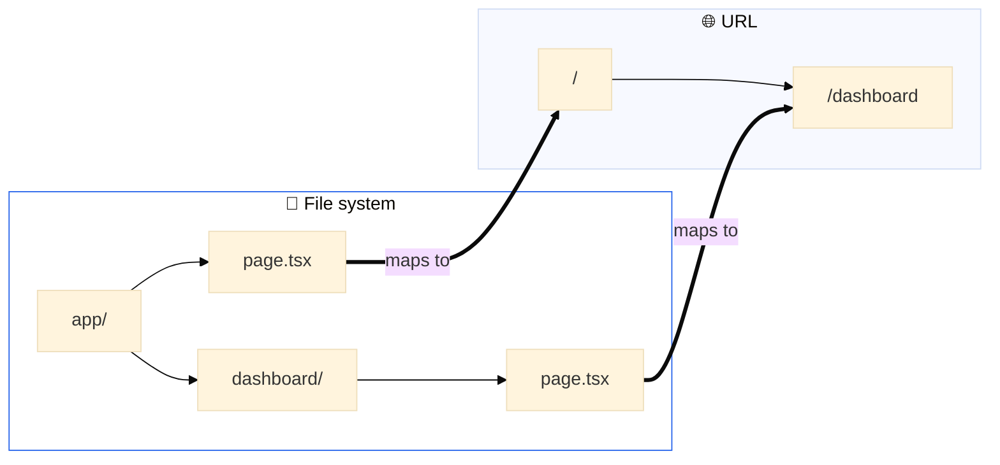

---
tags:
  - nextjs
---
[링크](https://nextjs.org/learn)
# 폴더 구조
- `/app`
	- 응용 프로그램의 모든 경로, 구성 요소 및 로직이 포함되어 있다.
	- 주요 작업 공간이다
- `/app/lib`
	- 재사용 가능한 유틸리티 함수 및 데이터 페치 기능과 같은 응용프로그램에 사용되는 기능이 포함되어 있다.
- `app/ui`
	- 카드 및 테이블 양식과 같은 응용 프로그램의 모든 UI 구성 요소가 포함되어 있다.
- `public`
	- 이미지와 같은 응용 프로그램의 모든 정적 Asset들이 포함되어 있다.
- ConfigFile
	- 애플리케이션의 루트에 `Next.config.ts`와 같은 구성 파일도 알 수 있다.
## 세그먼트란
- URL 경로를 구성하는 각 부분, 즉 폴더 구조의 한 단계를 의미한다.
### 예시
- `/invoices/create`라는 경로가 있다면
	- `invoices`가 첫 번째 세그먼트
	- `create`가 두 번째 세그먼트이다.
# 스타일 다루기
## 글로벌 스타일
- `/app/ui`폴더 내부 보면 `global.css`가 존재를 하고 이 파일을 사용하면 응용 프로그램의 모든 경로에 css 규칙을 추가하여 css 재설정 규칙, 링크와 같은 html 요소의 사이트 전체 스타일을 추가할 수 있다.
- 아래와 같은 방식으로 css 파일을 import 할 수 있다.
```typescript
import '@/app/ui/global.css';

export default function RootLayout({
	children,
}: {
	...// 로직
}
```
## Tailwind
- Tailwind는 css 프레임워크로서 React Code에서 유틸리티 클래스를 직접 신속하게 사용할 수 있게 하여서 개발 프로세스 속도를 높인다.
## CSS를 사용해서 import 하기
- css 클래스를 기본적으로 구성 요소에 로컬 범위로 컴포넌트를 제공해서 스타일링의 충돌 위험을 줄여준다.
- 아래와 같은 `home.module.css`파일이 있을 때
```css
.shape {
  height: 0;
  width: 0;
  border-bottom: 30px solid black;
  border-left: 20px solid transparent;
  border-right: 20px solid transparent;
}
```
- 아래와 같이 import 해서 사용할 수 있다.
```tsx
import styles from '@/app/ui/home.module.css'

<main>
	<div className={styles.shape}/>
</main>

```
## CLSX 라이브러리를 사용해서 클래스 이름 전환
- 조건을 기준으로 style을 적용하고 싶으면 아래와 같이 가능하다.
```tsx
<span
	className={clsx(
		'inline-flex items-center rounded-full px-2 py-1 text-xs',
	{
		'bg-gray-100 text-gray-500': status === 'pending',
		'bg-green-500 text-white': status === 'paid',
	},
	)}
>
```
# Font와 이미지
## Font 최적화
- Font는 웹 사이트 디장니에 중요한 역할을 하지만 Font 파일을 갖고 와서 로드해야 하는 경우 프로젝트에서 사용자 정의 Font를 사용하면 성능에 영향을 줄 수 있다
- Next.js에서는 Font 모듈을 사용할 때 응용 프로그램의 Font를 자동으로 최적화 한다.
  빌드 타임에서 Font파일을 다운로드 하고 다른 static asset들과 함게 호스팅한다.
  이로 인해서 사용자가 프로그램에 방문할 때 성능에 영향을 줄 Font 다운로드는 발생하지 않는다.
## 이미지 
- `Next.js`는 최상위 `/public`폴더에서 이미지와 같은 static asset을 제공할 수 있다.
- 일반 HTML을 사용하면 다음과 같이 이미지를 추가할 수 있다.
```html

```
### 주의 할점
- 이미지가 다른 화면 크기마다 반응하는지 확인하십시오.
- 다른 장치마다 특정 이미지 크기
- 이미지가 로드됨에 따라서 레이아웃 이동
- 웹페이지를 표시할 때 지금 화면에 보이지 않는(스크롤해야 보이는) 이미지는 바로 다운로드하지 말고, 사용자가 스크롤해서 그 이미지가 화면 근처로 올 때 로드해라.
### 추가 하기
- `/public`폴더 내부에 `/hero-desktop.png`가 존재한다면 아래와 같이 추가할 수 있다.
```tsx
import Image from 'next/image';

<Image 
	src="/hero-desktop.png" 
	width={1000} 
	height={760} 
	// display: none on mobile, block on desktop
	// tailwind의 속성으로 크기에 맞춰서 이미지를 숨기한다.
	className="hidden md:block" 
	alt="Screenshots of the dashboard project showing desktop version" />
```
- `Next.js`에서 갖고 오는 이미지 태그를 사용하는 것
- 일반적인 Img태그보다 더 많은 기능들을 제공한다.
	- `import Image from 'next/image';`
# 레이아웃 및 페이지 생성
## Nested 라우팅
- `Next.js`에서는 파일 시스템(폴더) 기반 라우팅을 사용하므로, 폴더 구조가 곧 중첩 라우트를 형성합니다. 각 폴더는 하나의 라우트 세그먼트가 되어 URL의 세그먼트와 대응됩니다

- 하지만 `page.tsx`파일은 특수한 파일로 해당 내부의 폴더의 루트를 의미하게 된다.

## 레이아웃
```tsx
export default function Layout({ children }: { children: React.ReactNode }) {
  return (
	<SideNav />	
	...

    /* 이런 방식으로 children을 활용해서 하위 컴포넌트 목록을 받을 수 있다.*/
    <div className="flex-grow p-6 md:overflow-y-auto md:p-12">
	  {children}</div>
    </div>
  );
}
```
- 이 children은 페이지가 될 수도 있고 또 다른 레이아웃이 될 수도 있다.
- 듀토에서 `/dashboard` 폴더 안의 페이지들은 자동으로 `<Layout />` 내부에 중첩되어 다음과 같이 렌더링됩니다.
### 부분 렌더링
- `Next.js`에서 레이아웃을 사용하면 네비게이션 시 하위 컴포넌트만 다시 그려진다.
- 레이아웃에 저장한 React 상태(토글, 폼 입력, Context 등)가 리셋되지 않는다
- 이를 부분 렌더링이라고 부른다.
### 루트 레이아웃
- 루트 레이아웃 안에 넣은 UI는 모든 페이지에서 공유된다.
- 특정 폴더 내부에서 적용한 레이아웃 `app/dashboard/layout.tsx`는 dashboard 전용 레이아웃이다.
# 페이지 간 탐색
## 네비게이션의 최적화
- 일반적으로 `<a>`태그를 사용하는데 이러면 각 페이지를 탐색할 때 마다 전체 페이지 새로고침이 발생한다.
## `<Link>` 컴포넌트
- `Next.js`에서는 페이지를 이동할 때 `Link`컴포넌트를 사용할 수 있다. 
- `Link`컴포넌트는 자바스크립트를 사용해서 client side navigation을 허용한다.
### Automatic code-splitting and prefetching
#### 정의
- 네비게이션 경험을 향상 시키기 위해서 페이지 단위로 분할한다.
- 전통적인 React SPA(Single Page Application)에서는 모든 페이지의 코드를 한 번에 브라우저로 내려보냅니다. 그래서 첫 페이지 로딩이 느려질 수 있습니다
  반면 `Next.js`는 사용자가 특정 페이지에 접근할 때 그 페이지에 필요한 코드만 로드합니다.
- 이 방식 덕분에 초기 로딩 속도가 빨라지고, 불필요한 코드 파싱이 줄어든다.
#### 장점
- 각 페이지가 독립적으로 동작하므로 어떤 페이지에서 에러가 발생해도, 다른 페이지에는 영향을 미치지 않는다.
- 전체 애플리케이션이 한 번에 깨지는 현상을 줄일 수 있다.
#### 사전 로딩
- Next.js는 사용자가 곧 방문할 가능성이 높은 페이지의 코드를 미리 백그라운드에서 다운로드한다.
- 사용자가 실제로 그 페이지로 이동할 때는 이미 코드가 준비되어 있어 페이지의 로딩 시간이 빨라진다.
### Showing active links
```tsx
'use client'

import { usePathname } from 'next/navigation';
```
- `use client`는 Next.js 13 이상에서 도입된 특별한 지시문이다.
- 이 코드를 파일의 맨 위에 작성하면, 해당 파일(또는 컴포넌트)이 클라이언트 컴포넌트임을 Next.js에 명시한다.
-  이 컴포넌트는 브라우저(클라이언트)에서 실행되어야 하며, 브라우저에서만 동작하는 React 훅(예: useState, useEffect, usePathname 등)을 사용할 수 있습니다.

```tsx
<Link
	key={link.name}
	href={link.href}
	className={clsx(
	  ...
	  {
		'bg-sky-100 text-blue-600': pathname === link.href,
	  },
	)}
>       
```
- 위와 같이 `clsx`와 함께 사용해서 현재 링크를 비교할 수 있다.
# 데이터베이스 갖고 오기
## 서버 컴포넌트를 사용해서 데이터를 갖고 온다.
### 장점
- async/await 직접 사용
	- 서버 컴포넌트는 JavaScript Promise를 네이티브로 지원하며, `useEffect`나 `useState` 없이도 비동기 데이터 페칭이 가능하다.
```tsx
// 서버 컴포넌트 예시
export default async function Page() {
  const data = await fetchData(); // 클라이언트 번들에 포함되지 않음
  return <div>{data}</div>;
}
```
- 서버 리소스 최적화
	- 대규모 데이터 처리나 복잡한 로직을 클라이언트가 아닌 서버에서 실행
	-  API 키, 데이터베이스 인증 정보 등 민감한 정보가 클라이언트에 노출되지 않음.
- 아키텍처의 단순화
	- 별도의 API 레이어 구축 없이 서버 컴포넌트에서 직접 데이터베이스 쿼리 실행 가능
	- 중복된 API 엔드포인트 작성 필요성이 감소
## reqeust waterfalls란
- 웹 페이지가 로드될 때 발생하는 네트워크 요청들이 순차적으로 일어나는 과정을 시각적으로 보여주는 개념이다
- 아래의 코드를 확인하면 await에 맞춰서 순차적으로 데이터를 갖고 온다.
- 하지만 병렬적으로 데이터를 갖고 올 수 없다.
```tsx
const revenue = await fetchRevenue();
const latestInvoices = await fetchLatestInvoices(); // wait for fetchRevenue() to finish
const { numberOfInvoices, numberOfCustomers, totalPaidInvoices, totalPendingInvoices,} = await fetchCardData(); // wait for fetchLatestInvoices() to finish
```
## 병렬로 데이터 호출
- `await Promise.all(...)`을 사용해서 데이터를 병렬적으로 갖고 올 수 있다.
# 정적 및 동적 렌더링
## 정적 렌더링이란
- 페이지를 미리 서버에서 만들어 두고 사용자가 방문할 때마다 미리 만들어진(캐시된) 결과를 제공하는 방식이다
## 장점
- 빠른 웹사이트
	- 빌드 시점(배포 시점)에 미리 렌더링된 HTML 파일이 만들어지고, 이 파일이 CDN(전 세계 서버)에 캐시되어 배포된다.
- 서버 부하 감소
	- 모든 요청마다 서버가 새로 페이지를 만들 필요가 없다.
- SEO(검색 엔진 최적화)
	- 페이지 내용이 미리 HTML로 만들어져 있기 때문에, 검색 엔진 크롤러가 페이지 내용을 쉽게 읽고 색인할 수 있다.
## 동적 렌더링이란
- 각 사용자의 데이터가 서버에서 컨텐츠가 렌더링이 된다.
### 장점
- 실시간 데이터
	- 응용 프로그램이 실시간 또는 자주 업데이트 되는 데이터를 표시할 수 있다.
- 사용자 별 컨텐츠
	- 대시 보드 또는 사용자 프로파일과 같은 개인화 콘텐츠를 제공할 수 있다.
	- 사용자 상호 작용을 기반으로 데이터를 업데이트 할 수 있다.
- 요청 시간 정보
	- 동적 렌더링을 사용하면 쿠키 또는 URL 검색 파라미터와 같이 요청시간에만 알 수 있는 정보에 액세스 할 수 있다.
### 주의
- 동적 렌더링을 사용하면 애플리케이션이 가장 느리게 갖고 온 데이터에 맞춰진다.
# 스트리밍
## 개념
- 스트리밍이란 더 작은 chunks 경로로 분해하고 준비가 되면 서버에서 클라이언트로 점진적으로 스트리밍 할 수 있는 데이터 전송 기술이다.
- 스트리밍을 통해서 느리게 데이터가 페치되서 전체 페이지가 block 되는 것을 방지할 수 있다.
- 사용자에게 표시되기 전에 모든 데이터가 로드 될 때 까지 기다리지 않을 수 있다.
## Streaming a whole page with `loading.tsx`
- `loading.tsx`파일은 `Next.js`에서 제공하는 특별한 파일이다.
- 페이지 컨텐츠의 로드가 있는 동안 대신해서 보여줄 수 있는 UI를 만들 수 있다.
- 여기서 `SideNav`는 정적파일이므로 즉시 표시되고 상호작용이 가능하다.
- 스켈레톤도 형성이 가능하다
### Streming a component
#### 기존 방식의 문제점
- 기존에는 느린 데이터 요청이 있으면 페이지 전체가 해당 데이터가 올 때 까지 기다려야 해서 전체 로딩이 지연됨.
#### Suspense 활용
- 느린 데이터 요청이 필요한 컴포넌트만 별도로 분리해서 `Suspense`로 감쌈
- `Suspense`의 `fallback`속성으로 로딩 중 보여줄 UI를 지정
- 나머지 페이지는 즉시 렌더링 되고, 느린 컴포넌트만 준비될 때 까지 fallback UI가 보여짐
```tsx
<Suspense fallback={<RevenueChartSkeleton />}>
	<RevenueChart />
</Suspense>
```
#### Suspend의 위치 활용
- 사용자의 스트리밍 할 때의 페이지 경험
- 우선 순위를 원하는 컨텐츠
- 구성 요소가 데이터 가져오기에 의존하는 경우
# 검색 및 페이지네이션
## 검색 기능
- `useSearchParams`
	- 현재 URL의 쿼리 파람에 access 할 수 있다.
- `usePathname`
	- 현재 user의 pathname을 읽을 수 있다.
- `useRouter`
	- 클라이언트 구성 요소 내의 경로 간 탐색을 활성화 할 수 있다.
## Debounce
### 문제 코드
- 아래와 같이 모든 입력에 대해서 처리를 하려고 하면 트래픽이 몰렸을 때 입력값 처리가 감당이 불가능하다.
```tsx
function handleSearch(term: string) {
  console.log(`Searching... ${term}`);
 
  const params = new URLSearchParams(searchParams);
  if (term) {
    params.set('query', term);
  } else {
    params.delete('query');
  }
  replace(`${pathname}?${params.toString()}`);
}
```
### 해결 방법
- 이를 해결하기 위해서 Debounce를 적용해서 서버로 데이터를 전송하는 타이머를 적용해서 한 번에 많은 요청이 들어오지 않도록 막는다.
- 아래는 `use-debounce`를 사용한 예시
```tsx
// ...
import { useDebouncedCallback } from 'use-debounce';
 
// Inside the Search Component...
const handleSearch = useDebouncedCallback((term) => {
  console.log(`Searching... ${term}`);
 
  const params = new URLSearchParams(searchParams);
  if (term) {
    params.set('query', term);
  } else {
    params.delete('query');
  }
  replace(`${pathname}?${params.toString()}`);
}, 300);
```
# Mutation 데이터
## React Server Action이란
- 비동기 코드를 직접 서버에서 실행할 수 있게 해주는 최신 기능
- 기존에는 데이터를 변경하거나 서버와 통신하려면 별도의 API 엔드포인트를 만들어야 했지만 Server Action을 사용하면 React 컴포넌트 안에서 바로 서버 코드를 작성하고 실행할 수 있다.
### 특징
- 서버에서 직접 실행
- API 엔드포인트 불필요
- 외부로 데이터를 노출하지 않아서 보안이 강화된다
- 서버에서 실행되는 함수는 클라이언트로 전송되지 않으므로 프론트엔드 번들 크기가 줄어들고 초기 로딩 속도가 빨라진다.
- 폼(Form)과의  자연스로운 통합
## Form with Server action
```tsx
// Server Component
export default function Page() {
  // Action
  async function create(formData: FormData) {
    'use server';
 
    // Logic to mutate data...
  }
 
  // Invoke the action using the "action" attribute
  return <form action={create}>...</form>;
}
```
### redirect 및 revalidatePath
#### redirect
- `redirect('/dashboard/invoices')`
- 위의 예를 들어, 새로운 인보이스를 만든 뒤 목록 페이지로 자동 이동시키고 싶을 때 사용한다.
- 서버 컴포넌트 또는 서버 액션에서 사용한다.
- 클라이언트에서 URL이 즉시 변경되고, 해당 경로로 이동한다.
#### revalidatePath
- `revalidatePath('/dashboard/invoices')`
- 지정된 경로의 캐시를 무효화한다.
- 위의 예를 들어, 새로운 인보이스를 추가하거나 기존 데이터를 수정/삭제한 후, 변경된 내용을 바로 반영하고 싶을 때 사용한다.
- 따라서 사용자는 최신의 데이터를 갖고 올 수 있다.
- 서버 캐시와 클라이언트 라우터 캐시 모두에 적용된다.
- 반환값은 없으며, 지정 경로의 데이터가 다음 요청 시 재검증된다.
## 업데이트
### Dynamic Route Segement 생성
#### 폴더 구조
```dir
/app
  /invoices
    /[id]
      /edit
        page.tsx
```
- `id`: 동적 세그먼트 폴더 (대괄호로 감싸 생성)
- `edit`: 정적 세그먼트 폴더 (고정된 이름)
#### 코드 접근 개념
- `page.tsx`에서 `params` 객체를 통해 동적 세그먼트 값을 읽을 수 있다.
- `/invoices/456/edit`로 접속하면 `params.id`는 `456`이 된다.
```tsx
// /app/invoices/[id]/edit/page.tsx
export default function EditInvoicePage({
  params,
}: {
  params: { id: string };
}) {
  return <div>Editing Invoice ID: {params.id}</div>;
}
```
#### 특징
- 자동 라우팅
	- 폴더 구조만으로 `Next.js`가 동적 경로를 인식한다.
- 동적/정적 구조를 동시에 사용할 수 있다.
- 타입안정성
	- typescript를 사용하면 id의 타입의 안정성을 유지할 수 있다.
## Function.prototype.bind란
- bind는 특정 함수에 고정값(this·매개변수)을 미리 결합(partial application)해 새로운 함수를 반환합니다.
### 사용 예제
```tsx
const updateInvoiceWithId = updateInvoice.bind(null, invoice.id);
```
- updateInvoice
	- 서버 액션(예: async function updateInvoice(id: string, formData: FormData))
- `.bind(thisArg, …prefilledArgs)`
	- this를 thisArg(여기선 null)로 고정하고, 이어지는 인수들을 **앞쪽 매개변수**로 미리 채움
- `invoice.id`
	- 첫 번째 매개변수에 invoice.id를 주입해서 id가 이미 지정된 함수를 생성한다.
### 사용 목적
- form이 제출될 때 function(formData)형태로 호출이 된다.
  하지만 호출될 함수는 function(id, formData)형태를 기대한다.
- 3. bind(null, invoice.id)로 id_를 먼저 고정해 두면, 브라우저가 넘겨줄 formData만 받아서 내부에서 updateInvoice(invoice.id, formData)를 수행할 수 있습니다.
- 즉, bind를 써서 form이 호출될 때 id가 자동으로 호출되도록 생성한 것이다.
# 에러 핸들링
## `error.tsx`사용
- `error.tsx`를 사용해서 특정 segment 경로의 UI boundary를 정할 수 있다.
- 예상치 못한 오류를 캐치해서 유저에게 fallback ui를 표시해 줄 수 있다.
## 예시 코드
```tsx
'use client';
 
import { useEffect } from 'react';
 
export default function Error({
  error,
  reset,
}: {
  error: Error & { digest?: string };
  reset: () => void;
}) {
  useEffect(() => {
    // Optionally log the error to an error reporting service
    console.error(error);
  }, [error]);
 
  return (
    <main className="flex h-full flex-col items-center justify-center">
    ...
    </main>
  );
}
```
- `use client`를 사용하였다.
- 두 개의 props를 받는다.
	- `error`
		- 자바스크립트의 native Error 객체이다.
	- `reset`
		- 실행이 되면 route segment를 다시 렌더링 하려고 한다.
### `not-found.tsx`
- 만약 404를 처리하고 싶으면 next에서 제공하는 notFound를 활용할 수 있다.
  `import { notFound } from 'next/navigation';`
- not-found는 `error.tsx`보다 우선적으로 처리 된다.
- custom한 `notFound`를 처리하고 싶으면 아래와 같이 폴더 구조를 활용할 수 있다.
```dir
/app
  /invoices
    /[id]
      /edit
        page.tsx
        not-found.tsx
```
# 접근성 향상
## useActionState
- useActionState(actionFn, initialState) = “서버/클라이언트 Action을 호출하고, 그 Action이 돌려준 값을 컴포넌트 상태로 관리” 하는 React 19 신규 Hook
### 예시 코드
```tsx
export default function Form({ customers }: { customers: CustomerField[] }) {
    const initialState: State = { message: null, errors: {} };
    const [state, formAction] = 
		    useActionState(createInvoice, initialState);

  return (
      <form action={formAction}>
      ...
      </form>
  );
```
- state
	- 최근 Action이 실행한 값
- formAction
	- Action 함수에 state를 첫 인자로 자동 주입한 **바인딩 함수**
#### 동작 흐름
 - 초기 데이터 초기화
	 - `state → { message: null, errors: {} }`
 - 사용자가 Form 제출
	- 브라우저가 FormData를 모아 formAction(formData) 호출
- Action 반환 값
	- 성공
		- `{ message: 'Saved!', errors: {} }` → state 업데이트 & 컴포넌트 리렌더
	- 검증 오류
		- `{ message: null, errors: { amount: 'Required' } }`
# 인증
## next-auth를 활용해서 인증 구현
### `auth.config.ts`
```typescript
import type { NextAuthConfig } from 'next-auth';
 
export const authConfig = {
  pages: {
    signIn: '/login',
  },
  callbacks: {
    authorized({ auth, request: { nextUrl } }) {
      const isLoggedIn = !!auth?.user; // 로그인 여부를 판단한다.(true/false)
      const isOnDashboard = nextUrl.pathname.startsWith('/dashboard');
      if (isOnDashboard) {
        if (isLoggedIn) return true;
        return false; // Redirect unauthenticated users to login page
      } else if (isLoggedIn) {
        return Response.redirect(new URL('/dashboard', nextUrl));
      }
      return true;
    },
  },
  providers: [], // Add providers with an empty array for now
} satisfies NextAuthConfig;
```
- pages.signIn 옵션을 /login으로 지정하면, 기본 로그인 페이지(/api/auth/signin) 대신 여러분이 만든 /login 경로로 사용자를 안내한다.
- callback
	- `authorized({ auth, request: { nextUrl } })`
		- auth
			- 현재 세션·쿠키 등에서 파싱된 인증 정보가 담겨 있다.
			- auth.user에 로그인된 사용자 객체가 들어 있고, 없으면 undefined이다.
		- nextUrl
			- 호출된 URL의 URL 객체 (pathname, search 등) 정보를 담고 있습니다.
	- `const isOnDashboard = nextUrl.pathname.startsWith('/dashboard');`
		- 현재 접근하는 url이 dashboard인지 확인을 한다.
		- 맞으면 로그인 여부를 확인해서 정상처리를 진행한다.
		- 미로그인 상태면 false를 반환 → NextAuth 기본 signIn 페이지로 리디렉션 해준다.
- satisfies
	- NextAuthConfig 타입을 충족하는 지 확인한다.
- 반환 값의 의미
	- true => 접근 허용
	- false => 지정한 url로 리디렉션