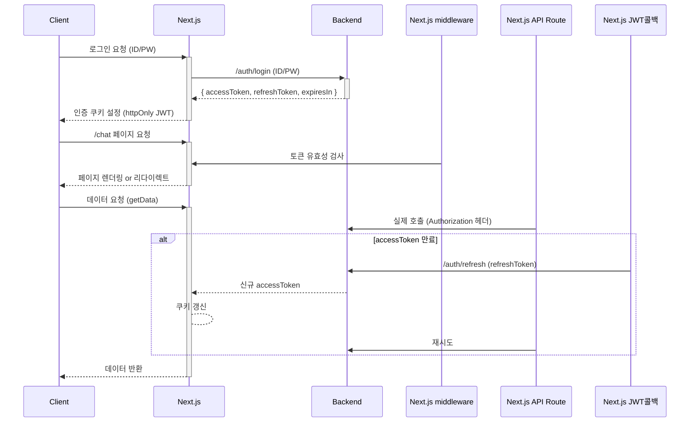
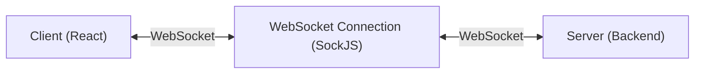

---
tags:
  - chat/program
  - chat/program/client
---
# Client 개발하면서 적어놓기
## 페이지 이동을 할 때에는 Link 컴포넌트 사용
- 클라이언트 사이드 라우팅
	- Link 컴포넌트를 사용하면 전체 페이지를 새로고침하지 않고, 필요한 부분만 빠르게 전환할 수 있어 부드러운 사용자 경험을 제공합니다
- SEO(검색 엔진 최적화) 지원 
	- Link는 Next.js의 서버 사이드 렌더링 구조와 잘 맞아 SEO에 유리하며, 검색 엔진이 페이지 구조를 잘 인식할 수 있도록 돕는다.
- Prefetch(사전 로딩) 
	- Link는 이동할 페이지의 리소스를 미리 불러와서, 클릭 시 즉시 페이지가 전환되도록 지원합니다
- 최적화된 코드 분할 및 접근성
	- 자동 코드 스플리팅, 웹 접근성 준수 등 Next.js의 다양한 최적화 기능이 내장되어 있다.
# 인증 구조
## 로그인 이후 token 정보 제출
```tsx
// 사용자가 로그인 폼 제출
const signinResult = await signIn('credentials', {
  redirect: false,
  accessToken,
  refreshToken,
});
```
## `authorize`함수 실행
- NextAuth가 `CredentialsProvider`의 `authorize`함수 호출
- 토큰 유효성 확인 후 사용자 객체 반환
```ts
async authorize(credentials) {
  // 전달받은 토큰 사용
  return {
    id: "user-id",
    accessToken: credentials.accessToken,
    refreshToken: credentials.refreshToken,
  };
}
```
## JWT 콜백 실행
- 첫 번째로 호출되는 콜백
- `authorize`에서 반환된 사용자 객체가 `user` 매개변수로 전달됨
- JWT 토큰에 필요한 정보 저장
```ts
async jwt({ token, user }) {
  if (user) {
    token.accessToken = user.accessToken;
    token.refreshToken = user.refreshToken;
  }
  return token;
}
```
## Session 콜백 실행
- 두 번째로 호출되는 콜백
- 위의 jwt에서 반환 된 토큰이 token 매개변수로 전달됨
- 클라이언트에서 전송할 세션 객체 구성
```ts
async session({ session, token }) {
  session.accessToken = token.accessToken;
  session.refreshToken = token.refreshToken;
  return session;
}
```
## 이후 페이지 접근 시
- 미들웨어 실행(`middleware.ts`)
	- 요청시마다 토큰 유효성 확인
	- `getToken()`함수는 내부적으로 JWT 검증 진행
- JWT 검증 시
	- 저장된 JWT 토큰을 디버깅하고 검증
- 세션 요청 시
	- `useSession()`훅 사용 시 세션 정보 요청
	- 다시 session 콜백 호출하여 최신 세션 데이터 구성
## 다이어그램

# WebSocket 채팅 구현 가이드

## 개요
이 문서는 Next.js 기반의 실시간 채팅 애플리케이션에서 WebSocket을 사용한 소켓 통신 구현에 대해 설명합니다.

## 기술 스택
- **WebSocket 라이브러리**: SockJS, STOMP.js
- **인증**: NextAuth.js
- **프론트엔드**: Next.js, React, TypeScript
- **상태 관리**: React Context API

## 아키텍처 구조


## 1. 소켓 연결 설정

### 1.1 SocketProvider 구성
```typescript
// app/lib/hooks/useChatSocket.tsx
export const SocketProvider: React.FC<SocketProviderProps> = ({ children }) => {
  const { data: session, status } = useSession();
  const clientRef = useRef<Client | null>(null);
  const [isConnected, setIsConnected] = useState<boolean>(false);
  const subscriptionsRef = useRef<Map<string, any>>(new Map());
```

### 1.2 연결 조건
- ✅ 사용자가 인증된 상태 (`status === 'authenticated'`)
- ✅ 유효한 액세스 토큰 존재 (`session?.accessToken`)
- ❌ 미인증 상태일 때 자동 연결 해제

### 1.3 소켓 연결 설정
```typescript
const connectSocket = () => {
  const socket = new SockJS(process.env.NEXT_PUBLIC_SOCKET_URL);
  const client = new Client({
    webSocketFactory: () => socket,
    connectHeaders: {
      Authorization: `${session?.accessToken}`,
    },
    // ... 이벤트 핸들러들
  });
}
```

## 2. 구독(Subscription) 패턴

### 2.1 채팅방 메시지 구독
```typescript
// 채팅방의 실시간 메시지 수신
subscribe(`/topic/room/${roomId}`, (message: ChatLogResponseDto) => {
  // 새 메시지 추가 및 UI 업데이트
});
```

### 2.2 읽음 상태 알림 구독
```typescript
// 다른 사용자의 읽음 상태 변경 알림
subscribe(`/topic/room/${roomId}/read-notifications`, (notification: ReadNotificationDto) => {
  // 읽음 상태 동기화
});
```

### 2.3 개인 읽음 응답 구독
```typescript
// 내 메시지의 읽음 상태 업데이트
subscribe(`/topic/room/${roomId}/read/user/${userId}`, (response: ChatUnReadUserResponseDto) => {
  // 안 읽은 사용자 수 업데이트
});
```

### 2.4 개인 알림 구독 (글로벌)
```typescript
// 사용자별 전역 알림
subscribe(`/topic/chat/user/${userId}`, (message) => {
  // 전역 메시지 처리
});
```

## 3. 메시지 전송 패턴

### 3.1 채팅 메시지 전송
```typescript
// 서버 API를 통한 메시지 저장
sendMessageToServer(accessToken, chatRoomId, messageContent);
```

### 3.2 읽음 상태 전송
```typescript
// WebSocket을 통한 읽음 상태 전송
sendMessage(`/app/room/${roomId}/read`, { messageIds }, replyDest);
```

## 4. 상태 관리

### 4.1 메시지 상태 관리
```typescript
const [messages, setMessages] = useState<ChatLogResponseDto[]>([]);
const messagesRef = useRef<ChatLogResponseDto[]>([]);

// 실시간 메시지 추가
const updated = [...prev, message];
messagesRef.current = updated;
setMessages(updated);
```

### 4.2 읽음 상태 업데이트
```typescript
// 읽지 않은 사용자 수 업데이트
setMessages((prevMessages) => {
  return prevMessages.map(msg => {
    msg.unreadCount = logIdWithUnread[msg.id];
    return msg;
  });
});
```
## 5. 에러 처리

### 5.1 연결 에러
```typescript
onStompError: (frame) => {
  console.error('STOMP 오류:', frame);
  setIsConnected(false);
}
```

### 5.2 메시지 전송 에러
```typescript
if (clientRef.current && isConnected) {
  // 메시지 전송
} else {
  console.error('소켓이 연결되지 않았습니다.');
}
```

## 6 최적화 고려사항

### 6.1 메모리 관리
- `useRef`를 사용한 최신 상태 참조
- 컴포넌트 언마운트 시 구독 해제
- 클라이언트 연결 정리

### 6.2 성능 최적화
- 메시지 배치 처리
- 불필요한 리렌더링 방지
- 디바운싱 적용 고려

### 6.3 UX 개선
- 연결 상태 시각적 표시
- 오프라인 모드 지원 고려
- 메시지 전송 실패 재시도

## 7. 트러블슈팅

### 7.1 일반적인 문제들
- **연결 실패**: 환경 변수 및 서버 상태 확인
- **구독 실패**: 권한 및 토큰 유효성 확인
- **메시지 중복**: 구독 해제 로직 확인
- **메모리 누수**: useEffect cleanup 함수 확인

### 7.2 디버깅 팁
- STOMP 디버그 모드 활성화
- 브라우저 네트워크 탭에서 WebSocket 연결 확인
- 콘솔 로그를 통한 메시지 플로우 추적
# Socket Context를 사용해서 Socket 구현
[[React Context란]]
### 1. Context 타입 정의
```typescript
interface SocketContextType {
  client: Client | null;           // STOMP 클라이언트 인스턴스
  isConnected: boolean;            // 연결 상태
  sendMessage: (destination: string, body: any, replyTo: string) => void;
  subscribe: (destination: string, callback: (message: any) => void) => void;
  unsubscribe: (destination: string) => void;
}
```

**각 필드의 역할:**
- `client`: WebSocket STOMP 클라이언트 객체
- `isConnected`: 현재 소켓 연결 상태 (true/false)
- `sendMessage`: 서버로 메시지 전송 함수
- `subscribe`: 특정 토픽 구독 함수
- `unsubscribe`: 구독 해제 함수

### 2. Context 생성
```typescript
const SocketContext = createContext<SocketContextType | null>(null);
```

**중요 포인트:**
- `createContext()`로 Context 객체 생성
- 초기값을 `null`로 설정
- TypeScript 타입 지정으로 타입 안정성 확보

### 3. Custom Hook 생성
```typescript
export const useSocket = () => {
  const context = useContext(SocketContext);
  if (!context) {
    throw new Error('useSocket must be used within a SocketProvider');
  }
  return context;
};
```

**이 Hook의 장점:**
- ✅ **타입 안정성**: Context가 없을 때 에러 발생
- ✅ **사용 편의성**: `useSocket()`만으로 모든 소켓 기능 접근
- ✅ **에러 방지**: Provider 외부에서 사용 시 명확한 에러 메시지

### 4. Provider 컴포넌트
```typescript
export const SocketProvider: React.FC<SocketProviderProps> = ({ children }) => {
  const { data: session, status } = useSession();
  const clientRef = useRef<Client | null>(null);
  const [isConnected, setIsConnected] = useState<boolean>(false);
  const subscriptionsRef = useRef<Map<string, any>>(new Map());

  // 소켓 연결/해제 로직...

  const value: SocketContextType = {
    client: clientRef.current,
    isConnected,
    sendMessage,
    subscribe,
    unsubscribe,
  };

  return (
    <SocketContext.Provider value={value}>
      {children}
    </SocketContext.Provider>
  );
};
```

## Context 사용 흐름

### 1. 애플리케이션 레벨에서 Provider 설정
```tsx
// app/layout.tsx
export default function RootLayout({ children }) {
  return (
    <html lang="en">
      <body>
        <SessionProvider>
          <SocketProvider>  {/* 🔥 여기서 Context 제공 */}
            {children}
          </SocketProvider>
        </SessionProvider>
      </body>
    </html>
  );
}
```

### 2. 컴포넌트에서 Context 사용
```tsx
// app/ui/room/chatRoomDetail.tsx
export const ChatRoomDetail = ({ selectedChatRoom, onClose }) => {
  // 🔥 useSocket Hook으로 Context 값들에 접근
  const { sendMessage, subscribe, unsubscribe, isConnected } = useSocket();
  
  useEffect(() => {
    if (selectedChatRoom && isConnected) {
      // 채팅방 메시지 구독
      subscribe(`/topic/room/${selectedChatRoom.id}`, (message) => {
        // 메시지 처리 로직
      });
      
      return () => {
        // 구독 해제
        unsubscribe(`/topic/room/${selectedChatRoom.id}`);
      };
    }
  }, [selectedChatRoom, isConnected]);
  
  // 컴포넌트 렌더링...
};
```

## 프로젝트에서 Context를 선택한 이유

### 소켓 연결은 전역적 상태
- 애플리케이션 전체에서 하나의 소켓 연결만 필요
- 여러 컴포넌트에서 동시에 사용
- 연결 상태를 전역적으로 관리 필요

### Props Drilling 방지
```tsx
// ❌ Context 없이 구현한다면
App → Layout → ChatPage → ChatRoom → ChatDetail
// 모든 단계에서 소켓 관련 props 전달 필요

// ✅ Context 사용
App → SocketProvider
ChatDetail에서 바로 useSocket() 사용
```

### 상태 캡슐화
- 소켓 연결, 구독 관리 등 복잡한 로직을 Provider에 캡슐화
- 사용하는 컴포넌트는 간단한 Hook으로 접근
## Context의 생명주기

### 1. 초기화 단계
```
1. SocketProvider가 마운트됨
2. useSession으로 인증 상태 확인
3. 인증되면 connectSocket() 호출
4. WebSocket 연결 및 Context value 업데이트
```

### 2. 사용 단계
```
1. 하위 컴포넌트에서 useSocket() 호출
2. Context에서 필요한 함수들 추출
3. subscribe/unsubscribe로 실시간 통신
4. sendMessage로 메시지 전송
```

### 3. 정리 단계
```
1. 컴포넌트 언마운트 시 unsubscribe 호출
2. SocketProvider 언마운트 시 disconnectSocket() 호출
3. 모든 구독 해제 및 연결 종료
```
