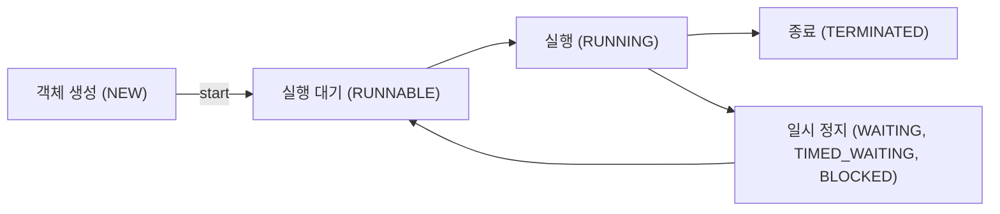

자바에서 main 쓰레드에 의해서 프로그램이 실행이 된다.
여기서 우가로 여러 쓰레드를 실행하는 방법을 알아보자
이는 멀티쓰레드와 병렬처리를 하는데 필요한 방법이다.
### Thread의 상태


## Thread 클래스

```Java
public void main() {  
    MyThread myThread = new MyThread();  
    // run이 아니라 start로 실행한다.
    myThread.start();  
    System.out.println("지금 쓰레드는 : " + Thread.currentThread().getName());  
}  
  
static class MyThread extends Thread {  
    @Override  
    public void run() {  
        System.out.println("지금 쓰레드는 : " + Thread.currentThread().getName());  
  
    }  
}
```
Output은 아래와 같이 출력이 된다.
```text
지금 쓰레드는 : Thread-0
지금 쓰레드는 : main
```
#### start 메서드
start 메서드의 설명을 읽어보면 JVM으로 실행을 한 다는 것을 알 수 있다. 
`Causes this thread to begin execution; the Java Virtual Machine calls the run method of this thread.`
```Java
public synchronized void start() {  
	// 이미 시작 된 쓰레드인지 확인을 한다.
	// 만약 시작된 쓰레드라면 에러를 발생시킨다.
    if (threadStatus != 0)  
        throw new IllegalThreadStateException();  

	// 쓰레드 그룹에 추가를 한다.
     group.add(this);  
  
    boolean started = false;  
    try {
	    // 쓰레드를 시자아아악 하겠습니다.
        start0();  
        started = true;  
    } finally {  
        try {  
            if (!started) {  
                group.threadStartFailed(this);  
            }  
        } catch (Throwable ignore) {  
            /* do nothing. If start0 threw a Throwable then  
              it will be passed up the call stack */        }  
    }  
}
```
native class는 자바가 아닌 네이티브 코드로 구성된 것을 의미하며 JVM 내부의 네이티브 라이브러리를 통해서 실행이 되는 것을 의미한다.
```java
private native void start0();
```

###  Runnable
Java에서 멀티스레딩을 구현할 때 가장 기본적으로 사용되는 인터페이스이다
Runnable 인터페이스는 `run()` 메서드 하나만을 정의하며, `void run()` 메서드를 오버라이드하여 스레드가 실행할 작업을 정의할 수 있습니다.
```Java
@FunctionalInterface  
public interface Runnable {  
	 public abstract void run();  
}
```
>특징으로는 반환값이 없다. 

아래와 같이 구현이 가능하다
```Java
public void runnable() {  
    Runnable runnable = new Runnable() {  
        @Override  
        public void run() {  
            System.out.println("지금 쓰레드는 : " + Thread.currentThread().getName());
        }  
    };  
  
    Thread thread = new Thread(runnable);  
    thread.start();  
  
}
```

### Callable
Runnable 인터페이스는 반환값을 받을 수 없다는 단점이 있었다.'
이를 해결하고자 제네릭을 사용해 결과를 받기 위해서 Callable 인터페이스를 사용한다.
### Future
Future 인터페이스는 Java에서 비동기 작업의 결과를 나타내는 객체를 정의하는 인터페이스이다. 
Future 인터페이스는 주로 멀티스레딩과 비동기 프로그래밍에서 작업이 완료될 때 결과를 가져오거나 작업 상태를 확인하기 위해 사용됩니다.
##### 주요 메서드
- get()
	- 작업이 완료될 때 까지 기다렸다가 결과를 반환한다.
	- 작업이 완료되지 않았으면 현재 쓰레드를 대기 상태로 만들어준다.
	- Future가 표현한 결과를 반환한다.
	- 일정시간 동안 대기 하도록 할 수 있다.
- isDone()
	- 작업이 완료되었는지 여부를 확인한다.
- isCancelled()
	- 작업이 취소되었는지 여부를 확인한다.
- cancel(boolean mayInterruptIfRunning)
	- 작업이 완료되기 전에 작업을 취소하려고 시도한다.

예시>
```Java
ExecutorService executor = Executors.newSingleThreadExecutor();  
  
Callable<String> task = () -> {  
    Thread.sleep(3000);  
    return "작업이 완료되었습니다.";  
};  
  
Future<String> submit = executor.submit(task);  
  
if (!submit.isDone()) {  
    System.out.println("작업이 진행중입니다.");  
}  
  
try {  
    String output = submit.get();  
    System.out.println("완료된 작업 이름 입니다. : " + output);  
} catch (Exception e) {  
    System.out.println("에러");  
} finally {  
    executor.shutdown();  
}
```

### Executor 
쓰레드를 직접 생성하거나 관리할 필요가 없이 작업을 실행할 수 있게 해주는 인터페이스
쓰레드 풀 및 큐를 이용한 작업 관리와 같은 처리가 가능하다
예시 > 
```Java
ExecutorService executor = new ThreadPoolExecutor(  
            2, 2, 0L, TimeUnit.MILLISECONDS,  
            new LinkedBlockingQueue<Runnable>(5)  // 작업 큐의 크기를 5로 설정  
        );  
  
        try {  
            for (int i = 0; i < 10; i++) {  
                Future<String> submit = executor.submit(() -> {  
                    System.out.println(  
                        "실행 중 (Thread: " + Thread.currentThread()  
                            .getName()  
                            + ")");  
                    try {  
                        Thread.sleep(1000); // 작업이 1초간 실행되도록 설정  
                    } catch (InterruptedException e) {  
                        System.out.println("에러 발생" + e.getMessage());  
                    }  
                    System.out.println("작업 완료 " + Thread.currentThread().getName());  
                    return "";  
                });  
//                submit.get();  
            }  
        } catch (Exception e) {  
            System.out.println(e.getMessage());  
        } finally {  
            executor.shutdown();  
        }
```
작업 큐의 크기를 일정 크기 만큼 생성 한 다음에 순차적으로 실행되도록 설정한다.
위의 경우 큐의 크기 + 작업 큐의 크기를 초과 했으므로 에러가 발생한다.
에러가 발생하지 않기 위해서는 들어오는 작업량에 맞춰서 큐나 쓰레드 풀의 크기를 조정해줘야 한다.
##### 파라미터 
- corePoolSize(코어 쓰레드 수)
	- 코어 스레드의 기본 수를 지정합니다. 스레드 풀은 최소한 이 수만큼의 스레드를 유지합니다.
	- 코어 스레드는 작업이 없더라도 풀에 남아 있으며, 이 수보다 더 많은 스레드를 필요로 할 때만 추가 스레드를 생성합니다.
- maximumPoolSize (최대 스레드 수)
	- 현재 활성 스레드가 corePoolSize를 초과하고 작업 큐가 꽉 찬 경우, maximumPoolSize까지 스레드를 추가하여 작업을 처리합니다.
- keepAliveTime
	- corePoolSize를 초과하는 여분의 스레드가 사용되지 않을 때 얼마 동안 유지할지를 설정합니다.
- workQueue
	- 작업을 대기시키기 위해 사용되는 큐로, Runnable 작업들이 큐에 저장됩니다.

### CountDownLatch
CountDownLatch는 동기화 도구로, 특정 수의 작업이 완료될 때까지 하나 이상의 스레드가 대기하도록 만드는 역할

##### 주요 메서드
- CountDownLatch(int count)
	- 생성자. count는 **대기해야 할 횟수**를 설정하는 값으로, 모든 스레드가 작업을 마칠 때까지 countDown() 메서드가 몇 번 호출되어야 하는지를 나타냅니다.

- countDown()
	- count 값을 1씩 줄입니다. 이 메서드가 호출될 때마다 count가 감소하고, count가 0이 되면 대기 중인 스레드들이 실행을 재개합니다.

- await()
	- count 값이 0이 될 때까지 현재 스레드를 대기 상태로 유지합니다. count가 0이 되면 모든 대기 중인 스레드가 즉시 실행을 재개합니다.

## 참고 블로그
[Thread와 Runnable에 대한 이해 및 사용법](https://mangkyu.tistory.com/258)